# Best Practices: Guardrails Closed-Loop Design

## AWS Bedrock AgentCore — Before → During → After Architecture

| **Field** | **Value** |
|:---|:---|
| **Version** | 1.4 (empirically amended; every runnable case measured, 1 case recorded as unmeasured, 3 day-2 replications owed) |
| **Date** | August 15, 2026 (v1.4-DRAFT: August 14, 2026; v1.3-DRAFT: August 13, 2026; v1.2: August 8, 2026) |
| **Scope** | End-to-end guardrails architecture for agents deployed on Amazon Bedrock AgentCore Runtime |
| **Audience** | Solutions Architects, Technical Account Managers, Builder Community |
| **References** | AWS Official Documentation; Amazon Bedrock AgentCore Service Approval Accelerator v2.9 (2026-07-13); grx-validation empirical validation platform (pre-registered) |

## Validation Status (v1.4)

This version amends v1.2 strictly on the basis of the pre-registered empirical validation in the `grx-validation` repository (`PREREGISTRATION.yaml`, per-case verdicts under `results/phase1/`, claim mapping in `claims/triage.csv`, narrative findings in `results/FINDING-*.md`). All counts below are re-derived from the result files via `census.py` on 2026-08-15, not remembered; the counts v1.4 moves (F1-15, F5-8, F5-7b) were re-derived by direct read of `results/phase1/F1-15.json`, `results/phase1/F5-8.json` and `results/phase1/F5-7b.json`:

- **93** registered test cases; **92** verdict-eligible (F9-1 is untestable by its own sealed oracle — AgentCore exposes no fault-injection surface for policy-evaluation timeouts); **546** document claims triaged; **90** cases mapped to at least one claim.
- **90** published verdicts: **45 TRUE** (claims empirically confirmed — annotated in place), **23 FALSE** (claims refuted — corrected in place), **20 INCONCLUSIVE** (the case did not reach a decidable state — claims left exactly as v1.2 wrote them), **2 RECORDED** (F5-4a, a descriptive failure-mode characterization used only to sharpen confirmed claims; F5-4b, a descriptive fail-closed characterization of the missing-permission failure mode — see §4.1). One of the 45 TRUE verdicts (F5-8) has one calendar day of data and therefore has **not** cleared this repository's two-calendar-day reproduction gate, so the claim it bears on is annotated rather than amended — see §4.4 route #3 and Appendix D.
- **1** case outstanding: F10-1. Every claim it tests is left exactly as v1.2 wrote it. Its status is recorded rather than open-ended — see `results/CENSUS-NOT-MEASURED.md`, which separates the three obstacles in front of it and states which are objective (Cost Explorer's daily granularity, and whether Bedrock inference charge is attributable per request tag at all) and which are decisions (the runner role is deliberately not granted `ce:GetCostAndUsage`, because `runner/iam_policy.py` derives its grants from captured evidence and no case has ever called Cost Explorer). F9-1 is not in this list and is not unfinished work: it is untestable by its own sealed oracle (above), so it is excluded from the verdict-eligible count rather than awaiting a run; the same document records why, and why that judgement is checkable rather than convenient — the `NOT_TESTABLE` kind was sealed before any data arrived.
- **1** case ran but carries **no publishable standing**: F5-3b (verdict TRUE, but its `every_boundary_transition_was_observed_to_settle` guard failed — two IAM boundary transitions never settled within their ~307 s observation budgets). It is not counted among the published verdicts above and is not cited as confirming any claim; see the register in Appendix D. Arithmetic: 90 published + 1 outstanding + 1 non-publishable = 92 verdict-eligible.

**What "1.4" claims, and what it does not.** Every case that could be run has been run: 90 of the 92 verdict-eligible cases carry a published verdict, one is recorded as unmeasured with its reasons, and one is non-publishable by its own guard. That is a statement about coverage, not about strength. Twenty of the ninety verdicts are INCONCLUSIVE, and several of those are instrument failures rather than platform facts — `results/FINDING-F5-7B.md` and `results/FINDING-F1-15.md` document two cases where the measuring apparatus, not AWS, is what failed. **An INCONCLUSIVE verdict is not evidence against a claim, and this version amends nothing on one.** Three TRUE verdicts (F5-8, F4-6, F2-1) additionally await a second calendar day under `reproduction_before_amendment`; the claims they bear on are annotated and left in place. A future v1.5 is expected to move those three and nothing else, unless F10-1 becomes measurable.

Editorial rule applied throughout: `[verified …]` marks a claim a published TRUE verdict confirms; `[corrected per …]` marks text rewritten because a published FALSE verdict refuted it; `(test pending …)` marks a claim whose case has no published verdict — the claim itself is untouched. **v1.4 adds one marker:** `(measured — amendment deferred …)` marks a claim whose case returned a published TRUE verdict on a **single** calendar day; the measurement stands as recorded, and the claim's text does not move until `PREREGISTRATION.yaml`'s `reproduction_before_amendment` gate (pre-registered n met, reproduced on ≥ 2 separate calendar days, archived request ids, alternative-explanation register) is satisfied. An INCONCLUSIVE verdict is **not** evidence against a claim.

<!-- RESOLVED 2026-08-14 (this note replaces the 2026-08-13 REVIEW marker that deferred these amendments): results/phase1/F1-6.json (TRUE), F8-1.json (FALSE), and F10-3.json (FALSE) now exist in the repository, together with the rest of the batch (F1-19, F1-24, F1-25, F1-26, F1-27, F1-28, F5-3a, F5-3b, F5-4b, F5-5, F5-9, F9-3). Each was read directly from results/phase1/ before editing, and the amendments the marker deferred are now applied at exactly the sites it named: §1 Regional-availability callout + §8 Region check (F8-1); §3.4 tier table crossRegionConfig row + §1 language callout (F1-6); §3.3 BP#3 + Appendix B "Selective application" row (F10-3). -->

## 1. Executive Summary

When deploying AI agents on Amazon Bedrock AgentCore with backend models (e.g., Claude), guardrails introduce multiple checkpoint hops in the request/response lifecycle. While these checkpoints are essential for safety and compliance, they add measurable latency at each hop. This document defines best practices for implementing the complete Before → During → After closed-loop guardrails architecture while maintaining acceptable end-to-end latency through hop-by-hop monitoring.

> **Regional availability (important):** v1.2 stated that Guardrails-in-policy (AgentCore Gateway policy guardrails, Hop #1/#5) was available only in US East (N. Virginia), Europe (London), Europe (Stockholm), Asia Pacific (Sydney), and Asia Pacific (Tokyo). **That five-Region restriction is refuted** [corrected per F8-1, FALSE, run r20260810T130945Z: `CreatePolicyEngine` succeeded (HTTP 202, `outcome: created`) in all five listed Regions AND in four Regions the list excluded — us-west-2, eu-central-1, sa-east-1, ap-south-1]. Scope of the correction: a successful `CreatePolicyEngine` is the control plane accepting a mutation, NOT the feature evaluating a request — this establishes that the five-Region list is wrong, not that policy guardrails *work* end-to-end in the four additional Regions. Singapore (ap-southeast-1) was NOT in the probe set, so v1.2's specific statement that Singapore is NOT yet supported stands as an unprobed claim — and in every Region, probed or not, confirm Regional support before designing a deployment. Standalone Bedrock Guardrails (via ApplyGuardrail / model invocation, Hop #2/#6) has broader Regional coverage.

> **Language support (important for non-English workloads):** Bedrock Guardrails content filters on the Classic tier support only English, French, and Spanish. The Standard tier adds broad multi-language coverage (including Chinese, Japanese, Korean) but **requires cross-Region inference**, meaning prompts and results may be processed outside your primary Region — evaluate this against your data-residency requirements together with the Regional constraint above. Per AWS: "Guardrails are ineffective with languages that aren't supported." See Section 3.4. *(Classic-tier ineffectiveness on zh/ja/ko is empirically confirmed [verified F8-2, TRUE, n=240 (216 attack + 24 benign), ApplyGuardrail, 2026-08-10: zh-TW/zh-CN/ja/ko detection 0 [0, 0.0175] while EN/FR/ES detection was high]; Standard-tier multi-language coverage is confirmed [verified F8-3, TRUE, n=216, paired improvement p ≈ 4.6×10⁻⁴⁶, 2026-08-10]. The `crossRegionConfig` requirement itself is confirmed [verified F1-6, TRUE, us-east-1, 2026-08-10: on both tier-carrying blocks, `CreateGuardrail` with `tier=STANDARD` and no `crossRegionConfig` was rejected with the tier/cross-Region validation, STANDARD *with* it was accepted — ruling out an account limitation — and both CLASSIC cells were accepted without it; one Region, one account, and acceptance of a create validates the request, not that cross-Region inference actually runs].)*

## 2. Architecture Overview: The Closed Loop

The AgentCore guardrails architecture follows a three-phase closed loop:

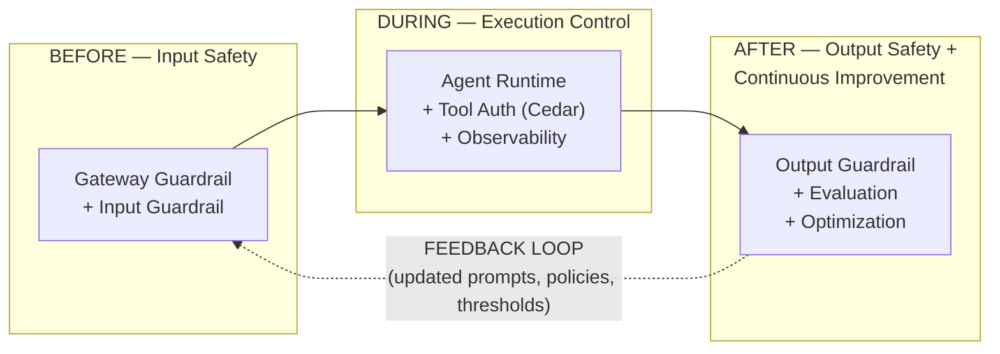

### 2.1 Hop Numbering (Normative for This Document)

The hop numbering is **this document's own framework** (AWS documentation has no "hop" concept). The table and the sequence diagram below are the normative definition; every other section, table, and diagram in this document uses these numbers.

| Hop | Checkpoint | Phase |
|:---:|:---|:---|
| 1 | AgentCore Gateway Policy Guardrails (input) | BEFORE |
| 2 | Bedrock Guardrails — input evaluation (or ApplyGuardrail) | BEFORE |
| 3 | Model inference (not a guardrail checkpoint; included for the latency budget) | DURING |
| 4 | Agent-to-tool authorization (Cedar Policy) | DURING |
| 5 | Tool request/response guardrails (Gateway Policy) | DURING |
| 6 | Bedrock Guardrails — output evaluation | AFTER |

Where each hop sits in a single request lifecycle (one tool call shown; Hops #4/#5 repeat for every tool call):

<!-- v1.3 amendment: the Hop #1 note below no longer says "HTTP 403" — [corrected per F4-6, FALSE, n=120, us-east-1, 2026-08-10]: on an MCP gateway target, all 120 policy denials returned HTTP 200 with a JSON-RPC error (code -32002) whose message names the denying policy ID. See §3.1 behavior notes. -->

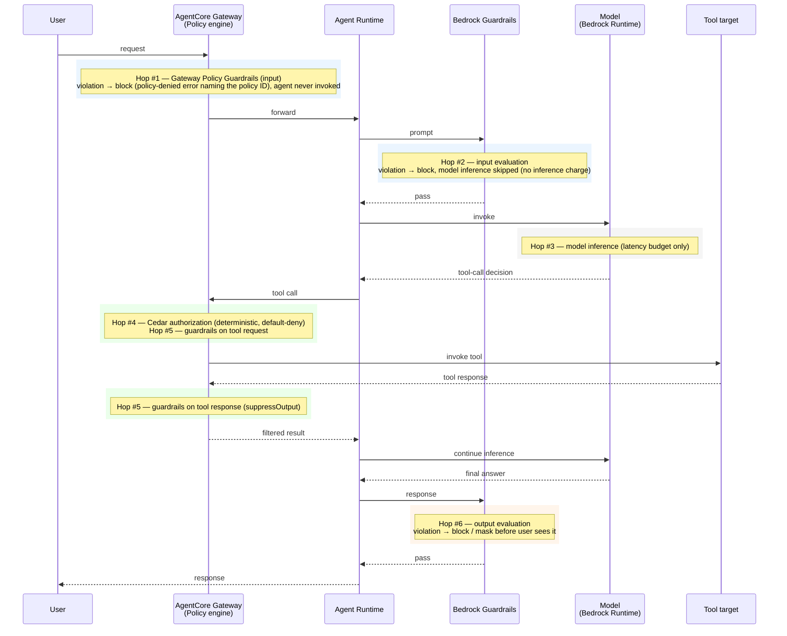

> Note: this diagram is a logical model of the checkpoints, not a wire-level trace. When Hop #2/#6 run via `guardrailConfiguration` attached to the model invocation, they execute inside the Bedrock Runtime call rather than as separate API round-trips; Hop #2-ALT (ApplyGuardrail, Section 3.3) is a separate round-trip.

## 3. Phase 1: BEFORE — Input Safety Checkpoints

### 3.1 Checkpoint Hop #1: AgentCore Gateway Policy Guardrails

**Service:** Amazon Bedrock AgentCore Gateway + Policy in AgentCore

**What it does:**

- Intercepts incoming requests at the gateway level BEFORE they reach the agent
- Evaluates content against configured guardrail safeguards using Cedar policy conditions
- Blocks violating requests immediately — the agent is never invoked

**Supported Safeguards:**

- Prompt Attack detection (JAILBREAK, PROMPT_INJECTION, PROMPT_LEAKAGE)
- Content Filter (categories with configurable thresholds; confidence scores are discrete values {0, 0.2, 0.4, 0.6, 0.8, 1.0}, not a continuous range) [verified F1-18, TRUE, n=300, us-east-1, 2026-08-10: all 300 observed scores fell on the documented lattice; caveat — scores below the configured threshold may not publish, so the lowest lattice points can be unobserved]
- Sensitive Information detection

**Thresholds:** if you author policies through the natural-language authoring service and do not specify a threshold, AgentCore applies defaults of Content Filter = 0.2, Prompt Attack = 0.4, Sensitive Information = 0.2. **If you hand-write Cedar policies without the authoring service, you MUST provide the threshold value explicitly — there is no automatic default.** Content Filter categories: VIOLENCE, HATE, SEXUAL, MISCONDUCT, INSULTS. [verified F1-7, TRUE, API-surface probe, run r20260810T180012Z, 2026-08-10] *(Validation: case F1-19, which probes this paragraph directly, ran to completion in rounds 4–7 of run r20260810T130945Z (2026-08-13 UTC, after the instrument repairs recorded in FINDING-P1-CEDAR-RESOURCE-SCOPE.md) and returned INCONCLUSIVE — the paragraph is left as written. Mechanism observation, not a verdict: the hand-written half behaved exactly as stated above, and mechanistically — a guardrails condition with no threshold settled `CREATE_FAILED` with "unexpected type: expected Bool but saw {HATE: {confidenceScore: decimal,}, …}", i.e. the bare guardrail call returns a per-category record of confidence scores and nothing in the grammar implicitly bridges it to the Bool the condition slot requires, while the same statement with an explicit `.greaterThan(decimal("0.2"))` reached ACTIVE. The defaults half could not be measured: `StartPolicyGeneration` settled at terminal `GENERATED` having emitted zero statements, with both assets carrying `{"type": "INVALID", "description": "Non-translatable: cannot be expressed in Dogwood"}` for both guardrail-intent fragments — so the 0.2 / 0.4 / 0.2 defaults above are untested, not wrong. Operationally: on 2026-08-13, in one account and one Region, with one prompt, the natural-language authoring path itself declined to express guardrail intents — confirm that path works in your account before designing around its defaults.)*

**Configuration Method:**

- Define guardrails inline within Cedar policies using `when guardrails { ... }` or `unless guardrails { ... }` conditions
- Attach the policy engine to your AgentCore Gateway
- Gateway Execution Role must have permissions for both AgentCore operations (`bedrock-agentcore:*`) and Bedrock Guardrails. The required Guardrails permission is `bedrock:InvokeGuardrailChecks` — the Policy data plane uses FAS (Forward Access Session) credentials to call this API on your behalf. Note: InvokeGuardrailChecks (used by Gateway policy) is distinct from the standalone ApplyGuardrail API in Section 3.3. **SDK prerequisite (v1.3 addition):** the policy API surface this document prescribes requires **botocore/boto3 ≥ 1.43.32** — `CreatePolicy.enforcementMode` and `definition.policy` first appear at 1.43.32, while `bedrock-runtime.InvokeGuardrailChecks` appears at 1.43.30, so versions 1.43.30–.31 expose the API without `enforcementMode`; an absent parameter is silently dropped from the request rather than rejected. The bundled AWS CLI v2 carries no policy-engine subcommands — use Python/boto3. [verified F1-1 and F1-2, both TRUE, 14 botocore wheels probed offline with monotonicity verified, 2026-08-09; see FINDING-F1-1]

> **Critical setup gotcha (ENFORCE + default-deny):** Cedar is default-deny — if no policy matches, the request is denied. A policy engine in ENFORCE mode that contains only guardrail policies (and no explicit `permit`) will therefore **block ALL gateway traffic, including benign requests** [verified F4-1, TRUE, n=120, us-east-1, 2026-08-10: engine in ENFORCE with no ACTIVE permit denied 120/120 benign requests; denial disappeared when the permit returned to ACTIVE]. Always include an explicit baseline permit, e.g. `permit (principal, action, resource is AgentCore::Gateway);`, alongside your guardrail policies (this is exactly what the official getting-started guide does).
>
> **v1.3 correction — the permit statement above does not create under the default `validationMode`** [corrected per F1-3, TRUE, replicated 2026-08-10 and 2026-08-11, us-east-1]: submitted as written, `CreatePolicy` accepts it with HTTP 202 and it then settles `CREATE_FAILED` with two "Overly Permissive" validator findings, because `PolicyValidationMode` defaults to `FAIL_ON_ANY_FINDINGS`. The official getting-started guide passes `--validation-mode IGNORE_ALL_FINDINGS` for this same statement; v1.2 never mentioned the parameter. Set `validationMode` explicitly when creating the baseline permit, and note that validation is **not** a synchronous gate — the create call returns 202 either way and the verdict arrives asynchronously in the policy `status`, so poll it before relying on the policy.

**Latency Impact:**

- Added latency at the gateway entry point
- If blocked, no further downstream processing occurs (saves overall latency)
- Note: AWS documentation does not publish parallelism or latency characteristics for Gateway policy guardrail evaluation — measure your own baseline with the `GuardrailLatency` metric (Section 6.2)

**Behavior notes:**

- AWS documents guardrail evaluation as non-deterministic ("The same input can result in different outputs. Policies, however, are deterministic."). **Measured, this variation did not appear** [corrected per F2-2, FALSE, n=300, us-east-1, 2026-08-10: 300 identical inputs produced one identical score (0.8000) 300/300 times; F2-5, FALSE, n=300 identical ApplyGuardrail calls, 2026-08-10: all 300 responses byte-identical in verdict and score, bounding the per-call flip rate at ≈0.994% (one-sided 95%); F2-4, FALSE, 2026-08-10: decision flip rate was 0 at every threshold placement, n_usable=299 of planned 300]. These results bound only *reported* variation at the measured operating points and do not prove the service is deterministic — but do not design as though run-to-run score variation on a fixed input is an observed behavior; the measured basis for defensive thresholds is AWS's auto-update of the underlying models (§3.2 BP#5), not per-call noise.
- Fail-secure: Policy evaluation timeouts result in an automatic DENY decision (AgentCore Service Approval Accelerator v2.9, Policy section). *(Validation: the TIMEOUT mode this sentence claims remains untestable from outside AWS — no fault-injection surface exists for service-side evaluation timeouts; case F9-1 is excluded by its own sealed oracle. Claim left as written. A DIFFERENT failure mode was measured and failed closed: with `bedrock:InvokeGuardrailChecks` removed from the gateway execution role, the engine denied BOTH the violating and the benign request — pre-removal violating DENY / benign ALLOW; post-removal violating DENY, benign DENY; violating still DENY after restore — i.e. it stopped discriminating by content rather than waving traffic through [F5-4b, RECORDED, us-east-1, run r20260810T130945Z, all 11 guards clean]. That characterizes the missing-permission mode only; it is not evidence about the timeout mode.)*
- Denied requests receive a message identifying the denying policy ID — **but not HTTP 403 on MCP targets** [corrected per F4-6, FALSE, n=120, us-east-1, 2026-08-10]: all 120 measured policy denials on an MCP gateway target returned **HTTP 200** with a JSON-RPC error (code -32002, "Tool Execution Denied: Tool call not allowed due to policy enforcement […]") naming the denying policy ID in the message. Do not key alerting or client logic on a 403 status for MCP traffic; parse the JSON-RPC error instead. **v1.4 — the denial shape is per-surface, and one surface DOES answer 403** *(mechanism observations from the F1-15 run, us-east-1, observed 2026-08-14 — direct wire observations, not a verdict; that case's sealed verdict is INCONCLUSIVE and amends nothing)*: under a single unconditional gateway-scoped `forbid`, the gateway's **inference** surface denied with **HTTP 403** and the body `{"error":{"type":"permission_error","message":"Request Denied: Gateway Target request not allowed due to policy enforcement [Policy evaluation denied due to <policyId>]"}}` — a different status, a different envelope and different wording from the MCP `-32002` shape, which was the only shape this document previously described. **Detection keyed only on `-32002` misses inference-surface denials entirely; match both shapes.** A third channel exists on the MCP surface: under the same forbid, `tools/list` **succeeded and returned zero tools** (three in the baseline) — the engine filters tool discovery rather than failing the request, so a client watching only `tools/call` errors sees no error at all while its tool inventory silently empties. Single calendar day, one gateway.

**Best Practices:**

1. Configure only the minimum necessary safeguards at the gateway level to reduce latency
2. Use aggressive thresholds (closer to 0) only for high-risk categories; use moderate thresholds for general content
3. Monitor the gateway Latency and Duration metrics (namespace `AWS/Bedrock-AgentCore`) plus the Policy metrics in Section 6.2 (GuardrailLatency, ConfidenceScore, DenyDecisions) in CloudWatch
4. Leverage the gateway's early-block behavior to save downstream compute costs
5. Protect the enforcement mode: any principal with `bedrock-agentcore:UpdateGateway` can switch the gateway to LOG_ONLY or detach the policy engine entirely — AWS documents no separate condition key protecting this field. Grant UpdateGateway only to trusted principals and alarm on gateway configuration changes via CloudTrail. [verified F5-2, TRUE, n=120, us-east-1, replicated 2026-08-12 and 2026-08-13 — with the shipped role configuration, 0 of 120 `UpdateGateway` attempts by the runtime role succeeded.] **Measured interval the detection control must beat (v1.3 addition, same case):** once the grant exists, the mode flip was accepted in 602.8 ms / 931.7 ms and a previously-blocked request was being served **13.2–14.2 s later** (both days, confirmed from fresh sessions). A CloudTrail-based alarm therefore *detects* the change rather than prevents it — if prevention is required, use an SCP, permission boundary, or resource policy denying the call. Audit `iam:PassRole` alongside `bedrock-agentcore:UpdateGateway`: `roleArn` is a required member of the call, so every attempt is also evaluated against PassRole. (No CloudTrail detection latency was measured; this measures only the attack side.)

Reference: <https://docs.aws.amazon.com/bedrock-agentcore/latest/devguide/policy-guardrails-in-policies.html>

### 3.2 Checkpoint Hop #2: Bedrock Guardrails — Input Evaluation

**Service:** Amazon Bedrock Guardrails (standalone service)

**What it does:**

- Evaluates the user prompt BEFORE model inference when `guardrailConfiguration` is attached to the model invocation
- If the input violates a configured policy, model inference is NOT executed — and you are not charged for model inference (you pay only the guardrail evaluation). If the OUTPUT is blocked instead, you still pay for the full model inference plus guardrail evaluation of both input and response. This billing asymmetry is the quantitative rationale for the "fail fast at the outermost layer" principle (Section 7.1) *(test pending: the billing-asymmetry case F10-1 has no published verdict as of 2026-08-13 — claim left as written)*:

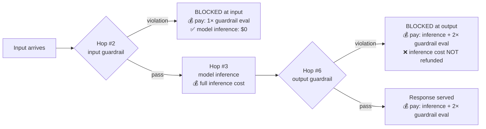

- Supports the full range of guardrail policies (more comprehensive than Gateway-level)

**Supported Safeguards:**

- Content Filters (hate, insults, sexual, violence, misconduct) [verified F3-1, TRUE, n=600, 2026-08-10: pooled detection above threshold 0.93 [0.907, 0.948]; F3-2, TRUE, n=110: benign false-positive rate 0.9% [0.16%, 5.0%]; F3-3, TRUE, n=60: 0 of 60 hard negatives triggered]
- Denied Topics (custom-defined) [verified F3-5, TRUE, n=120, 2026-08-10: in-topic detection 0.90 [0.80, 0.95] vs. off-topic false-positive 0.033 [0.009, 0.114], intervals disjoint]
- Word Filters (custom blocklists) [verified F3-6, TRUE, n=66, 2026-08-10: 0 of 66 listed terms missed]
- Sensitive Information Filters (PII detection/redaction) — **detection is not uniform across the documented entity types** [corrected per F3-4, FALSE, n=341 (11 per entity, 31 entity types), 2026-08-10]: 20 of 31 entity types were confirmed (recall CI lower bound above 0.5), but **9 documented entity types were refuted** — CA_HEALTH_NUMBER, CA_SOCIAL_INSURANCE_NUMBER, DRIVER_ID, LICENSE_PLATE, UK_NATIONAL_HEALTH_SERVICE_NUMBER, UK_UNIQUE_TAXPAYER_REFERENCE_NUMBER, US_BANK_ACCOUNT_NUMBER, US_BANK_ROUTING_NUMBER, US_PASSPORT_NUMBER each had a recall CI **upper** bound below 0.5 (DRIVER_ID detected 0/11, US_PASSPORT_NUMBER 2/11, US_BANK_ACCOUNT/ROUTING 3/11 each even under a laxer any-entity reading); PHONE and UK_NATIONAL_INSURANCE_NUMBER were inconclusive. Test the specific entity types you rely on rather than assuming documented = detected.
- Prompt Attack detection — **requires input tagging on InvokeModel**: with InvokeModel / InvokeModelWithResponseStream, prompt-attack filtering is ONLY applied to content wrapped in input tags ("If there are no tags, prompt attacks … will not be filtered"). Use a random `tagSuffix` per request to prevent tag-injection. **Converse/ConverseStream behave differently**: message content is evaluated by default with no tagging needed — but once you add ANY `guardContent` block, the guardrail evaluates ONLY the guarded blocks and skips the rest (scope-limiting, not enabling; system prompts are the opposite — never evaluated unless wrapped in `guardContent`). Whether the prompt-attack filter specifically runs on untagged Converse messages is not documented — verify with a red-team test before relying on it. [verified F5-6, TRUE, 4 arms × (60 attacks + 60 benign), us-east-1, 2026-08-11: untagged InvokeModel prompt-attack recall was 0 [0, 0.031] (n=120) — untagged input is indeed not scanned for prompt attacks, confirming the tagging requirement.]
- Contextual Grounding checks (see limits in Section 5.1) [verified F3-7, TRUE, n=120, 2026-08-10: ungrounded-response detection 0.933 [0.841, 0.974] vs. grounded false-positive 0.033 [0.009, 0.114], intervals disjoint]
- Automated Reasoning checks (detect mode only; English (US) only; available in 6 Regions) [detect-only and en-US-only verified F8-8, TRUE, SDK-surface probe on botocore 1.43.67, 2026-08-10]. **v1.3 correction — "no streaming support" is not supported by the API surface** [corrected per F1-14, FALSE, SDK-surface probe over 350 operations / 14,774 member paths, 2026-08-10]: `ConverseStream` accepts `guardrailConfig` and models 132 Automated-Reasoning assessment paths under `stream.metadata.trace.guardrail.*` — the same `GuardrailTraceAssessment` shape `Converse` carries — so a guardrail with an `automatedReasoningPolicyConfig` is attachable to the streaming operation and the streaming response has a slot for its assessment. (This is an API-model observation; live streaming AR behavior was not exercised.)

**Configuration Method:**

- Create a Guardrail resource in Amazon Bedrock Console or via API
- Obtain `guardrailIdentifier` and `guardrailVersion`
- Attach to model invocation in agent code

**Latency Impact:**

- For input evaluation, all configured policies are evaluated IN PARALLEL (officially documented: "the input is evaluated in parallel for each configured policy")
- Latency increases with the number of policies and input content length
- If blocked, model inference is skipped (net latency and cost saving for violating inputs)

**Best Practices:**

1. A single guardrail resource supports separate input vs. output settings — content filters have independent `inputStrength` / `outputStrength`, and sensitive-info entities have independent `inputAction` / `outputAction`. Prefer one resource with per-direction settings over maintaining two resources.
2. Avoid redundant policies — if Gateway Guardrails already handle prompt attacks, consider removing duplicate checks here (but note the Regional and tagging constraints above before relying on either layer alone)
3. Use the InvocationLatency CloudWatch metric under the **`AWS/Bedrock/Guardrails`** namespace to track ApplyGuardrail overhead. For guardrail overhead INSIDE a model invocation, CloudWatch has no direct metric — read the `invocationMetrics.guardrailProcessingLatency` field from the invocation trace/response instead.
4. For latency-sensitive applications, enable only essential policies at this layer and defer comprehensive checks to async evaluation
5. AWS periodically and automatically updates the underlying guardrail models ("Updates apply automatically and require no action on your part"). Maintain a regression test set and re-validate guardrail behavior on a schedule — past evaluation results do not guarantee future behavior.

Reference: <https://docs.aws.amazon.com/bedrock/latest/userguide/guardrails-how.html>

### 3.3 Checkpoint Hop #2-ALT: ApplyGuardrail API (For Non-Bedrock Models)

**Service:** Amazon Bedrock Runtime — ApplyGuardrail API

**What it does:**

- Provides the same guardrail evaluation as Hop #2 but as a standalone API call, decoupled from foundation models
- Suitable for third-party models, self-hosted models, or LiteLLM Gateway scenarios
- Customer controls when and how the API is called

**Configuration Method:**

```python
response = client.apply_guardrail(
    guardrailIdentifier="your-guardrail-id",
    guardrailVersion="1",
    source="INPUT",
    content=[{"text": {"text": user_prompt}}]
)
```

**Latency Impact:**

- Adds a full round-trip API call to Bedrock Runtime
- Consider batching content blocks for high-throughput workloads: passing multiple content items in a single ApplyGuardrail call reduces the number of round trips. (AWS publishes no specific speed-up figures; the related InvokeGuardrailChecks API documents a hard limit of 10 content blocks per message.)

**Best Practices:**

1. Caching guardrail decisions is high-risk and should be tightly constrained if used at all: AWS auto-updates the underlying models, and "similar" inputs can differ exactly in the attack payload. If you cache, restrict it to **exact-match inputs only, with a short TTL, and never for the prompt-attack category**. *(v1.3 note: the "guardrail evaluation is non-deterministic" premise was removed from this rationale — [corrected per F2-5, FALSE, n=300 identical ApplyGuardrail calls, 2026-08-10: all 300 responses were byte-identical in verdict and score; per-call flip rate bounded at ≈0.994%, one-sided 95%]. The measured reasons to constrain caching are AWS auto-updates and payload-sensitivity, which stand on their own.)*
2. Use content-array batching to reduce the number of API calls
3. Apply selective evaluation — not all inputs require full guardrail assessment. **But do not plan on input tagging to reduce text units billed:** v1.2's claim that tagging enables evaluating only the user-supplied portion of a RAG prompt, reducing text units billed, is refuted [corrected per F10-3, FALSE, run r20260813T145248Z, 2026-08-13: the API-reported text-unit count for a tagged evaluation of a RAG-shaped prompt was IDENTICAL to the untagged one]. Caveat: this reads the unit count the API reports; no invoice, Cost Explorer, or CUR figure was read.
4. Set timeouts and circuit breakers for the API call to prevent latency spikes from blocking the entire request. **Decide your failure posture explicitly**: AWS does not document fail-open vs. fail-closed behavior for Bedrock Guardrails errors during model invocation — your application owns this decision when calling ApplyGuardrail (fail-closed is the safe default for regulated workloads).

Reference: <https://docs.aws.amazon.com/bedrock/latest/userguide/guardrails-use-independent-api.html>

### 3.4 Guardrail Tiers and Language Support

Bedrock Guardrails offers two safeguard tiers with materially different coverage:

| | **Classic tier** | **Standard tier** |
|:---|:---|:---|
| Content filter / prompt attack languages | English, French, Spanish only | Dozens of languages, incl. Chinese (Simplified), Japanese, Korean, German, Hindi, Arabic, and more |
| Prompt leakage detection | Weak but measurable (v1.2 said "No") | Yes (strong) |
| Denied topic definition length | 200 chars (confirmed at boundary) | 1,000 chars — **not reproducible as documented; see correction below** |
| Cross-Region inference | Not used | **Required** (`crossRegionConfig` / guardrail profile) [verified F1-6, TRUE, us-east-1, 2026-08-10: STANDARD without `crossRegionConfig` was rejected on both tier-carrying blocks, STANDARD with it was accepted, both CLASSIC cells accepted without it — create-request validation only, in one Region and one account] |

**v1.3 corrections to this table:**

- **Prompt leakage detection is not Standard-exclusive** [corrected per F8-4, FALSE, n=460 (120 leakage + 110 benign per tier), 2026-08-10]: on the aggregate PROMPT_ATTACK signal, the Classic tier detected prompt leakage at recall 0.41 [0.32, 0.50] against a benign FPR of 0.036 [0.014, 0.090] — weak but real, not "No". The Standard tier detected it at recall 0.99 [0.95, 0.998] with FPR 0 [0, 0.034]. Standard remains the right choice where leakage detection matters; the v1.2 claim that Classic provides none is refuted.
- **The Standard tier's documented 1,000-char denied-topic limit did not hold** [corrected per F8-5, FALSE, boundary probes, 2026-08-10]: Classic accepted a 200-char definition and rejected 201 chars with `ValidationException` (boundary confirmed); Standard **rejected a 1,000-char definition with `ValidationException`** (the 1,001-char probe returned `ThrottlingException`, so the exact effective limit was not established). Do not plan on 1,000-char topic definitions without testing your own account.

Tier selection decision:

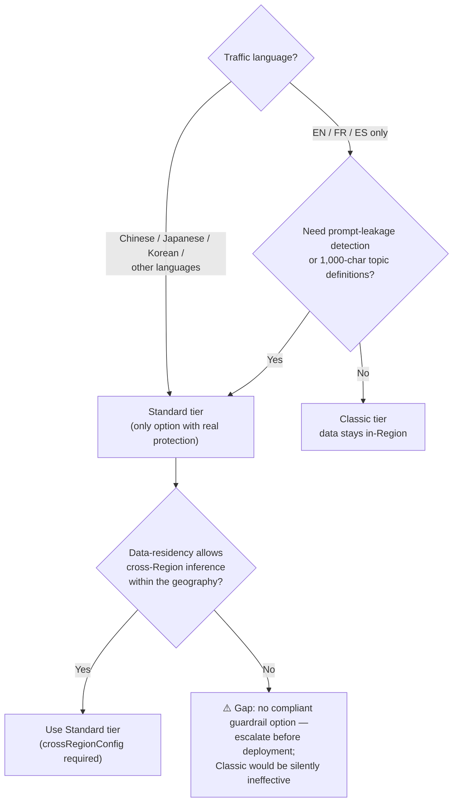

Key implications:

- Official warning: "Guardrails are ineffective with languages that aren't supported." A Classic-tier guardrail provides essentially no protection for Chinese/Japanese/Korean traffic. [verified F8-2, TRUE, n=240, 2026-08-10: Classic-tier detection on zh-TW/zh-CN/ja/ko attack content was 0 [0, 0.0175] (n=216) — statistically indistinguishable from the benign FPR — while EN/FR/ES detection was high. The failure is silent: no error, no signal that evaluation was inert.]
- Standard tier's mandatory cross-Region inference keeps data within the same geography (e.g., US requests stay in US Regions) at no extra cost, but "your input prompts and output results might move outside of your primary Region" — reconcile this with data-residency commitments and with the Guardrails-in-policy Regional constraint in Section 1. [in-geography claim verified F8-6, TRUE, n=60, 2026-08-10: all 60 trials on profile `us.guardrail.v1:0` disclosed processing Regions, all within the US geography, 0 out-of-geography]
- Word filters support English, French, and Spanish only, on either tier. *(Validation: case F8-7 returned INCONCLUSIVE; F1-26 ran (run r20260810T130945Z) and also returned INCONCLUSIVE — `CreateGuardrail` refused the non-EN/FR/ES word policy on BOTH tiers, but the supported-language-only control was refused too, so the refusal is not attributable to the non-EN/FR/ES words and a rejection of unknown cause establishes neither disjunct. Claim left as written.)*
- Automated Reasoning checks are English (US) only. [verified F8-8, TRUE, SDK-surface probe, 2026-08-10: no field on any of the 24 Automated-Reasoning operations can express a non-en-US language, and no DETECT/ENFORCE mode enum exists — detect-only]

References: <https://docs.aws.amazon.com/bedrock/latest/userguide/guardrails-supported-languages.html> and <https://docs.aws.amazon.com/bedrock/latest/userguide/guardrails-tiers.html>

## 4. Phase 2: DURING — Execution Control and Observability

(Hop #3 — model inference — is not a guardrail checkpoint; it appears in the latency budget in Section 6.1.)

### 4.1 Checkpoint Hop #4: Agent-to-Tool Authorization (Cedar Policy)

**Service:** Amazon Bedrock AgentCore Policy (Cedar-based)

**What it does:**

- Intercepts EVERY agent-to-tool request through the AgentCore Gateway
- Makes deterministic allow/deny decisions based on Cedar policy logic
- Immune to prompt injection — operates outside the model's reasoning

**Key Characteristics:**

- **Deterministic** (not probabilistic like guardrails) [Cedar determinism verified F2-1, TRUE, n=630, us-east-1, 2026-08-10: 0 of 630 repeated evaluations varied, ceiling 0.47% one-sided 95%. Note: the guardrail side of this contrast also showed no run-to-run variation at n=300 — see the §3.1 behavior-notes correction (F2-2/F2-5)]
- Default-deny: if no policy matches, the request is denied [verified F4-4, TRUE, n=120, us-east-1, 2026-08-10: 120/120 requests with no matching policy were denied; forbid-overrides-permit also verified F4-5, TRUE, n=120, same run]
- Evaluates tool-call level authorization (which tool, what parameters, under what conditions)
- Policy/guardrails apply to three gateway target types — MCP targets (`POST /mcp`, JSON-RPC `tools/call`), HTTP runtime targets (`POST /<target>/invocations`), and HTTP inference targets (`POST /inference/v1/messages` — **path corrected in v1.4**; v1.2 wrote `POST /inference`, which is the gateway's prefix and not the whole route, see the mechanism observations at the end of this section) — not MCP tools only *(Validation: case F1-15 ran (run r20260810T130945Z, 2026-08-14 UTC) and returned **INCONCLUSIVE** — the three-target-type claim is left exactly as v1.2 wrote it. Of the three types the sentence names, `mcp` and `inference` were both built and both **denied by policy** under one unconditional gateway-scoped `forbid`, each having been allowed without it; the third, `http.agentcoreRuntime`, cannot be constructed at this API version, so the sealed conjunction "all three" can be neither satisfied nor refuted. This is not FALSE: a target type that cannot carry a request cannot bypass evaluation of one, and nothing was observed bypassing anything. It is not TRUE either: two is not three, and reading "all three" as "all that exist" would decide a different quantity than the seal names. The corrected path above is an incidental wire detail in the same bullet rather than the claim's substance — the enumeration itself is untouched. See FINDING-F1-15.md.)*
- Fail-secure: evaluation timeouts result in automatic DENY *(Validation: the timeout mode this sentence claims is untestable from outside AWS — F9-1 excluded by its sealed oracle; claim left as written. The fail-secure label IS corroborated for the missing-permission mode specifically: with `bedrock:InvokeGuardrailChecks` removed from the gateway execution role, the engine denied both violating and benign requests — fail-CLOSED for that failure mode [F5-4b, RECORDED, us-east-1, run r20260810T130945Z]. F5-4b says nothing about the timeout mode.)*

**Latency Impact:**

- Cedar policy evaluation is deterministic and fast (formal logic, not ML inference)
- Minimal latency overhead compared to guardrail evaluation
- Spans are emitted for policy operations when tracing is enabled

**Best Practices:**

1. Use Cedar Policy for tool-level access control — it's faster and more reliable than guardrails for authorization decisions
2. Do NOT rely on guardrails alone for tool authorization — guardrails are probabilistic; Cedar is deterministic
3. Follow least-privilege principle: explicitly permit only required tool actions
4. Monitor policy evaluation latency via AgentCore Policy metrics in CloudWatch (Section 6.2)
5. Keep policy rules focused and minimal — overly complex policies add evaluation time
6. Use the two-level LOG_ONLY controls deliberately: the policy ENGINE has a `mode` (ENFORCE default / LOG_ONLY) and each POLICY has an `enforcementMode` (ACTIVE default / LOG_ONLY). **Engine mode takes precedence — an engine in LOG_ONLY blocks nothing, even if individual policies are ACTIVE.** Verify engine mode is ENFORCE before relying on any policy in production. [both levels verified: F4-2, TRUE, n=120, us-east-1, 2026-08-10 — engine in LOG_ONLY blocked 0 of 120 requests despite ACTIVE policies; F4-3, TRUE, n=120, same run — engine mode took precedence over per-policy `enforcementMode`; the mode enum LOG_ONLY|ENFORCE and per-policy `enforcementMode` API surface verified F1-5 and F1-1, TRUE, 2026-08-09/10]

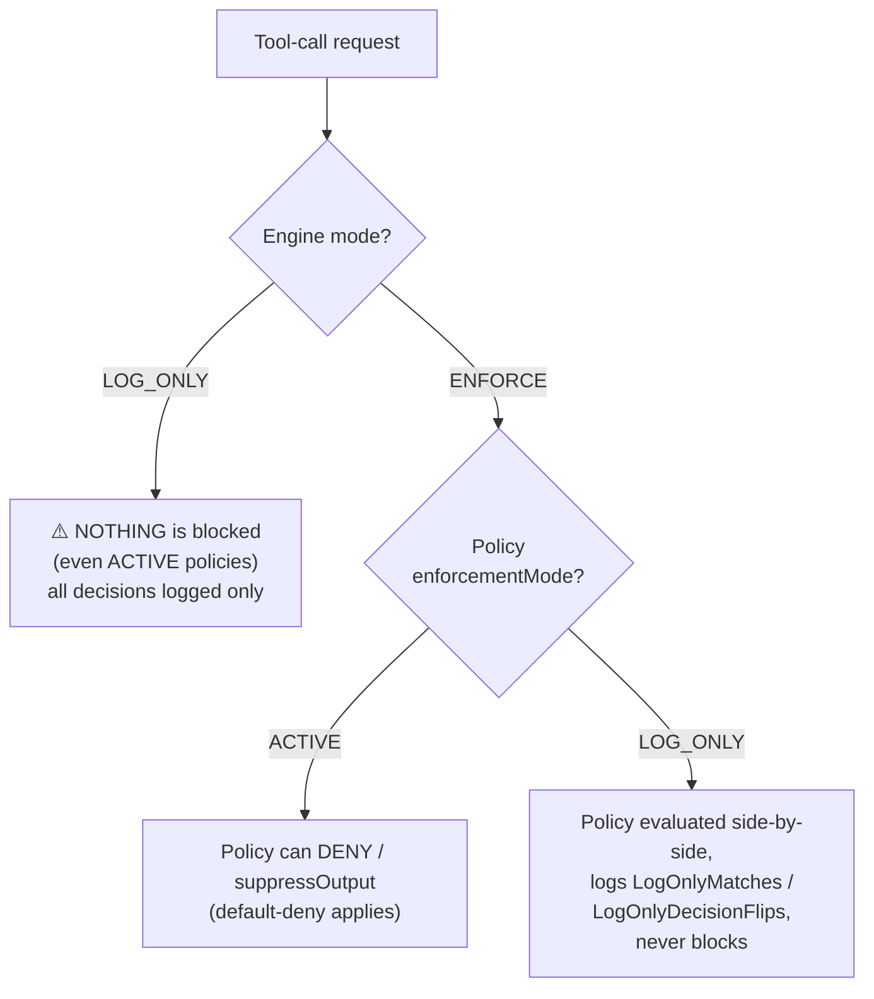

Reference: <https://docs.aws.amazon.com/bedrock-agentcore/latest/devguide/policy.html>

**Limitations of guardrails in policy:** (1) the guardrail *functions* score content with ML — they do not pattern-match — but v1.2's flat "no regex or pattern matching" is refuted as a statement about what you can author: the validator ACCEPTED Cedar's `like` operator (`context.input.text like "*jailbreak*"`) inside a `when guardrails {…}` block, terminal ACTIVE, four times, with the pattern-free control also ACTIVE, while a regex-shaped category literal (`["HATE.*"]`) was rejected synchronously against the five fixed categories [corrected per F1-25, FALSE, run r20260810T130945Z, us-east-1, **replicated across two UTC days, 2026-08-13 and 2026-08-14**: the day-2 round reproduced the `like` acceptance, the pattern-free control's acceptance and the regex-shaped category's rejection, arm for arm, on the same SDK and the same `validationMode`]. Whether an accepted `like` is ever **evaluated** — whether the glob filters anything at request time — is **untested** (every observation is `CreatePolicy` under LOG_ONLY), so keep regex-style checks in a Gateway REQUEST Lambda interceptor (see below): an accepted-but-unverified `like` is exactly the trap that advice avoids. (2) v1.2 said you cannot mix standard Cedar `when {…}` with `when guardrails {…}` — the authoring-time half of that is refuted: the validator ACCEPTED the mixed policy without warning or finding, terminal ACTIVE, four times, with both split controls ACTIVE [corrected per F1-24, FALSE, run r20260810T130945Z, us-east-1 — **replicated on 2026-08-14 UTC**, same as F1-25: the mixed policy and both splits reached ACTIVE again on the second calendar day]. The evaluation-time half — that the guardrails block **replaces** the standard condition — is **untested** here; if it holds as documented, acceptance is worse than the rejection v1.2 promised, because the business condition is silently discarded from a policy that reads like a conjunction. So split the conditions into two statements, because a mixed policy that is accepted is not a policy that works — the advice stands, and the validator will not enforce it for you. (3) a `when guardrails {…}` block must contain at least one guardrail definition.

> **Mechanism observations (v1.4, from the F1-15 run — INCONCLUSIVE, not a verdict; observed live in us-east-1 on 2026-08-14, one calendar day unless noted):** five results here are direct API-shape and wire observations rather than oracle outputs, so they are citable in their own right. None of them amends the three-target-type claim in **Key Characteristics** above, which stands exactly as v1.2 wrote it.
>
> 1. **`CreateGateway.protocolType` is an enum with exactly one member, `MCP`** (botocore 1.43.67), and `protocolConfiguration` correspondingly offers only the `mcp` union member. Because of that, `CreateGatewayTarget` refuses the entire `http` arm — not one variant of it — with `ValidationException: HTTP target configuration is not supported for gateways with MCP protocol type. Provide an MCP-compatible target configuration and retry the request.` **Consequence for a reader: guidance to create an HTTP runtime target is currently unfollowable** — there is no value that produces a non-MCP gateway, so there is no gateway on which an `http.*` target is accepted. This one is read from the pinned service model, which is immutable per SDK version, so it carries no calendar-replication caveat; re-check it when you move SDK versions, not when you move days.
> 2. **The inference surface's wire path is `POST /inference/v1/messages`.** `POST /inference` alone is refused with `{"success":false,"error":"Http operation is not supported for gateway protocol type MCP"}`, as is `/v1/messages` on its own. The real route is a composition: `inference.provider.operations[].path` is the **client-facing** path (`/v1/messages`), which the gateway serves beneath its own `/inference` prefix — so v1.2's path was the prefix mistaken for the whole route. Corrected in the bullet above as a path fact.
> 3. **`operations[].models` is load-bearing on an `inference.provider` target even though the API marks it optional.** A target declaring only `endpoint` is created, reaches READY, and is **unroutable**: every request returns `404 Model '<id>' not found on any target`, because a target advertising no models can never be selected by the routing layer. Declare `operations` with `models` or the target is inert while looking healthy.
> 4. **`operations[].models[].model` has pattern `[a-zA-Z0-9\-\._\*\?@]+(/[a-zA-Z0-9\-\._\*\?@]+)*`** — it admits `*`/`?` globs and **no colon at all**, so Bedrock's own canonical model ids (the `…-v1:0` form) cannot be spelled in that field. A colon-bearing id is rejected with `400 Model ID contains invalid characters`; colon-free ids and globs are accepted. Plan the glob (e.g. `anthropic.claude-*`) rather than the canonical id.
> 5. **A policy denial on the inference surface is HTTP 403**, body `{"error":{"type":"permission_error","message":"Request Denied: Gateway Target request not allowed due to policy enforcement [Policy evaluation denied due to <policyId>]"}}` — **not** the JSON-RPC `-32002` shape the MCP surface uses. **Any denial detection keyed only on `-32002` misses inference-surface denials entirely** (see §3.1 behavior notes, §6.4 and the §8 Phase 2 checklist). And on the MCP surface under the same forbid, `tools/list` **succeeded and returned an empty list** where the baseline advertised three tools: the engine filters tool discovery rather than failing the request, which is a third evaluation channel — one that raises no error for a client to catch.
>
> Scope: one gateway, one Region, one calendar day, and the policy behaviour behind items 2–5 is single-day. Under this repository's two-calendar-day reproduction rule that behaviour could not support a *positive* claim without a day-2 run; nothing here rests on one, because the verdict is INCONCLUSIVE and no claim moved. Full narrative and the near-miss FALSE it corrects: `results/FINDING-F1-15.md`.

> **Complementary control — Gateway Lambda interceptors:** in addition to Cedar policy, AgentCore Gateway supports REQUEST/RESPONSE Lambda interceptors that provide tool-level, operation-level, and parameter-level access control (JWT claims validation, RBAC/ABAC, response filtering/sanitization, per-user rate limiting). They run at the same gateway boundary as Hops #4/#5 and can implement checks Cedar cannot express (e.g., regex validation). Security note: with `passRequestHeaders` enabled, ALL headers — including OAuth bearer tokens — are forwarded to the customer Lambda; treat interceptor Lambdas as security-sensitive boundaries. (AgentCore Service Approval Accelerator v2.9, Gateway section.)

### 4.2 Checkpoint Hop #5: Tool Request/Response Guardrails

**Service:** AgentCore Gateway Policy — Guardrails on Tool I/O

**What it does:**

- Evaluates content in both tool requests (agent → tool) and tool responses (tool → agent). Request authorization uses the `permit` / `forbid` effects; tool-output filtering uses the `suppressOutput` effect — a distinct effect that evaluates an action's output after it completes and suppresses the output when a guardrail is violated.
- Same guardrail safeguards as Hop #1 but applied to tool communication
- Prevents sensitive data leakage through tool interactions

**Latency Impact:**

- Added for EACH tool invocation in the agent's execution loop
- For multi-step agents making N tool calls, this adds N × guardrail_evaluation_time — measured, the per-additional-tool-call cost was **≈850 ms** (bootstrap slope CI [838.7, 862.7] ms), far above v1.2's 165–750 ms estimate [corrected per F6-8, FALSE, n=600 usable of 1600, us-east-1, 2026-08-10; see §6.1]
- Most significant latency impact in complex agent workflows

**Best Practices:**

1. **Selectively apply guardrails per tool** — not all tools handle sensitive content; skip guardrails for trusted internal tools. **Do NOT skip them for tools returning external/untrusted content** (web search, browsing, third-party APIs): tool responses are the primary carrier of indirect prompt injection, and e.g. the Web Search Tool performs no malicious-content classification of results — AWS guidance is to apply guardrails before search results influence agent reasoning (Accelerator v2.9, Web Search section).
2. **Monitor per-tool-call latency** — use the `GuardrailLatency` metric with the ToolName dimension plus distributed tracing spans to identify which tool interactions are slowest
3. **Set guardrail thresholds appropriately per tool type** — a database query tool may need stricter PII filtering than a calculator tool
4. PII caveat revised: v1.2 stated that the Bedrock Guardrails sensitive-information filter does not detect PII inside `tool_use` parameters. **Measured, it did** [corrected per F1-28, FALSE, run r20260810T130945Z: identical EMAIL PII was handled on EVERY trial of the tool-block placement arm (`tool_result_json`) and of the message-text control — both placements are handled, so `tool_use` parameters are NOT a scanning blind spot for this entity]. Scope of the correction: only ONE entity type (EMAIL) of the 31 in `GuardrailPiiEntityType` was probed, the tool blocks were supplied by the caller rather than elicited from a model on the output side, and nothing was established about the regex half of `sensitiveInformationPolicyConfig`. So still do not treat Hop #5 as a complete PII barrier for structured tool arguments — §3.2's measured per-entity detection gaps apply here too — and validate structured parameters that must never pass with Cedar or interceptors.

> **Mechanism observation (v1.3, from the F5-5 run — INCONCLUSIVE, not a verdict):** the tool-response-guardrail advice above does not apply uniformly to arbitrary custom tools. A `when guardrails` policy referencing `context.output.text` could not be created against a custom echo tool: the probe policy settled `CREATE_FAILED` with the service reporting that the argument `context.output.text` "is not present in the context" of the target action — a provider's context field-path argument must be declared on every action the rule applies to [F5-5, run r20260810T130945Z; guards `probe_policy_became_active` and `echo_round_trip_observed` both false, so the case's sealed suppression question was never measured]. If a tool's action schema does not declare the output field, an output-side guardrail rule cannot even be attached to it.

Reference: <https://docs.aws.amazon.com/bedrock-agentcore/latest/devguide/policy-guardrails-getting-started.html>

### 4.3 Real-Time Observability (During Execution)

**Service:** Amazon Bedrock AgentCore Observability

**What it does:**

- Provides OpenTelemetry-compatible distributed tracing across ALL agent components
- Automatically captures: LLM inference calls, tool invocations, memory operations
- Publishes metrics, spans, and traces to Amazon CloudWatch

**Key Metrics (Auto-Generated):**

- Session count, latency, duration
- Token usage and error rates
- First-byte latency (time to first response token)
- Total duration (end-to-end processing time)

**Best Practices:**

1. Turn on tracing across EVERY agent component, not only the outer boundary — the trace must span the request end-to-end
2. Enable CloudWatch Transaction Search FIRST — it is a prerequisite for enabling tracing on the gateway
3. Use AWS Distro for Open Telemetry (ADOT) SDK for custom runtime metrics (`aws-opentelemetry-distro` >= 0.10.0; note the ADOT Collector is not supported for agent observability)
4. Instrument policy and guardrail operations with spans for hop-by-hop latency analysis; policy spans are written to the `aws/spans` log group, and gateway vended logs (which can include request/response bodies) correlate to spans via `trace_id`/`span_id` [verified F7-4, TRUE, n=20, us-east-1, 2026-08-10: 20/20 request IDs joined to policy spans in `aws/spans`, span name `AgentCore.Policy.AuthorizeAction`, first span queryable ≈50 s after the request; tracing-off control verified F7-5, TRUE, 2026-08-10: with tracing disabled, 0 spans appeared for the same traffic]

Reference: <https://docs.aws.amazon.com/bedrock-agentcore/latest/devguide/observability.html>

### 4.4 Non-Bypassable Per-Tool-Use Hooks (Agent Containment Pattern)

**Goal:** enforce a "hook" on EVERY tool use by the agent — analogous to PreToolUse/PostToolUse hooks in agent frameworks — such that the agent runtime **cannot skip, bypass, or disable the hook itself**, even if the model is prompt-injected or the agent code is compromised.

**Threat model:** the thing you are defending against is the agent itself — a model that has been manipulated (or is simply wrong) into attempting a harmful tool call, and agent code that could attempt to (a) call tools directly without going through the checkpoint, (b) exfiltrate over the network, or (c) use its own AWS credentials to weaken or remove the enforcement layer.

**The core principle: enforcement must live OUTSIDE the agent's execution environment.** Anything running inside the agent's process — framework callbacks, in-code validation, system-prompt instructions — is advisory only: the same code/model being contained can skip it. AgentCore's architecture provides an out-of-process enforcement point at the Gateway data plane, which the Accelerator describes explicitly: "Policies intercept all agent traffic at the gateway boundary and **cannot be bypassed by agents or malicious actors**" (Accelerator v2.9, Policy section). Cedar policy "operates outside the model's reasoning" and is therefore immune to prompt injection. [Bypass route #1 verified in the steady state: F5-1, TRUE, n=120, us-east-1, replicated 2026-08-11 and 2026-08-12 — with the shipped role configuration, 0 of 120 direct tool invocations bypassing the gateway executed (Wilson 99% [0, 0.0587]); a deliberate permission mutation inverted the result 20/20, proving the instrument. Note this falsifies five enumerated routes at specific points, not the universal "cannot be bypassed" quantifier, which no experiment can prove.]

**Hook mapping (framework concept → AgentCore primitive):**

| Framework hook concept | AgentCore primitive | Enforcement location |
|:---|:---|:---|
| PreToolUse hook (allow/deny before execution) | Cedar Policy `permit` / `forbid` (Hop #4) — deterministic, default-deny, parameter-level conditions | Gateway data plane (outside agent microVM) |
| PreToolUse content check | Guardrails-in-policy `when guardrails {...}` on tool requests (Hop #5) | Gateway data plane |
| PreToolUse custom logic (regex, external authz, per-user rate limits) | Gateway **REQUEST Lambda interceptor** | Gateway boundary, customer Lambda |
| PostToolUse output filter | `suppressOutput` effect — evaluates the action's output after completion and suppresses it on guardrail violation | Gateway data plane |
| PostToolUse transformation/sanitization | Gateway **RESPONSE Lambda interceptor** | Gateway boundary, customer Lambda |
| Hook audit trail | CloudTrail (policy CRUD + evaluation decisions) + Policy metrics/spans | Independent of agent |

**The five bypass routes and how to close each one:**

The hooks above only bind if every path AROUND them is closed. Each row is a way the agent could escape, and its closure:

| # | Bypass route | Closure |
|:--|:---|:---|
| 1 | **Agent calls the tool API directly, skipping the Gateway** | Give the agent runtime NO direct tool credentials: tools are reachable only as Gateway targets, and outbound credentials live in AgentCore Identity's Token Vault (vended per-call by the Gateway, never stored in the runtime). The runtime execution role must not carry IAM permissions for the tool's underlying APIs. |
| 2 | **Agent code makes arbitrary network calls (exfiltration / shadow tools)** | Network containment: run the Runtime in VPC mode with egress restricted to the Gateway endpoint (+ required AWS endpoints); Code Interpreter in Sandbox or VPC mode (Sandbox still allows DNS as a limited exfiltration channel — the Accelerator recommends Route 53 Resolver DNS Firewall or VPC mode for sensitive data). **Implementation details in Section 4.5.** |
| 3 | **Agent uses its execution-role credentials to disable the policy engine** | This is the critical one: any code in the session can read the execution role's credentials via the microVM metadata service (Accelerator: "any code executing within a tool session can access these credentials"). *(**Measured — amendment deferred:** F5-8, TRUE, us-east-1, run r20260810T130945Z, 2026-08-14 UTC. In **3 of 3** distinct tool sessions, `sts:GetCallerIdentity` called from inside the session returned **the runtime's own execution role** (HTTP 200 each time, each trial's request id recorded in the verdict record). The channel that carried it was the **instance metadata service** at `169.254.169.254` — IMDSv2 token issued, role listed, role credentials served — while the ECS link-local address `169.254.170.2` was unreachable, no AWS credential environment variables were set, no shared credentials file existed at any of the four probed paths, and `boto3` was not importable. The enumeration is eight mechanisms wide and every probed channel is recorded rather than summarised into a boolean, which is the record's own stated guard against a ninth channel nobody thought of. The runtime was the `codeConfiguration` arm of `agentRuntimeArtifact` (S3 zip, PYTHON_3_12, serverProtocol HTTP) with networkMode PUBLIC. **The Accelerator (NDA) citation above is retained unchanged in this draft, and the swap to this public evidence is deferred:** `PREREGISTRATION.yaml`'s `reproduction_before_amendment` rule amends no claim in this document on a single day's data, this measurement is one calendar day, and the day-2 replication is due 2026-08-15 UTC. The gate is procedural — nothing about the measurement is in doubt — and the citation swap is queued behind it, not weakened by it. **What the TRUE verdict does not prove**, from the case's own record: not that the credentials carry any particular permission (this role could read one S3 prefix and write logs — reachability says nothing about grants); not that a **CONTAINER**-based runtime behaves the same way, since only the `codeConfiguration` arm was measured and the container arm is an inference from the shared microVM contract rather than an observation; and not that the call was authorized — `sts:GetCallerIdentity` requires no IAM permission and the execution policy attached here deliberately omitted it, so the call proves the credentials **exist and STS accepts them**, not that a grant allowed it. No model was called, so it says nothing about what an agent's own reasoning would do with the credentials once it had them.)* Therefore the execution role must NOT include `bedrock-agentcore:UpdateGateway`, policy/policy-engine mutation actions, or interceptor management — because `UpdateGateway` can switch the engine to LOG_ONLY or detach it entirely, and **AWS documents no condition key protecting the mode field**. Least privilege here IS the anti-jailbreak control **for the steady state only — it is not an incident-response action** [verified in steady state and scoped by measurement: F5-1, TRUE, n=120, replicated 2026-08-11/12; F5-2, TRUE, n=120, replicated 2026-08-12/13, us-east-1]. Removing the grant does not close the path when `DeleteRolePolicy` returns, **and it does not close when you check and observe the denial either**: across four data-plane replicates, 32 of 80 invocations sent *after* a denial had been observed still executed, including 11 of 20 sent after three consecutive `AccessDeniedException` responses spanning 20 seconds. On the control plane, `UpdateGateway` was still authorized 325.0 s (2026-08-12) and 305.8 s (2026-08-13) after both grants were deleted and `ListRolePolicies` read back the shipped set — 6 of 15 and 7 of 10 probes accepted inside that window. The same eventual consistency misleads permissively: a freshly *granted* permission was still being denied 26 probes into a 300-second wait, then all 20 invocations sent immediately afterwards executed. **During containment, use a control that fails closed at the boundary being crossed** (disable the function, revoke the session, block at the gateway), with the IAM change as the durable fix behind it. Do not write a runbook of the form "remove the permission, confirm the deny, then proceed" — or its twin "grant it, confirm it works, then start" — and do not publish a wait-N-seconds number; the measurement supports none. |
| 4 | **Any principal in the account weakens enforcement (confused deputy, leaked creds)** | Account-level backstop: an SCP (or permission boundary) denying `UpdateGateway` / policy-engine mutations except from a designated break-glass admin role. This holds even if route #3's role hygiene regresses. |
| 5 | **Enforcement silently degrades (timeout, misconfig, LOG_ONLY left on)** | Fail-secure defaults do the first half: Cedar is default-deny and evaluation timeouts return automatic DENY. You own the second half: never run the engine in LOG_ONLY in production; alarm on CloudTrail `UpdateGateway`/policy-change events. **v1.3 correction — mode-filtered metric alarming is not a control you can rely on** [corrected per F9-2, TRUE, 200 `mcp:tools/call` requests and 308 `get_metric_statistics` reads, us-east-1, 2026-08-11 and 2026-08-12]: of the three mismatch metrics, only `MismatchErrors` carries `PolicyEnforcementMode` as a dimension at all, and it never emitted a LOG_ONLY-valued series — 12 of 40 reads pinned to `PolicyEnforcementMode=ACTIVE` returned the firing, while **all 20 reads pinned to `PolicyEnforcementMode=LOG_ONLY` and all 8 pinned to the LOG_ONLY twin's own policy ID returned nothing**, even though that twin held the byte-identical statement and was half of the disagreement being counted. The mismatch is attributed entirely to the ACTIVE side. Alarm on the CloudTrail call and on positive-signal evidence that the policy is evaluating (§6.2), not on a mode dimension. |

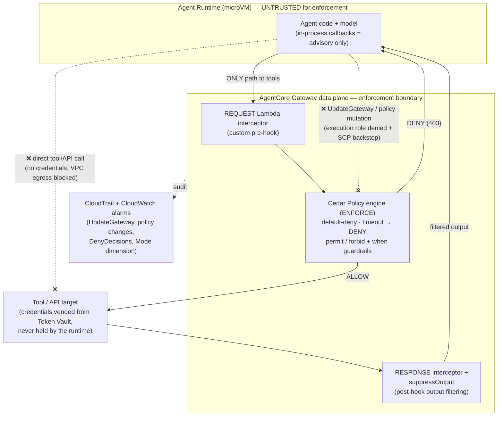

**What this pattern does NOT cover (be honest about the boundary):**

- Guardrail content checks inside the hook are still non-deterministic ML — only the Cedar `permit`/`forbid` layer is deterministic. Put anything that must never happen (tool allowlists, parameter bounds) in Cedar, not in a guardrail threshold. *(This advice stands on measured detection gaps rather than on run-to-run variation: guardrail recall was well below 1 for several PII entity types (F3-4, FALSE) and for PROMPT_LEAKAGE (F3-8, FALSE), while Cedar evaluation itself varied 0 of 630 times (F2-1, TRUE). See the §3.1 behavior-notes correction on non-determinism.)*
- Hooks fire on tool USE. Harm that requires no tool call (e.g., harmful text generation) is Hop #2/#6's job, not this pattern's.
- Interceptor Lambdas are themselves security-sensitive: with `passRequestHeaders` enabled they receive bearer tokens; scope their IAM roles and code review them like any other trusted component.

References: Accelerator v2.9 (Policy, Gateway, Built-in Tools sections); <https://docs.aws.amazon.com/bedrock-agentcore/latest/devguide/policy.html>; <https://docs.aws.amazon.com/bedrock-agentcore/latest/devguide/policy-enforcement-modes.html>

### 4.5 Network Containment (Implementing Bypass Route #2)

Section 4.4 closes bypass route #2 with one sentence — "restrict egress." This section makes that executable. Scope note: this covers only the network controls that serve **containment** (keeping the agent from going around the checkpoints). Connectivity design — private Gateway targets via VPC Lattice Resource Gateway, Direct Connect to on-premises, private IdPs, custom domains — belongs in a separate network-architecture document; see the Accelerator v2.9 Gateway and Identity sections for those.

> Source caveat: most facts in this section come from the Accelerator v2.9 (NDA document); public AWS documentation covers AgentCore network modes only sparsely. Before external distribution, downgrade these citations to "confirm with your AWS account team."

#### 4.5.1 Runtime egress lockdown

Run the Agent Runtime in **VPC mode** and restrict outbound traffic to only:

- The AgentCore Gateway endpoint (the ONLY path to tools — this is what makes the Hop #4/#5 checkpoints unavoidable)
- Required AWS service endpoints: Bedrock model endpoints (Hop #2/#3/#6), STS, CloudWatch Logs, X-Ray
- Session storage: VPC-mode Runtime needs outbound S3 — scope it with an S3 Gateway endpoint policy conditioned on `aws:PrincipalServiceName = bedrock-agentcore.amazonaws.com` (Accelerator, Runtime section)

Everything else — 0.0.0.0/0, arbitrary DNS-resolvable hosts — should be unreachable. An agent that cannot reach anything but the Gateway cannot exfiltrate or call shadow tools, regardless of what the model decides.

#### 4.5.2 Code Interpreter: the three network modes

The Code Interpreter is where the agent executes **arbitrary generated code** — the highest-risk network position in the architecture. It has three modes (Accelerator, Built-in Tools section):

| Mode | Reachability | Containment verdict |
|:---|:---|:---|
| **Public** | Unrestricted internet | Dev/test only — a prompt-injected agent can exfiltrate freely |
| **Sandbox** | S3 + DNS only | Better, but **DNS is a real exfiltration channel** — the Accelerator's own words: "DNS queries represent a limited data channel — organizations processing sensitive data should evaluate whether VPC Mode provides a stronger security boundary." Mitigate with Route 53 Resolver DNS Firewall |
| **VPC** | Only what your subnets/SGs allow | Strongest boundary. ENIs created via the `AWSServiceRoleForBedrockAgentCoreNetwork` service-linked role; required endpoints: ECR, S3, CloudWatch Logs; DNS Firewall still recommended against DNS exfiltration |

#### 4.5.3 PrivateLink coverage matrix

If your environment mandates PrivateLink for all traffic, check coverage BEFORE designing the closed loop — verify against the live AWS table, because this matrix has already moved (Accelerator, Service Controls table; corrections below):

| Primitive (see header note) | Data plane | Control plane |
|:---|:---:|:---:|
| Runtime, Memory, Built-in Tools, Identity, Gateway, Policy | ✅ | ✅ |
| Evaluations | **AWS documents Supported as of 2026-08-09/10** (v1.2 said ❌) | ✅ |
| **Optimization** | **AWS documents Supported as of 2026-08-09/10** (v1.2 said ❌) | **AWS documents Supported as of 2026-08-09/10** (v1.2 said ❌) |

**v1.3 corrections to this matrix** [corrected per F5-7a, FALSE, two instruments — `ec2:DescribeVpcEndpointServices` across 8 Regions plus the live AWS documentation page and 8 Internet Archive snapshots — replicated 2026-08-09 and 2026-08-10, 75 fields compared with 0 disagreements]:

- Five dated archive snapshots (2026-04-12 → 2026-07-14) agree with v1.2 (`Evaluations · Not yet supported`), and the **live page on both 2026-08-09 and 2026-08-10 reads `Evaluations and Optimizations · Supported · Supported`**. For Evaluations this is a *change* in AWS behaviour/documentation; for Optimization the v1.2 claim is refuted with the change date **undetermined**, because the archived pages were silent about Optimization rather than contradicting it. The corrected cells state what AWS **documents**, dated — not that support is functionally present, which no read-only instrument establishes. That was case F5-7b, which **has now run and returned INCONCLUSIVE** (2026-08-14, us-east-1): functional support is still unmeasured, but not for want of an attempt — the case's own invoke channel returned a client-side socket timeout on all three arms and never observed an image pull either way, so the run measured the instrument rather than the platform. See `results/FINDING-F5-7B.md`. Treat these cells as documentation facts, not as functional confirmation.
- **Header corrected from "Service" to "Primitive":** the rows name AgentCore primitives, while PrivateLink attaches to *endpoint services*, and the mapping is many-to-one — three endpoint services span the six tabulated primitives. Instrument limitation recorded as one: those three endpoint services exist in 8 Regions, including Regions this document lists as unsupported, which is evidence about endpoint-service existence and not about feature availability.

Two policy caveats: (a) VPC endpoint policies restrict by IAM principal only — **OAuth-authenticated callers require Principal `*`** in the endpoint policy (constrain them via the resource/action instead); (b) the Gateway has a **third, separate** PrivateLink endpoint distinct from the data/control planes [verified F5-7a, same run: the third Gateway endpoint service was confirmed present].

#### 4.5.4 Two known traps

1. **VPC Lattice Resource Gateway ≠ PrivateLink endpoint.** The Resource Gateway is an ENI in your subnets for private **egress** to VPC targets; the PrivateLink VPC endpoint is for **ingress** to AgentCore. The Accelerator warns explicitly: "Customers should not conflate these two constructs." Mixing them up produces security groups that block the wrong direction.
2. **Harness VPC mode must allow `public.ecr.aws`.** Session images are pulled from ECR Public, which has **no VPC endpoint** — VPC-mode deployments need an outbound route to it (typically NAT gateway + internet gateway), or sessions fail to start with image-pull timeouts. This is a mandatory hole in an otherwise-closed egress policy; scope it to the ECR Public IP ranges/domain rather than opening 0.0.0.0/0.

#### 4.5.5 Enforcing VPC deployment via IAM (containment, not connectivity)

Network mode is itself a configuration an agent-deploying principal could weaken. Mandate VPC-connected deployments at the IAM layer with condition keys (Accelerator, Runtime section): `aws:SourceVpc` / `aws:SourceVpce` / `aws:SourceIp` on invocation, and `bedrock-agentcore:subnets` / `bedrock-agentcore:securityGroups` on deployment — so a runtime simply cannot be created outside the contained network. This is the same control family as bypass route #4's SCP backstop: it survives even if an individual role's hygiene regresses.

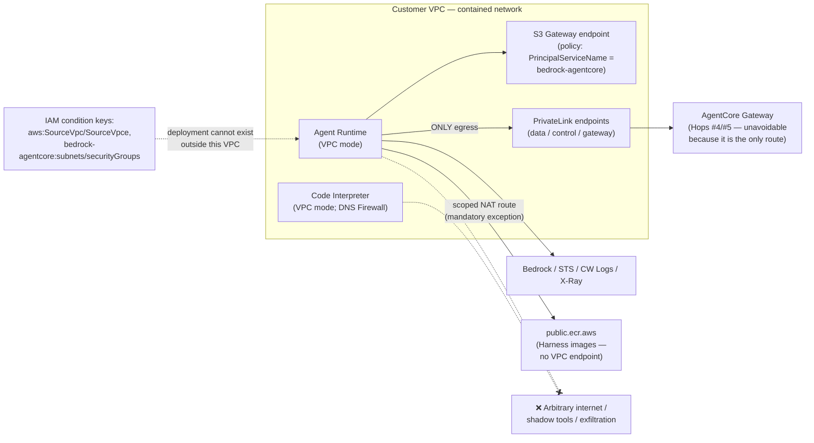

References: Accelerator v2.9 (Runtime, Built-in Tools, Gateway, Service Controls sections); <https://docs.aws.amazon.com/bedrock-agentcore/latest/devguide/vpc.html> (VPC and AWS PrivateLink); <https://docs.aws.amazon.com/bedrock-agentcore/latest/devguide/agentcore-vpc.html> (Runtime and built-in tools VPC configuration); <https://docs.aws.amazon.com/bedrock-agentcore/latest/devguide/security-vpc-condition.html> (VPC condition keys)

## 5. Phase 3: AFTER — Output Safety and Continuous Improvement

### 5.1 Checkpoint Hop #6: Bedrock Guardrails — Output Evaluation

**Service:** Amazon Bedrock Guardrails (attached to model invocation)

**What it does:**

- Evaluates the model's generated response AFTER inference
- Can apply the same guardrail policies as input evaluation, or different output-specific settings within the same guardrail resource (see Best Practice #2 below)
- Blocks the response before it reaches the user if violations are detected
- Note: reasoning/chain-of-thought content blocks are excluded from guardrail evaluation *(Validation: case F1-27 ran (run r20260810T130945Z) and returned INCONCLUSIVE — no placement arm was accepted by the service: both the `reasoning_user` and `reasoning_assistant` arms returned `ValidationException`, and a request the service refused is not a request whose content went un-evaluated. Claim left as written.)*

**Latency Impact:**

- Adds post-inference evaluation latency before the user sees the response
- For streaming responses, behavior depends on the streaming mode (see Best Practice #1)
- AWS documents parallel policy evaluation explicitly for INPUT evaluation; no equivalent statement exists for output — measure output-side overhead yourself via `guardrailProcessingLatency`

**Best Practices:**

1. For streaming, choose the official mode deliberately: **synchronous** (default) buffers and scans each chunk before sending — better accuracy, added latency; **asynchronous** (`streamProcessingMode: ASYNCHRONOUS`) sends chunks immediately and scans in the background — lower latency, but inappropriate content may reach the user before blocking kicks in, and **sensitive-information masking is NOT supported in asynchronous mode**. Use asynchronous only where that leakage window is acceptable.

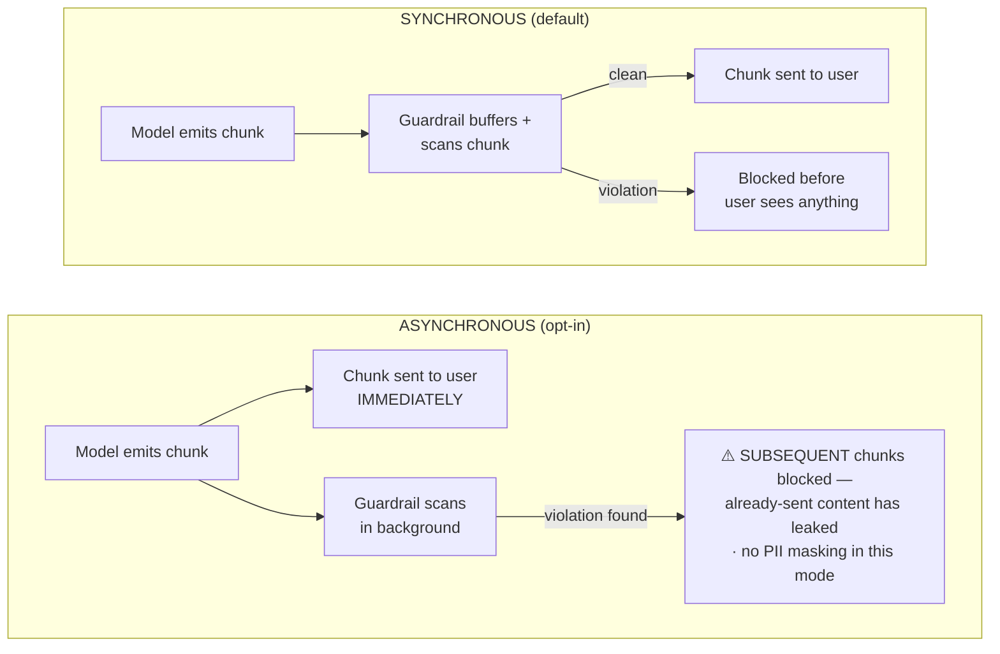

Trade-off in one line: synchronous = accuracy first (adds latency); asynchronous = latency first (accepts a leakage window and loses masking).
2. Configure output-specific settings (`outputStrength`, `outputAction`) within your guardrail resource if output needs different policies than input
3. Monitor InvocationLatency (`AWS/Bedrock/Guardrails` namespace, GuardrailContentSource = Output dimension) separately for output evaluation
4. Consider Automated Reasoning checks for hallucination detection on critical outputs (note: detect mode only — the app must handle findings; English (US) only) [detect-only and en-US verified F8-8, TRUE, 2026-08-10]. **The "no streaming support" caveat is withdrawn** [corrected per F1-14, FALSE, SDK-surface probe, 2026-08-10]: `ConverseStream` accepts `guardrailConfig` and models Automated-Reasoning assessment paths in its stream metadata — see §3.2.
5. Contextual Grounding limits to plan around: max 100,000 characters grounding source, 1,000 characters query, 5,000 characters response; *(Validation: case F1-13, which probes these three limits, returned INCONCLUSIVE — limits left exactly as v1.2 states them.)* supported for summarization/paraphrasing/QA — conversational chatbot QA is NOT supported; in streaming, an irrelevant response may only be flagged after it has fully streamed
6. PII masking caveats: masked PII still appears UNMASKED in model invocation logs (CloudWatch `input` field) and in the guardrail trace `match` field — scope log access and retention accordingly

References: <https://docs.aws.amazon.com/bedrock/latest/userguide/guardrails-how.html> and <https://docs.aws.amazon.com/bedrock/latest/userguide/guardrails-streaming.html>

### 5.2 Continuous Evaluation (Post-Serving)

**Service:** Amazon Bedrock AgentCore Evaluations

**What it does:**

Provides automated assessment of agent performance quality, in three modes:

- **On-demand:** directly analyzes a chosen set of spans (development / spot checks)
- **Batch:** runs evaluators against multiple agent sessions in a single asynchronous job
- **Online:** continuously samples and evaluates LIVE production interactions (percentage-based sampling, e.g. 10%) without manual triggers

[All three modes verified F1-23, TRUE, API-surface probe over 350 operations, 2026-08-10: on-demand, batch (`StartBatchEvaluation` and siblings), and online modes are each present on `bedrock-agentcore`.]

Detects quality drops over time.

**Best Practices:**

1. Enable online evaluation in production to continuously monitor quality
2. Define custom evaluators aligned with your business metrics (not just safety — also correctness, helpfulness)
3. Set CloudWatch alarms on evaluation score thresholds to detect regressions early
4. Use evaluation results as input to the optimization feedback loop
5. Data-residency note: built-in evaluators run on service-owned Bedrock credentials using Geo Cross-Region Inference (CRIS), routing model invocations across Regions within the geography; custom LLM-judge evaluators invoke YOUR designated Bedrock model in your own account (you retain billing, quota, and Region control). Quotas as of the devguide snapshot at writing time (2026-08): up to 1,000 evaluation configurations per Region per account; up to 1M input+output tokens/minute for large Regions — quota values change frequently; verify current values in the Service Quotas console before capacity planning.

Reference: <https://docs.aws.amazon.com/bedrock-agentcore/latest/devguide/evaluations.html>

### 5.3 Optimization Feedback Loop

**Service:** Amazon Bedrock AgentCore Optimization

**What it does:**

- Analyzes production traces and evaluation outputs
- Generates optimized system prompts or tool descriptions (Recommendations)
- Validates improvements offline using batch evaluations (an AgentCore Evaluations capability)
- Confirms improvements with A/B testing on live traffic (online)

**Capabilities (per official documentation):**

1. **Recommendations** — AI-generated improvements to system prompts and tool descriptions based on real agent traces; explains what changed and why
2. **Configuration Bundles** — versioned, immutable snapshots of agent configuration; the unit of deployment and rollback for optimization changes
3. **A/B Testing** — controlled traffic splitting between two variants through AgentCore Gateway; online evaluation scores each session; reports statistical significance (p < 0.05; traffic split is sticky by runtime session ID; variants injected via W3C baggage headers)

[The three-capability decomposition is verified F1-22, TRUE, API-surface probe, 2026-08-10: Recommendations, Configuration Bundles, and A/B Testing (`CreateABTest` and siblings) are each present, and Batch Evaluation carries no Optimization root — it belongs to Evaluations, as v1.2 states.]

**Best Practices:**

1. Run recommendations targeting the specific evaluator metric that degraded
2. Always validate with batch evaluation before promoting to A/B test
3. Require statistical significance in A/B tests before full rollout
4. Use Configuration Bundles for version control of system prompts and tool descriptions; restrict `UpdateConfigurationBundle` / `DeployConfigurationBundle` IAM permissions to principals authorized to change agent behavior
5. Document each optimization cycle for audit trail
6. Private-network deployments: **AWS's live documentation marks both Optimization and Evaluations as PrivateLink-Supported on data and control planes as of 2026-08-09/10** [corrected per F5-7a, FALSE, replicated 2026-08-09 and 2026-08-10 — v1.2 stated, from Accelerator v2.9, that Optimization had no PrivateLink support and Evaluations control-plane only; five archive snapshots from 2026-04-12 → 2026-07-14 agree with v1.2, so this is a documented change for Evaluations and a refutation with undetermined change date for Optimization]. Verify the live AWS table for your Regions before designing, and note that documented support is not the same as measured functional support — that remains unmeasured. Case F5-7b **ran on 2026-08-14 and returned INCONCLUSIVE**: it is attempted-and-not-measured rather than not attempted, because the only channel that could have observed an image pull returned a fixed client-side timeout on every arm (`results/FINDING-F5-7B.md`). If your environment mandates PrivateLink for all traffic, confirm current coverage rather than planning around the v1.2 gap.

Reference: <https://docs.aws.amazon.com/bedrock-agentcore/latest/devguide/optimization.html>

## 6. Hop-by-Hop Latency Monitoring Design

### 6.1 Latency Budget Breakdown

The following table shows the latency checkpoints in a typical agent invocation. **In v1.3 the per-hop figures are MEASURED, not illustrative** — v1.2's illustrative ranges were refuted at five of six hops.

> **Measurement basis (replaces v1.2's disclaimer):** the ranges below are measured p50/p90/p99 with distribution-free order-statistic confidence intervals at **n=1000 paired, interleaved observations per hop**, in **us-east-1** on **2026-08-10** (run `r20260810T130945Z`), against one gateway, one policy engine, and one model. They are **not** published or guaranteed by AWS and they are not a portable SLA: latency varies by Region, model, content length, number of policies, and traffic conditions, and these numbers describe one account's measurement on one day. Measure your own baselines using the CloudWatch metrics and spans in Section 6.2 — but calibrate expectations against measured values rather than v1.2's estimates, which ran low.

| **Hop #** | **Checkpoint** | **Service** | **Measured latency (p50 / p90 / p99)** | **v1.2 estimate** | **Monitoring Metric** |
|:---|:---|:---|:---|:---|:---|
| 1 | Gateway Guardrail (Input) | AgentCore Gateway Policy | **401 / 528 / 779 ms** (p50 CI [396, 406]) | 50–200ms — **refuted** | Gateway Latency + GuardrailLatency (`AWS/Bedrock-AgentCore`) |
| 2 | Bedrock Guardrail (Input) | Bedrock Guardrails | **231 / 374 / 622 ms** (p50 CI [226, 235]) | 100–500ms — **refuted** (p99 above band) | InvocationLatency (`AWS/Bedrock/Guardrails` namespace) |
| 3 | Model Inference | Bedrock Runtime | 500ms–30s *(not separately re-measured; carried from v1.2)* | 500ms–30s | InvocationLatency (`AWS/Bedrock` namespace, model-specific) |
| 4 | Tool Auth (Cedar Policy) | AgentCore Policy | **55 / 70 / 94 ms** (p50 CI [54, 56]) | 5–50ms — **refuted** | Policy invocation spans |
| 5 | Tool Guardrails (per call) | AgentCore Gateway Policy | **401 / 528 / 779 ms × N calls** (p50 CI [396, 406]) | 50–200ms × N — **refuted** | GuardrailLatency (ToolName dimension) |
| 6 | Bedrock Guardrail (Output) | Bedrock Guardrails | **234 / 366 / 662 ms** (p50 CI [228, 238]) | 100–500ms — **refuted** (p99 above band) | guardrailProcessingLatency (invocation trace) |
| — | **Total (single tool call)** | — | **1483 / 1722 / 2107 ms** (p50 CI [1474, 1491]) | ~800ms–31s+ — **confirmed** | End-to-end trace duration |

Per-hop citations: [corrected per F6-1, FALSE, n=1000, us-east-1, 2026-08-10 — Hop #1 p50 401 ms, ≈2× the top of the 50–200 ms band]; [corrected per F6-2, FALSE, n=1000 — Hop #2 p50 inside the band but p99 622 ms above it]; [corrected per F6-3, FALSE, n=1000 — Hop #4 p50 55 ms, band 5–50 ms]; [corrected per F6-4, FALSE, n=1000 — Hop #5 p50 401 ms per call]; [corrected per F6-5, FALSE, n=1000 — Hop #6 p50 234 ms, p99 662 ms above the band]; [verified F6-6, TRUE, n=1000 — end-to-end p50 1483 ms falls inside ~800ms–31s+; note the document's upper bound is open-ended, so only its floor was falsifiable]. Hop #3 was not given its own measured row: no case re-measured model inference in isolation, so its v1.2 range stands unamended.

**Hop additivity holds** [verified F6-7, TRUE, n=1600, us-east-1, 2026-08-10]: the residual in `Duration_gw = GuardrailLatency + TargetExecutionTime + ε` was significantly **positive** (95% CI [258.8, 273.0] ms), not negative — so the hops do not overlap and the per-hop decomposition underlying §6.1, §6.3 and §6.4 is sound. The positive residual means there is ≈260–273 ms of gateway time the two component metrics do not account for; budget for it.

Note: For agents making multiple tool calls (e.g., 3–5 calls), Hop #4 and #5 repeat for each call, adding **≈850 ms per additional tool invocation** (bootstrap slope 95% CI [838.7, 862.7] ms) [corrected per F6-8, FALSE, n=600 usable of 1600 attempted, us-east-1, 2026-08-10 — v1.2 said 165–750 ms; the measured interval is disjoint from and above it].

### 6.2 CloudWatch Metrics for Hop-by-Hop Monitoring

#### AgentCore Gateway Metrics

All gateway metrics are published under the `AWS/Bedrock-AgentCore` namespace and are batched at 1-minute intervals. (Note: FirstByteLatency is not a valid gateway metric name; use Latency.) [verified F7-2, TRUE, us-east-1, 2026-08-10: all 7 documented gateway metrics were published in that namespace, 0 absent; 1-minute batching verified F7-7, TRUE, n=45 datapoints, same run — every datapoint landed exactly on the 60-second grid with 0 s maximum offset]

| **Metric** | **Description** | **Use** |
|:---|:---|:---|
| **Latency** | Initial response time — time from request received to first response token | Measures gateway processing incl. guardrail/policy evaluation |
| **Duration** | Total end-to-end processing time | Overall gateway hop latency |
| **Invocations** | Total number of requests made to the Data Plane API | Volume tracking |
| TargetExecutionTime | Time to execute the target (Lambda/OpenAPI/etc.) | Isolates target contribution to total Latency |
| Throttles | Requests throttled (HTTP 429) | Capacity planning |
| SystemErrors | Requests failed with 5xx | Availability monitoring |
| UserErrors | Requests failed with 4xx (except 429) | Client error monitoring |

#### AgentCore Policy Metrics

Published by default under `AWS/Bedrock-AgentCore`, with dimensions including ToolName, Category, Filter, Mode, and PolicyEnforcementMode. **v1.3: 3 of the 13 metrics this section names were measured absent** [corrected per F7-1, FALSE, us-east-1, 2026-08-10 — 13 of the 15 documented policy metrics had their publishing condition actually created by this project's traffic; of those, 10 published and **`ConfidenceScore`, `ConfidenceThreshold`, and `TemporalLatency` produced no datapoints at all**. `SuppressOutputs` and `LogOnlyEvalIncomplete` are the 2 excluded from the count — their publishing conditions were never exercised, so they remain untested rather than confirmed absent]. Key metrics for guardrails-in-policy, with measured publication status:

| **Metric** | **Description** | **Use** |
|:---|:---|:---|
| **GuardrailLatency** | Time spent in guardrail evaluation within policy | Hop #1/#5 latency isolation. **Published** [F7-1, TRUE for this metric] |
| **ConfidenceScore / ConfidenceThreshold** | Documented as observed score vs. configured threshold per evaluation | ⚠️ **Measured ABSENT — neither metric published any datapoint** [corrected per F7-1, FALSE, 2026-08-10] on traffic that produced scores. **Do not point threshold calibration here.** For calibration, read the score out of the application logs at `body.policy.guardrailFindings.<policyId>.contentFilter[].score` — and note it is a **JSON string with four fixed decimals** (e.g. `"0.8000"`), so it needs a cast before any numeric comparison [corrected per F3-10, FALSE, 3 arms / 1,491 evidence records, us-east-1, 2026-08-12; see §7.1] |
| **AllowDecisions / DenyDecisions** | Authorization outcomes | Rejection-rate tracking. **Both published** [F7-1, 2026-08-10] |
| **SuppressOutputs** | Tool outputs suppressed by suppressOutput effect | Hop #5 filtering rate. *(Publishing condition never exercised by the validation — untested, not confirmed absent.)* |
| **LogOnlyMatches / LogOnlyDecisionFlips / LogOnlyEvalIncomplete** | LOG_ONLY policy would-be matches, decision changes vs. ACTIVE policies, and incomplete evaluations | `LogOnlyMatches` and `LogOnlyDecisionFlips` **published** [F7-1, 2026-08-10]. ⚠️ **A sustained zero `LogOnlyDecisionFlips` is NOT sufficient as a safe-promotion signal** — zero is produced both by "the shadow policy agrees with production" and by "the shadow policy never evaluated at all", and §7.1 assigned one meaning to both. Gate promotion on a **positive** signal first: `LogOnlyMatches > 0` on traffic the policy is supposed to match, and/or a per-request application-log record of the shadow evaluation [F3-10 joined 122 of 122 labelled requests to a logged evaluation with 0 unmatched, 2026-08-12]. `LogOnlyEvalIncomplete` **published no datapoints and lists 0 dimension combinations in this account** — including across a window in which a LOG_ONLY policy that could not evaluate served 20 requests, the exact condition the metric is named for, while its two sibling metrics listed 14 dimension combinations each in the same query, re-confirmed 77 minutes later across a UTC day boundary [F7-1, 2026-08-10, `name_in_namespace_inventory: false`; supplementary CloudWatch read 2026-08-11/12; F9-2's independent recount found 0 positive datapoints in all 40 `get_metric_statistics` reads of it, 2026-08-13]. An alarm on it sits in `INSUFFICIENT_DATA` — if you keep it, configure missing data as breaching or it is decoration. |
| **MismatchErrors / TotalMismatchedPolicies / PolicyMismatch** | Guardrail evaluations that failed due to missing attributes or type mismatches | **These do fire** [verified F9-2, TRUE, 200 requests / 308 metric reads, us-east-1, 2026-08-11 and 2026-08-12: `MismatchErrors` and `PolicyMismatch` each fired twice, each firing over a measured zero baseline]. Two v1.3 corrections to how to read them. **(1) The consequence depends on mode, and in ACTIVE it is inverted:** the unevaluable policy protected 20/20 requests *by denying all of them*, so "may not be protecting you" describes an **availability incident**, not an exposure; in LOG_ONLY, where the exposure is real, all three metrics stayed at zero. **(2) The magnitudes are not request counts.** Over 20 requests, `MismatchErrors` summed to 120 (6 dimension combinations × 20), `TotalMismatchedPolicies` to 80 and `PolicyMismatch` to 40 — a cross-dimension sum, which is the CloudWatch console default, reads **6× the request count**. The multiplier is not stable either: the combination count grew 8 → 16 → 20 for `MismatchErrors` and 4 → 6 → 8 for `PolicyMismatch` across two days, because every broken policy leaves its own `Policy`-dimensioned series behind. Alarm on `SampleCount` at one **pinned** dimension combination, not `Sum` across all of them. |
| Policy spans (`aws/spans` log group) | Per-operation evaluation detail (AuthorizeAction etc.) | Trace-level hop analysis. **Confirmed** [verified F7-4, TRUE, n=20, 2026-08-10: 20/20 requests joined to an `AgentCore.Policy.AuthorizeAction` span; first span queryable ≈50 s after the request, so spans are not a real-time surface] |

This table is not exhaustive — additional metrics (DeterminingPolicies, NoDeterminingPolicies, TemporalLatency, and others) are documented at <https://docs.aws.amazon.com/bedrock-agentcore/latest/devguide/observability-policy-metrics.html>. Of these three, `DeterminingPolicies` and `NoDeterminingPolicies` **published**; **`TemporalLatency` did not**, on traffic that carried a temporal policy-session header on every request [corrected per F7-1, FALSE, us-east-1, 2026-08-10].

Note on terminology: the value surfaced as ConfidenceScore is called a *severity score* for content filters and prompt attacks, and a *confidence score* for sensitive-information filters.

#### Bedrock Guardrails Metrics

Namespace: **`AWS/Bedrock/Guardrails`** (not `AWS/Bedrock` — that namespace holds model runtime metrics). Dimensions include Operation, GuardrailArn/GuardrailVersion, GuardrailContentSource (Input/Output), and GuardrailPolicyType. [verified F7-3, TRUE, us-east-1, 2026-08-10: 5 of 7 documented metrics in this namespace published with 0 absent; 2 metrics were excluded because their publishing condition was not exercised — untested rather than confirmed]

| **Metric** | **Description** | **Use** |
|:---|:---|:---|
| **Invocations** | Number of guardrail API requests | Volume tracking |
| **InvocationLatency** | Latency of guardrail evaluation (ApplyGuardrail operation) | Guardrail overhead for standalone calls |
| **InvocationsIntervened** | Invocations where the guardrail took action | Block/mask rate |
| **TextUnitCount** | Text units processed | Cost tracking (billing is per text unit) [verified F10-2, TRUE, 27 comparable observations across 9 content lengths, 2026-08-10: the per-text-unit relationship held at every length, 0 disagreements] |
| **InvocationClientErrors** | Client-side errors | Error rate monitoring |
| **InvocationServerErrors** | Server-side errors | Availability monitoring |
| **InvocationThrottles** | Throttled requests | Capacity planning |

For guardrail overhead inside a model invocation (Converse/InvokeModel with `guardrailConfiguration`), use the `invocationMetrics.guardrailProcessingLatency` field from the invocation trace — there is no CloudWatch metric for per-invocation guardrail overhead.

#### Bedrock Runtime Metrics

| **Metric** | **Description** | **Use** |
|:---|:---|:---|
| **InvocationLatency** | Full inference request time | Model inference duration |
| **OutputTokensPerSecond (OTPS)** | Token generation throughput. Note: OTPS is a metric-math expression, not a published metric — `OTPS = OutputTokenCount / (InvocationLatency − TimeToFirstToken) × 1000` — and requires TimeToFirstToken, which is published only for streaming operations (ConverseStream / InvokeModelWithResponseStream) | Distinguish model-side throughput degradation from longer outputs |

#### AgentCore Runtime Session Metrics

| **Metric** | **Description** | **Use** |
|:---|:---|:---|
| **Session latency** | End-to-end session duration | Total user-perceived latency |
| **Token usage** | Tokens consumed per session | Cost tracking |
| **Error rates** | Failures per session | Reliability monitoring |

### 6.3 Distributed Tracing Architecture

The following trace tree illustrates the span hierarchy for a single agent invocation with one tool call. Hop labels follow the normative numbering in Section 2.1.

> Note: the span names below (`policy.guardrails.input`, `bedrock.invoke_model`, …) are **illustrative**, not AWS-emitted names. Officially documented: policy spans are written to the `aws/spans` log group with operations such as AuthorizeAction. Verify actual span naming in your environment via CloudWatch Transaction Search before building dashboards on it. [verified F7-4, TRUE, n=20, us-east-1, 2026-08-10: the span names actually observed were `AgentCore.Policy.AuthorizeAction`, `AgentCore.Gateway.InvokeTool`, and `AgentCore.Gateway.InvokeTool.<toolName>` — the illustrative names in the diagram below are confirmed *not* to be the emitted names, and spans first became queryable ≈50 s after the request. Spans also carried **no guardrail score attribute**, so do not plan to reconstruct confidence scores from spans.]

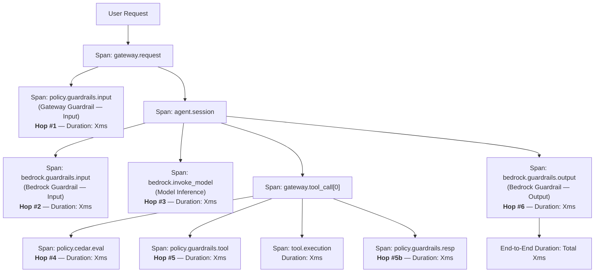

### 6.4 Alerting Strategy for Latency

| **Alert** | **Condition** | **Action** |
|:---|:---|:---|
| Gateway guardrail latency spike | Latency > P99 + 50% | Investigate guardrail configuration complexity |
| Bedrock guardrail latency spike | InvocationLatency > P99 + 50% | Check for increased input size or throttling |
| End-to-end session latency | Total duration > SLA threshold | Identify bottleneck hop via traces |
| Guardrail throttling | InvocationThrottles > 0 | Request quota increase or reduce call volume |
| High rejection rate | Block rate > 20% in 5 min | Investigate potential attack or misconfigured threshold |
| Incomplete LOG_ONLY evaluation | ⚠️ `LogOnlyEvalIncomplete > 0` **cannot fire — this metric published no datapoints and lists 0 dimension combinations in this account** [corrected per F7-1, FALSE, us-east-1, 2026-08-10, `name_in_namespace_inventory: false`; F9-2, TRUE, 2026-08-13: 0 positive datapoints across all 40 `get_metric_statistics` reads of it, including the window in which an unevaluable LOG_ONLY policy served 20 requests] | Do not rely on this alarm as written: a CloudWatch alarm on a never-published metric sits in `INSUFFICIENT_DATA`, not `ALARM`. Either drop it, or configure it to treat missing data as breaching — and pair it with the positive signal `LogOnlyMatches > 0`, which does publish. |
| Policy engine mode change | CloudTrail UpdateGateway event | Verify the change was authorized (Section 3.1 BP#5). **v1.3: key the rule on the call, not on a mode value** — see §3.1 BP#5 for the measured ≈13-second window between an accepted flip and a served request, and §4.4 route #5 for why a `Mode`/`PolicyEnforcementMode` dimension filter is not reliable coverage [F5-2, TRUE, replicated 2026-08-12/13; F9-2, TRUE, 2026-08-11/12]. |

**v1.3 addition — the publish-lag floor under every alarm period above** [verified F7-6, TRUE, n=30, us-east-1, 2026-08-10]: measured lag from request to queryable datapoint had **p90 = 11.5 s**. Of the seven alarms in this table, only the "High rejection rate" row states an evaluation period (5 min / 300 s), and 300 s comfortably exceeds the measured p90 — that alarm is defensible as written, and a 1-minute period would also clear the measured lag. The other **six rows state no evaluation window at all and are therefore unimplementable as written**: pick a period, and keep it at or above 60 s so the measured publish lag cannot make the alarm miss.

**v1.4 addition — a denial-detection rule keyed on one wire shape is not coverage** *(mechanism observations from the F1-15 run, us-east-1, 2026-08-14 — direct wire observations, not a verdict; that case is INCONCLUSIVE and amends no claim)*. The "High rejection rate" row above, and any log- or client-side rule that counts policy denials, has to match **three** observable forms of the same decision, because one unconditional gateway-scoped `forbid` produced all three at once:

| Surface / channel | What a denial looks like |
|:---|:---|
| MCP `tools/call` | HTTP **200** + JSON-RPC error **`-32002`**, "Tool Execution Denied: Tool call not allowed due to policy enforcement [Policy evaluation denied due to `<policyId>`]" [F4-6, FALSE, n=120, 2026-08-10 — see §3.1] |
| Inference (`POST /inference/v1/messages`) | HTTP **403** + `{"error":{"type":"permission_error","message":"Request Denied: Gateway Target request not allowed due to policy enforcement […]"}}` — **different status, different envelope, different wording** |
| MCP `tools/list` | **No error at all**: the call succeeds and returns an **empty tool list** (three tools in the baseline). Tool discovery is filtered, not failed |

A rule matching only `-32002` sees the first and misses the second; a rule matching only HTTP 403 does the reverse; neither sees the third, which has to be caught by checking **advertised tool count** against what the gateway is supposed to expose. One gateway, one Region, one calendar day.

## 7. Best Practices Summary: Latency Optimization with Guardrails

### 7.1 Design Principles

**Threshold tuning workflow (LOG_ONLY → ENFORCE):** AWS recommends calibrating guardrail thresholds before enforcing. The workflow below is **executable as measured**, but three of v1.2's four steps needed correction about *where* the reader is sent and *what a green signal means* [corrected per F3-10, FALSE, 3 arms, 1,491 evidence records all carrying `request_id`, 11 of 11 guards passing, us-east-1, 2026-08-12, plus its supplementary log-surface read of 579 log events with 0 unparsed].

1. **Set the policy engine to LOG_ONLY** — no request is denied [verified F4-2, TRUE, n=120, us-east-1, 2026-08-10: 0 of 120 blocked with ACTIVE policies present]. **But "nothing blocked" is not "nothing logged as blocked":** every shadow evaluation wrote `decision: DENY`, `effect: FORBID`, `isError: true`, and `severityText: ERROR` into the application logs — 30 of 30 in the LOG_ONLY arm, using the *same four field values* as the 31 real denials in the ENFORCE arm. The one field naming a mode, `policyMode`, read `ENFORCE` in both, because it reports the *policy's* configured mode, not the engine's. **Expect your error-rate and denial dashboards to move during a LOG_ONLY window**, and scope any log-based alerting by policy ID or by test-arm rather than by `decision`, `effect`, `isError`, or severity — this measurement found no field that distinguishes a shadow denial from a real one.
2. **Run a golden test set or real production traffic** through the gateway the policy engine is attached to.
3. **Label results and build the confusion matrix from the APPLICATION LOGS, not from CloudWatch metrics.** v1.2 sent the reader to `ConfidenceScore` in §6.2; that metric published nothing at all (F7-1, FALSE — see §6.2), and even where a score metric exists, 1-minute aggregation destroys the per-request join at any usable request rate: the join failed in both production-rate arms and came back only in a deliberately spaced arm at one request per minute, so the failure is the rate, not the instrument. From the logs the join is total — **122 label rows, 122 matched, 0 unmatched, 0 duplicate `request_id`s**, and the matrix computes (tp 30, tn 30, fp 0, fn 0 at the configured threshold, in all three arms). Three properties a reader needs: **(a) the surface** is `body.policy.guardrailFindings.<policyId>.contentFilter[].score`; **(b) the type** is a **JSON string with four fixed decimals** (`"0.8000"`), so `jq 'select(.score > 0.5)'` silently does the wrong thing without a cast; **(c) the direction** — **61 of 122 requests published no score at all, and every request that did publish one was a positive**: a request scoring below the configured threshold (0.2 here) emits no `score` field. So a closed calibration window can support *raising* a threshold (17 of 20 candidate thresholds were answerable) but **not lowering it** (3 of 20 unanswerable). Calibrate from the most permissive threshold you are willing to actually run.
4. **Once calibrated, switch the engine to ENFORCE** — and verify an explicit permit policy exists first, created with an explicit `validationMode` (Section 3.1), or ENFORCE will block all traffic [verified F4-1, TRUE, n=120, us-east-1, 2026-08-10]. **Do not gate promotion on `LogOnlyDecisionFlips` alone.** A sustained zero is produced both by "the shadow policy agrees with production" *and* by "the shadow policy never evaluated at all", and v1.2 assigned one meaning to both: a guardrail statement conditioned on a data path that does not exist reached `ACTIVE` with an empty `lint` array, published `LogOnlyDecisionFlips = 0` and `LogOnlyMatches = 0` in LOG_ONLY — and then **denied 20 of 20 requests the moment it was promoted**. The zero was not instrument absence: `list_metrics` named both metrics with 14 dimension combinations each, the 60-minute pre-window baseline was also 0, and the same two metrics published 4,708 and 3,372 datapoints on this same gateway for a *working* LOG_ONLY policy [F7-1, TRUE for these two metrics, 2026-08-10; failure mode recorded in F5-4a, 5 arms at n=20, us-east-1, 2026-08-11/12, and cross-checked by F9-2, TRUE, 2026-08-13]. **Add a positive gate before reading any flip count:** require `LogOnlyMatches > 0` on traffic the policy is supposed to match, and/or confirm per-request in the application logs that the shadow policy evaluated at all (step 3's join did this for 122 of 122 requests).

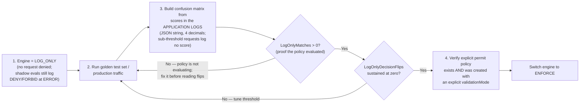

*(Diagram amended in v1.3: the `LogOnlyMatches > 0` gate is new [F5-4a failure mode, us-east-1, 2026-08-11/12; F7-1, TRUE for `LogOnlyMatches`, 2026-08-10]; the step-1 and step-3 labels are corrected per F3-10, FALSE, 2026-08-12; the step-4 `validationMode` requirement per F1-3, TRUE, replicated 2026-08-10/11.)*

| **#** | **Principle** | **Rationale** |
|:--:|:---|:---|
| 1 | **Layer guardrails by risk, not by feature** | Not every checkpoint needs every policy. Match guardrail scope to the actual risk at each hop. |
| 2 | **Fail fast at the outermost layer** | Block obviously harmful content at the Gateway (Hop #1) to avoid unnecessary downstream processing — and note the billing asymmetry: input blocks avoid model-inference charges entirely; output blocks do not *(billing asymmetry test pending: F10-1 has no published verdict as of 2026-08-13 — claim left as written)*. The **latency** saving is measured: blocked requests completed 30–57 ms faster than passed ones (Hodges-Lehmann shift 95% CI [30.2, 57.0] ms) [verified F6-9, TRUE, n=455 usable of a planned 1000, us-east-1, 2026-08-10 — direction confirmed; the interval is wider than the design intended, so treat the magnitude as indicative]. |
| 3 | **Use deterministic controls for authorization** | Cedar Policy (Hop #4) is faster and more reliable than guardrails for tool-level access control. Cedar is deterministic [verified F2-1, TRUE, n=630, 2026-08-10: 0 of 630 evaluations varied] and fail-secure (timeout → DENY) *(timeout behaviour untestable from outside AWS — F9-1 excluded; claim left as written)*. **"Faster" is measured and the margin is large:** Cedar authorization ran at p50 55 ms against gateway guardrail evaluation at p50 401 ms [F6-3 and F6-1, both FALSE against v1.2's estimates but both measured, n=1000 each, us-east-1, 2026-08-10]. The reason to prefer Cedar for authorization is measured detection gaps in the ML path (§3.2, F3-4 and F3-8, both FALSE), not run-to-run non-determinism, which was not observed (§3.1 behavior notes). |
| 4 | **Monitor every hop independently** | End-to-end latency hides which hop is degrading. Use distributed tracing spans and per-hop metrics (Section 6.2) for each checkpoint. |
| 5 | **Deduplicate policies across layers** | If Gateway Guardrails handle prompt attacks, don't repeat the same check at the model level — but only after confirming Regional availability (Hop #1) and input tagging (Hop #2) so deduplication doesn't create a gap. |
| 6 | **Batch for high-throughput** | Use content-array batching for ApplyGuardrail API calls. Treat caching as a last resort with strict constraints (Section 3.3 BP#1). |
| 7 | **Set latency budgets per hop** | Define acceptable latency for each checkpoint and alert when exceeded. |

### 7.2 Anti-Patterns to Avoid

| **Anti-Pattern** | **Problem** | **Recommendation** |
|:---|:---|:---|
| **Enabling ALL guardrail policies at EVERY hop** | Excessive latency accumulation | Apply minimum necessary policies per hop |
| Using guardrails for tool authorization | Probabilistic detection with measured gaps (e.g. 9 of 31 PII entity types refuted, PROMPT_LEAKAGE recall 0.36 pooled) — and bypassable via prompt injection | Use Cedar Policy for deterministic authorization [F2-1, TRUE, n=630; gaps per F3-4 and F3-8, both FALSE, 2026-08-10] |
| **Guardrail-only policy set in ENFORCE mode** | Default-deny blocks ALL traffic without an explicit permit [verified F4-1, TRUE, n=120, us-east-1, 2026-08-10: 120/120 denied] | Always include a baseline permit policy — and create it with an explicit `validationMode`, or the create silently settles `CREATE_FAILED` (Section 3.1) [F1-3, TRUE, replicated 2026-08-10/11] |
| **No observability instrumentation** | Cannot identify latency bottlenecks | Enable full distributed tracing from day one |
| Same guardrail thresholds for all content | Over-blocking legitimate content or under-blocking harmful content | Tune thresholds per hop and content type |
| **Ignoring guardrail throttling** | Silent failures under load *(Validation: case F9-3 ran (run r20260810T130945Z) and returned INCONCLUSIVE — all 480 of 480 burst `ApplyGuardrail` responses carried a real verdict, 0 observable failures and 0 silent passes, but 0 requests were throttled at an achieved 182.2 rps against the documented 100 rps ceiling, so "0 silent passes" is vacuously true of a question that was never put and the rate mutation did not invert. Claim left as written.)* | Monitor InvocationThrottles and implement retry/backoff |
| Skipping guardrails on external-content tools | Tool responses are the primary indirect-prompt-injection vector | Apply prompt-attack + content guardrails to untrusted tool outputs (Section 4.2) |
| Classic-tier guardrails on non-EN/FR/ES traffic | "Guardrails are ineffective with languages that aren't supported" — measured: Classic-tier detection on zh/ja/ko attack content was 0 [0, 0.0175] at n=216, and the failure is silent [verified F8-2, TRUE, 2026-08-10] | Use Standard tier (and plan for its cross-Region inference requirement) [Standard multi-language coverage verified F8-3, TRUE, n=216, 2026-08-10] |
| Manual prompt optimization only | Slow, inconsistent, not evidence-based | Use AgentCore Optimization for automated improvement |

### 7.3 Recommended Guardrail Distribution

| **Hop** | **Recommended Policies** | **Rationale** |
|:---|:---|:---|
| **Gateway (Input)** | Prompt Attack (HIGH threshold), Content Filter (MEDIUM) | Fast early blocking of obvious threats |
| **Bedrock Guardrails (Input)** | Denied Topics, Sensitive Info, Content Filter (fine-grained), Prompt Attack (with input tagging — untagged InvokeModel input is measurably not scanned: recall 0 [0, 0.031] at n=120 [verified F5-6, TRUE, us-east-1, 2026-08-11]) | Comprehensive input safety after gateway filter — but verify the specific PII entity types you depend on; 9 of 31 documented types were refuted [F3-4, FALSE, 2026-08-10] |
| **Cedar Policy (Tool Auth)** | Tool-level allow/deny, parameter validation | Deterministic authorization — no ML overhead |
| **Tool I/O Guardrails** | Sensitive Info (PII on tool responses); Prompt Attack on external/untrusted tool responses | Prevent data leakage and indirect prompt injection from tool outputs |
| **Bedrock Guardrails (Output)** | Content Filter, Sensitive Info, Contextual Grounding (within its character limits) | Final safety check before user sees response |

## 8. Implementation Checklist

**Phase 1: Foundation**

- [ ] **Pin `botocore`/`boto3` ≥ 1.43.32** before writing any policy code — 1.43.30–.31 expose `InvokeGuardrailChecks` without `enforcementMode`, and the bundled AWS CLI v2 has no policy-engine subcommands at all (v1.3 addition) [F1-1/F1-2, TRUE, 14 wheels probed offline, 2026-08-09]
- [ ] Create Bedrock Guardrail resources (with per-direction input/output settings) *(per-direction independence: case F1-11 returned INCONCLUSIVE — item left as written)*
- [ ] **Verify tier vs. traffic language** (Section 3.4): non-EN/FR/ES traffic REQUIRES Standard tier — Classic is silently ineffective [verified F8-2, TRUE, n=240, 2026-08-10]; confirm data-residency allows Standard's mandatory cross-Region inference [the `crossRegionConfig` requirement verified F1-6, TRUE, us-east-1, 2026-08-10 — create-request validation only]. **Also test your own denied-topic definition lengths:** the documented Standard-tier 1,000-char limit was rejected with `ValidationException` [F8-5, FALSE, 2026-08-10]
- [ ] Set up AgentCore Gateway with Policy Engine — confirm Guardrails-in-policy is available in your Region. Do NOT plan from v1.2's five-Region list: it is refuted [corrected per F8-1, FALSE, run r20260810T130945Z — `CreatePolicyEngine` also succeeded (HTTP 202) in us-west-2, eu-central-1, sa-east-1, and ap-south-1, four Regions the list excluded]. A create acceptance is control-plane only, not proof the feature evaluates requests in those Regions, and ap-southeast-1 (Singapore) was not probed — verify your specific Region yourself
- [ ] **Write an explicit baseline permit policy BEFORE enabling ENFORCE** (default-deny gotcha, Section 3.1) [verified F4-1, TRUE, n=120, 2026-08-10] — **and pass an explicit `validationMode`**: the statement this document recommends is rejected under the `FAIL_ON_ANY_FINDINGS` default, asynchronously, after a 202 response. Poll the policy `status`; do not treat the 202 as success [F1-3, TRUE, replicated 2026-08-10/11]
- [ ] Define Cedar policies for tool authorization
- [ ] Configure guardrails in Gateway Policy (Cedar `when guardrails` conditions — thresholds are mandatory in hand-written policies)
- [ ] Configure input tagging (with random `tagSuffix`) wherever prompt-attack filtering is expected at the model layer [verified F5-6, TRUE, 4 arms × 120, us-east-1, 2026-08-11: untagged InvokeModel prompt-attack recall 0 [0, 0.031] — tagging is genuinely required, not optional]
- [ ] Apply network containment (Section 4.5): Runtime VPC mode with egress allowlist, Code Interpreter Sandbox/VPC mode + DNS Firewall, VPC condition keys on deployment IAM; check the PrivateLink matrix if in a private network
- [ ] Enable CloudWatch Transaction Search, then AgentCore Observability tracing [verified F7-5, TRUE, us-east-1, 2026-08-10: with tracing disabled, 0 spans appeared for the same traffic; with it enabled, spans appeared — tracing is genuinely a prerequisite, and spans lag the request by ≈50 s]
- [ ] Instrument agent code with ADOT SDK for custom spans

**Phase 2: Monitoring**

- [ ] Create CloudWatch dashboard with hop-by-hop latency metrics (GuardrailLatency, InvocationLatency, guardrailProcessingLatency) — **do not add `ConfidenceScore`/`ConfidenceThreshold`; neither published any datapoint** [F7-1, FALSE, 2026-08-10]. On any mismatch metric, chart `SampleCount` at one pinned dimension combination rather than `Sum` across dimensions, which reads up to 6× the request count [F9-2, TRUE, 2026-08-11/12]
- [ ] Set up alarms for each latency checkpoint (period ≥ 60 s — measured publish lag p90 = 11.5 s, and six of §6.4's seven alarms state no period at all [F7-6, TRUE, n=30, 2026-08-10]) and on UpdateGateway configuration changes — keyed on the CloudTrail call, not on a mode value [F5-2, TRUE, replicated 2026-08-12/13]. **`LogOnlyEvalIncomplete` is not usable as an alarm as v1.2 prescribed: the metric published nothing and lists 0 dimension combinations in this account** [F7-1, FALSE, 2026-08-10; F9-2, TRUE, 2026-08-13]. If you keep it, treat missing data as breaching; add `LogOnlyMatches > 0` as the positive gate instead
- [ ] **Make policy-denial detection surface-aware (v1.4 addition):** match the MCP shape (HTTP 200 + JSON-RPC `-32002`) **and** the inference shape (HTTP **403** + `permission_error`, "Request Denied: Gateway Target request not allowed due to policy enforcement"), and check **advertised tool count** as well as call errors — under an active forbid, MCP `tools/list` succeeds and returns an empty list, so that denial channel raises no error to alarm on [mechanism observations from the F1-15 run, INCONCLUSIVE, us-east-1, 2026-08-14 — see §3.1, §4.1 and §6.4; single calendar day, one gateway]
- [ ] Configure guardrail-specific metrics monitoring (invocation count, latency, throttles, InvocationsIntervened, TextUnitCount)
- [ ] Enable distributed tracing across all agent components
- [ ] Create operational runbook for latency spike investigation

**Phase 3: Optimization**

- [ ] Enable AgentCore Evaluations (online mode) for continuous quality assessment — verify PrivateLink posture first if in a private network (Section 5.3 BP#6; note AWS now documents Evaluations and Optimization as PrivateLink-Supported, a change from v1.2 [F5-7a, FALSE, replicated 2026-08-09/10])
- [ ] Establish baseline latency measurements for each hop
- [ ] Run AgentCore Optimization Recommendations when quality degrades
- [ ] Validate with batch evaluations before A/B testing
- [ ] Implement A/B testing via Gateway traffic splitting
- [ ] Document optimization cycles and threshold tuning decisions

**Phase 4: Maintenance**

- [ ] Review guardrail policies quarterly — remove redundant checks
- [ ] Monitor latency trends — adjust as model/traffic patterns change
- [ ] Update Cedar policies as new tools are added
- [ ] Revisit threshold values based on false positive/negative rates
- [ ] Re-run the guardrail regression test set periodically — AWS auto-updates the underlying guardrail models with no action on your part

## 9. Reference Architecture: Complete Closed Loop

The following diagram shows the complete end-to-end architecture across all three phases. **Latency annotations below are the measured p50/p90 values from §6.1** (us-east-1, n=1000 per hop, 2026-08-10), not v1.2's illustrative ranges; Hop #3 keeps its v1.2 range because no case re-measured it.

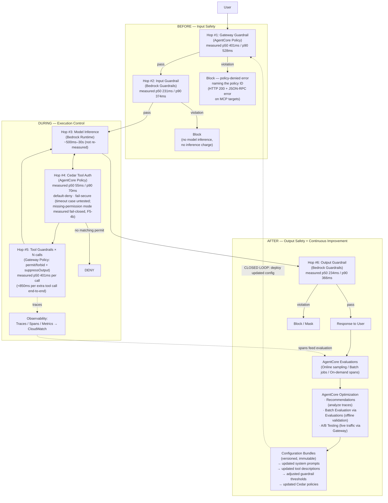

## 10. Key AWS Documentation References

All 24 reference rows below were fetched and checked [verified F0-1, TRUE, 24 rows, observed 2026-08-09: every URL resolved and its page title matched the row's topic, 0 failures].

| **Topic** | **URL** |
|:---|:---|
| How Bedrock Guardrails Works | <https://docs.aws.amazon.com/bedrock/latest/userguide/guardrails-how.html> |
| Guardrails in AgentCore Policy | <https://docs.aws.amazon.com/bedrock-agentcore/latest/devguide/policy-guardrails-in-policies.html> |
| Getting Started with Gateway Guardrails | <https://docs.aws.amazon.com/bedrock-agentcore/latest/devguide/policy-guardrails-getting-started.html> |
| Policy in AgentCore | <https://docs.aws.amazon.com/bedrock-agentcore/latest/devguide/policy.html> |
| Understanding Cedar Policies | <https://docs.aws.amazon.com/bedrock-agentcore/latest/devguide/policy-understanding-cedar.html> |
| Policy Conditions (when guardrails) | <https://docs.aws.amazon.com/bedrock-agentcore/latest/devguide/policy-conditions.html> |
| Testing Policies (LOG_ONLY workflow) | <https://docs.aws.amazon.com/bedrock-agentcore/latest/devguide/policy-test-a-policy.html> |
| ApplyGuardrail API | <https://docs.aws.amazon.com/bedrock/latest/userguide/guardrails-use-independent-api.html> |
| Guardrails Streaming Modes | <https://docs.aws.amazon.com/bedrock/latest/userguide/guardrails-streaming.html> |
| Guardrails Tiers | <https://docs.aws.amazon.com/bedrock/latest/userguide/guardrails-tiers.html> |
| Guardrails Supported Languages | <https://docs.aws.amazon.com/bedrock/latest/userguide/guardrails-supported-languages.html> |
| Guardrails Input Tagging | <https://docs.aws.amazon.com/bedrock/latest/userguide/guardrails-tagging.html> |
| AgentCore Observability | <https://docs.aws.amazon.com/bedrock-agentcore/latest/devguide/observability.html> |
| AgentCore Gateway Metrics | <https://docs.aws.amazon.com/bedrock-agentcore/latest/devguide/observability-gateway-metrics.html> |
| AgentCore Policy Metrics | <https://docs.aws.amazon.com/bedrock-agentcore/latest/devguide/observability-policy-metrics.html> |
| Monitor Bedrock Guardrails with CloudWatch | <https://docs.aws.amazon.com/bedrock/latest/userguide/monitoring-guardrails-cw-metrics.html> |
| Monitor Bedrock Runtime Metrics | <https://docs.aws.amazon.com/bedrock/latest/userguide/monitoring-runtime-metrics.html> |
| AgentCore Evaluations | <https://docs.aws.amazon.com/bedrock-agentcore/latest/devguide/evaluations.html> |
| AgentCore Optimization | <https://docs.aws.amazon.com/bedrock-agentcore/latest/devguide/optimization.html> |
| AgentCore A/B Testing | <https://docs.aws.amazon.com/bedrock-agentcore/latest/devguide/ab-testing.html> |
| Well-Architected Agentic AI Lens | <https://docs.aws.amazon.com/wellarchitected/latest/agentic-ai-lens/agentic-ai-lens.html> |
| Input Validation Best Practices | <https://docs.aws.amazon.com/prescriptive-guidance/latest/agentic-ai-security/best-practices-input-validation.html> |
| AgentCore Memory Best Practices (Memory security; not guardrails-specific) | <https://docs.aws.amazon.com/bedrock-agentcore/latest/devguide/best-practices.html> |
| Diagnose InvocationLatency with OTPS | <https://docs.aws.amazon.com/bedrock/latest/userguide/monitoring-runtime-otps.html> |

## Appendix A: Guardrails Checkpoint Decision Matrix

Use this matrix to decide which guardrails to enable at each hop:

| **Content Risk** | **Gateway (Hop#1)** | **Input Guard (Hop#2)** | **Tool I/O (Hop#5)** | **Output Guard (Hop#6)** |
|:---|:--:|:--:|:--:|:--:|
| **Prompt Injection/Attack** | ✅ HIGH | Optional (deduplicate; requires input tagging — verified [F5-6, TRUE, 2026-08-11]) | ✅ for external/untrusted tool responses (indirect injection vector) | ❌ |
| **Violent Content** | ✅ MEDIUM | ✅ LOW | ❌ | ✅ MEDIUM |
| **Sexual Content** | ✅ MEDIUM | ✅ LOW | ❌ | ✅ MEDIUM |
| **Hate Speech** | ✅ MEDIUM | ✅ LOW | ❌ | ✅ MEDIUM |
| **PII/Sensitive Info** | ❌ | ✅ (detect — **but 9 of 31 documented entity types were measured undetected; see §3.2** [F3-4, FALSE, n=341, 2026-08-10]) | ✅ (redact — v1.2's caveat that `tool_use` parameters are not scanned is refuted for the probed entity: identical EMAIL PII was handled in both message text and a tool-result JSON block on every trial [corrected per F1-28, FALSE, 2026-08-10]; one entity type of 31 probed, caller-supplied input-side tool blocks only, regex `sensitiveInformationPolicyConfig` untested — see §4.2 BP#4) | ✅ (redact) |
| **Denied Topics** | ❌ | ✅ | ❌ | ✅ |
| **Word Blocklist** | ❌ | ✅ | ❌ | ✅ |
| **Hallucination** | ❌ | ❌ | ❌ | ✅ (Contextual Grounding / Automated Reasoning, detect-only) |
| **Tool Authorization** | ❌ | ❌ | ✅ (Cedar) | ❌ |

## Appendix B: Latency Optimization Techniques

| **Technique** | **Description** | **Latency Reduction** |
|:---|:---|:---|
| **Parallel policy evaluation** | Bedrock evaluates all input policies in parallel (built-in) | Significant vs. sequential |
| **Early blocking at Gateway** | Block at Hop#1 to skip Hops #2–6 entirely | Measured saving 30–57 ms (Hodges-Lehmann shift 95% CI [30.2, 57.0]) [verified F6-9, TRUE, n=455, us-east-1, 2026-08-10 — direction confirmed; n fell short of the planned 1000, so treat the magnitude as indicative]. Avoided model-inference charges *(test pending: F10-1 unpublished as of 2026-08-13)* |
| **Content block batching** | Batch multiple content blocks in a single ApplyGuardrail call | Fewer round trips (AWS publishes no specific figures; InvokeGuardrailChecks caps at 10 content blocks/message) |
| **Selective application** | Only apply guardrails to content that needs evaluation | Proportional to skip rate — **but do not count input tagging as a text-unit saving:** tagged evaluation of a RAG-shaped prompt reported a text-unit count IDENTICAL to untagged [corrected per F10-3, FALSE, 2026-08-13; API-reported unit count — no invoice, Cost Explorer, or CUR figure was read]. Tagging remains required for prompt-attack scanning (F5-6, §3.2) |
| **Deduplicate across layers** | Remove same policy from multiple hops (verify no coverage gap first) | Removes redundant evaluation time |
| **Latency-optimized inference** | Use Bedrock latency-optimized inference for model calls | Reduces Hop#3 time |
| **Asynchronous streaming mode** | Official ASYNCHRONOUS streamProcessingMode: chunks stream immediately, scanning in background | Removes buffering delay (trade-off: leakage window before blocking; no PII masking in async mode) |

> Removed from this list in v1.2: "intelligent caching" as a general technique — AWS auto-updates the underlying models and "similar" inputs can differ exactly in the attack payload; see Section 3.3 BP#1 for the narrow conditions under which caching is defensible. *(v1.3: the "guardrails are non-deterministic" half of this rationale was removed — no run-to-run variation was observed at n=300 on a fixed input [F2-5, FALSE, 2026-08-10]. The exclusion stands on the auto-update and payload-sensitivity grounds.)*

## Appendix C: Change Log v1.1 → v1.2

**Factual corrections (verified against official AWS documentation):**

1. Guardrails CloudWatch namespace corrected to `AWS/Bedrock/Guardrails` throughout (was: `AWS/Bedrock`).
2. Default policy thresholds clarified: applied only via the natural-language authoring service; hand-written Cedar requires explicit thresholds.
3. AgentCore Optimization "(Preview)" label removed — the service is GA (Accelerator v2.9 service table).
4. Optimization capabilities corrected to Recommendations / Configuration Bundles / A/B Testing; Batch Evaluation reassigned to AgentCore Evaluations.
5. Parallel-evaluation claims scoped to what AWS documents (input evaluation only); removed for Gateway policy.
6. best-practices.html reference relabeled — that page covers AgentCore Memory, not guardrails.
7. Unofficial "190x" / "80–90%" figures removed from Appendix B (already removed from §3.3 in v1.1).
8. §6.4 alert condition corrected from FirstByteLatency to Latency.
9. Hop numbering unified (1–6, Model Inference = Hop #3) across headings, Executive Summary, tables, and diagrams.

**Risk-based revisions:**

10. Caching guidance rewritten with strict constraints (§3.3 BP#1).
11. Async output evaluation aligned to official streaming modes with masking/leakage warnings (§5.1 BP#1).
12. Appendix A now recommends prompt-attack screening on untrusted tool responses (indirect prompt injection).

**Additions:** ENFORCE default-deny permit gotcha; two-level LOG_ONLY precedence + UpdateGateway risk; prompt-attack input-tagging requirement; expanded Policy metrics (GuardrailLatency, LogOnlyDecisionFlips, etc.); guardrailProcessingLatency guidance; new §3.4 Tiers & Language Support; billing asymmetry; PII log/tool_use caveats; fail-secure vs. undocumented failure behavior; Gateway Lambda interceptors; PrivateLink gaps for Evaluations/Optimization; CRIS data-residency note; Contextual Grounding limits; OTPS clarification; Evaluations three modes.

**New section:** §4.4 Non-Bypassable Per-Tool-Use Hooks (agent containment pattern) — maps framework-style Pre/PostToolUse hooks to out-of-process AgentCore primitives (Cedar Policy, guardrails-in-policy, suppressOutput, Lambda interceptors) and closes the five bypass routes (direct tool calls, network egress, execution-role self-disable, account-level tampering, silent degradation).

**New section:** §2.1 Hop Numbering — declares the hop framework as this document's own (not an AWS concept) and anchors it with a normative sequence diagram placing #1–#6 on the request lifecycle.

**Post-review refinements (external agent review, 2026-08-08):** §6.2 Policy table gained MismatchErrors family + non-exhaustive note; §3.2 prompt-attack entry now distinguishes Converse default-evaluation and the guardContent scope-limiting trap (prompt-attack behavior on untagged Converse messages is undocumented — red-team it); §5.2 quotas stamped with as-of date + Service Quotas caveat; §8 tier/language check promoted to its own checklist item.

**New section:** §4.5 Network Containment — makes bypass route #2 executable: Runtime egress lockdown (S3 Gateway-endpoint scoping), Code Interpreter three network modes + DNS-exfiltration warning, PrivateLink coverage matrix (Optimization gap), two known traps (Lattice Resource Gateway ≠ PrivateLink; ECR Public mandatory egress exception), and IAM VPC condition keys enforcing contained deployment. Connectivity design deliberately out of scope. §8 Phase 1 checklist gains a network-containment item.

**Format change (v1.2):** this Markdown file is the canonical version of the document, with Mermaid diagrams for human- and AI-agent readability: hop-numbering sequence diagram (§2.1, normative), closed-loop overview (§2), billing asymmetry (§3.2), tier selection decision tree (§3.4), two-level LOG_ONLY precedence (§4.1), containment boundary (§4.4), streaming mode comparison (§5.1), trace tree (§6.3, with span-name disclaimer), threshold-tuning workflow (§7.1), reference architecture (§9). The .docx lineage ends at v1.1; regenerate Word/PDF exports from this file if needed.

## Appendix D: Change Log v1.2 → v1.4 (empirical amendments)

Every change in v1.3 and v1.4 is traceable to a published verdict file under `results/phase1/` in the `grx-validation` repository. Claims whose cases are outstanding, INCONCLUSIVE, or untestable are **unchanged** — only markers were added. Counts re-derived via `census.py` on 2026-08-15. A second amendment batch was applied on 2026-08-14, when the deferred result files landed (see the resolved marker in the Validation Status section): F1-6 (TRUE — §1, §3.4, §8), F8-1 (FALSE — §1, §8), F10-3 (FALSE — §3.3 BP#3, Appendix B), F1-28 (FALSE — §4.2 BP#4, Appendix A), F5-4b (RECORDED — §3.1, §4.1, §9), nine INCONCLUSIVE results (F1-19, F1-24, F1-25, F1-26, F1-27, F5-3a, F5-5, F5-9, F9-3 — claims unchanged, annotations updated), and F5-3b (ran, no publishable standing). A third amendment batch was applied on 2026-08-14: rounds 4–7 of the same run (2026-08-13 UTC, after the instrument repairs recorded in FINDING-P1-CEDAR-RESOURCE-SCOPE.md — an instrument document that asserts nothing about this one and is not cited as evidence for any reading) superseded the defect-invalidated round-1 results for the grammar cases, and round 8 (2026-08-14 UTC) replicated them on a second calendar day: F1-24 and F1-25 moved from INCONCLUSIVE to published FALSE (§4.1 limitations items 2 and 1 — see correction item 13, whose two-UTC-day coverage satisfies the amendment gate), and F1-19 remained INCONCLUSIVE (no claim changed; mechanism observations annotated at §3.1). **A fourth batch — this draft, v1.4 — covers exactly two newly completed cases and amends no claim on either:** F1-15 (INCONCLUSIVE — the §4.1 three-target-type claim is unchanged; five direct API-shape and wire observations are annotated as dated mechanism observations at §4.1, the bullet's incidental `POST /inference` path is corrected as a wire fact, and the newly observed inference-surface denial shape is carried into §3.1, §6.4 and §8 — items 21 and 22 below) and F5-8 (TRUE, but on one calendar day — §4.4 route #3's Accelerator citation is **retained** and the swap to public evidence is deferred behind `reproduction_before_amendment`; see the left-unchanged register below). Counts in the Validation Status section moved accordingly: 89 published verdicts, 2 cases outstanding (F5-7b, F10-1). **A fifth batch — the v1.4 release, 2026-08-15 — covers exactly one newly completed case and amends no claim on it:** F5-7b (INCONCLUSIVE — §4.5 network containment and §4.4 routes #2 and #4 are unchanged; see the left-unchanged register below and `results/FINDING-F5-7B.md`). Counts moved to 90 published verdicts and 1 case outstanding (F10-1). The release also adds `results/CENSUS-NOT-MEASURED.md`, which closes the census by recording the reason each of the two unmeasured cases is unmeasured; it introduces no claim about the product and amends nothing.

**Corrections driven by FALSE verdicts (document defects):**

1. §6.1 latency table — per-hop illustrative ranges replaced with measured p50/p90/p99 at n=1000 per hop; five of six measured hops fell outside v1.2's bands [F6-1, F6-2, F6-3, F6-4, F6-5, all FALSE, us-east-1, 2026-08-10]. §9's diagram annotations updated to match.
2. §6.1 / §4.2 — per-additional-tool-call cost corrected from 165–750 ms to ≈850 ms (CI [838.7, 862.7]) [F6-8, FALSE, n=600 usable, 2026-08-10].
3. §3.1 behavior notes, §7.1 principle #3, §3.3 BP#1, Appendix B note — the "guardrail evaluation is non-deterministic" premise rescoped: no run-to-run variation was observed on fixed inputs [F2-2, F2-5, F2-4, all FALSE, n=300 each, 2026-08-10]. AWS's documented statement is retained; the document no longer *rests* recommendations on observed variation.
4. §3.1 behavior notes, §2.1 diagram, §9 diagram — "HTTP 403" corrected: MCP-target denials returned HTTP 200 with a JSON-RPC error (-32002) naming the policy ID, 120/120 [F4-6, FALSE, n=120, 2026-08-10].
5. §3.2 Sensitive Information Filters, Appendix A — 9 of 31 documented PII entity types measured undetected (recall CI upper bound below 0.5) [F3-4, FALSE, n=341, 2026-08-10].
6. §3.4 tier table — "Prompt leakage detection: Classic = No" corrected to weak-but-measurable (recall 0.41 [0.32, 0.50] vs FPR 0.036) [F8-4, FALSE, n=460, 2026-08-10].
7. §3.4 tier table — Standard-tier 1,000-char denied-topic limit corrected: a 1,000-char definition was rejected with `ValidationException`; the Classic 200-char boundary held [F8-5, FALSE, 2026-08-10].
8. §3.2, §5.1 BP#4 — "Automated Reasoning: no streaming support" withdrawn: `ConverseStream` accepts `guardrailConfig` and models 132 AR assessment paths [F1-14, FALSE, SDK-surface probe, 2026-08-10].
9. §4.5.3, §5.3 BP#6 — PrivateLink matrix corrected and dated: AWS's live page marks Evaluations and Optimization Supported on both planes as of 2026-08-09/10, against five archive snapshots that agree with v1.2 [F5-7a, FALSE, replicated 2026-08-09/10]. Header corrected from "Service" to "Primitive".
10. §6.2 policy metrics, §6.4, §8 — `ConfidenceScore`, `ConfidenceThreshold`, and `TemporalLatency` measured absent, and `LogOnlyEvalIncomplete` never published with 0 dimension combinations, so its prescribed alarm cannot fire [F7-1, FALSE, 2026-08-10; corroborated by F9-2, TRUE, 2026-08-13].
11. §7.1 steps 1, 3 and 4 and the workflow diagram — calibration re-pointed from CloudWatch metrics to the application logs, with the score's JSON-string type and the sub-threshold censoring stated; the "nothing blocked" promise scoped (shadow evaluations log `DENY`/`FORBID` at ERROR level); a positive `LogOnlyMatches > 0` gate added before any flip-count reading [F3-10, FALSE, 2026-08-12; failure mode from F5-4a, 2026-08-11/12].
12. §6.2 mismatch-metric row, §4.4 route #5, §8 — consequence split by mode (ACTIVE = DENY-all availability signal, LOG_ONLY = silent), dimension multiplier documented (a cross-dimension `Sum` reads up to 6× the request count), and mode-filtered alarming withdrawn as unreliable [F9-2, TRUE, 2026-08-11/12 — this metric-reading correction rests on a TRUE verdict about firing, not on a refutation of the metrics' existence].

13. §4.1 "Limitations of guardrails in policy" — items (1) and (2) rewritten to separate authoring from evaluation: the validator ACCEPTED Cedar's `like` inside a `when guardrails {…}` block (pattern-free control ACTIVE; a regex-shaped category literal rejected synchronously against the five fixed categories) and ACCEPTED a policy mixing `when {…}` with `when guardrails {…}` (both split controls ACTIVE) — four terminal-ACTIVE acceptances per arm, 0 model calls, LOG_ONLY throughout [F1-24 and F1-25, both FALSE, run r20260810T130945Z, us-east-1, evidence 2026-08-13 **and** 2026-08-14 UTC]. **Date coverage: two separate UTC calendar days**, which is what this repository's amendment gate requires. Rounds 4–7 fell entirely on 2026-08-13, which rules out a transient but not a same-day deployment; the day-2 round (round 8, 2026-08-14T00:54:25Z–00:55:19Z UTC, its target fixed in FINDING-F1-GRAMMAR-PERMISSIVENESS §6 before it ran and its outcome recorded in §6.1) reproduced every arm: the mixed policy ACTIVE with both splits ACTIVE, the `like` policy ACTIVE with the pattern-free control ACTIVE, and the regex-shaped category literal rejected — on the same SDK build and the same `validationMode` as day 1. Both corrections are therefore published rather than provisional. Evaluation-time behaviour (whether a mixed policy's standard condition is honoured; whether an accepted `like` filters anything) is unmeasured; the split-into-two-statements advice and the interceptor-for-regex advice are unchanged.

**Additions and confirmations driven by TRUE verdicts:**

14. §3.1 — **new SDK prerequisite:** `botocore`/`boto3` ≥ 1.43.32, with the 1.43.30–.31 trap window named; also added to the §8 checklist [F1-1, F1-2, TRUE, 2026-08-09].
15. §3.1 default-deny callout, §7.1 step 4, §7.2, §8 — **new `validationMode` requirement:** the recommended baseline permit statement settles `CREATE_FAILED` under the default `FAIL_ON_ANY_FINDINGS`, asynchronously, after a 202 [F1-3, TRUE, replicated 2026-08-10/11].
16. §3.1 BP#5 — **new measured interval:** an accepted mode flip took 602.8/931.7 ms and a previously-blocked request was served 13.2–14.2 s later; `iam:PassRole` named beside `UpdateGateway` [F5-2, TRUE, replicated 2026-08-12/13].
17. §4.4 route #3 — **least privilege rescoped to the steady state:** revocation is eventually consistent in both directions (32 of 80 invocations executed after an observed denial; control-plane authorization persisted 325.0 s / 305.8 s after grant deletion), so runbooks of the form "revoke, confirm, proceed" are prohibited and no wait-N-seconds number is published [F5-1 and F5-2, both TRUE, replicated across four UTC days].
18. §6.4 — **new publish-lag floor:** measured p90 lag 11.5 s; only 1 of 7 alarms states a period, and the other 6 are unimplementable as written [F7-6, TRUE, n=30, 2026-08-10].
19. §6.3 — actual span names recorded (`AgentCore.Policy.AuthorizeAction`, `AgentCore.Gateway.InvokeTool[.<tool>]`), ≈50 s span lag, and the measured absence of a score attribute on spans [F7-4, TRUE, n=20, 2026-08-10].
20. In-place confirmations added (prose unchanged, citation appended): §1 and §3.4 language/tier claims [F8-2, F8-3, F8-6, F8-8]; §3.1 score lattice [F1-18], content-filter categories [F1-7]; §3.2 detection efficacy [F3-1, F3-2, F3-3, F3-5, F3-6, F3-7] and input tagging [F5-6]; §4.1 determinism, default-deny, forbid-override and the two-level LOG_ONLY precedence [F2-1, F4-2, F4-3, F4-4, F4-5, F1-5]; §4.4 bypass route #1 [F5-1]; §5.2/§5.3 capability inventories [F1-22, F1-23]; §6.1 additivity [F6-7] and end-to-end total [F6-6]; §6.2 metric namespaces and batching [F7-2, F7-3, F7-7] and per-text-unit billing [F10-2]; §7.1 principle #2 early-block saving [F6-9]; §10 references [F0-1].

**v1.4 — corrections and additions driven by direct API-shape and wire observations, not by verdicts:** both items below come from the F1-15 run, whose sealed verdict is INCONCLUSIVE and licenses no amendment. They are cited as observations because they are readings of the service model and of the wire rather than oracle outputs, and neither touches the claim the oracle quantified over.

21. §4.1 target-type bullet and a new mechanism-observation block in the same section — five results recorded, dated 2026-08-14, us-east-1: (a) `CreateGateway.protocolType` is an enum whose only member is `MCP` (botocore 1.43.67), so `CreateGatewayTarget` refuses the whole `http` arm with `ValidationException: HTTP target configuration is not supported for gateways with MCP protocol type` — guidance to create an HTTP runtime target is **currently unfollowable**, and because this is read from the pinned service model (immutable per SDK version) it carries no calendar-replication caveat; (b) the inference wire path is **`POST /inference/v1/messages`**, not v1.2's `POST /inference`, which is refused with `Http operation is not supported for gateway protocol type MCP` — the route is a composition, with `operations[].path` the client-facing path served beneath the gateway's own `/inference` prefix, and **this path is the only text corrected in the bullet**; (c) `operations[].models` is load-bearing on an `inference.provider` target despite being optional in the API — without it the target reaches READY and is unroutable, returning `404 Model '<id>' not found on any target`; (d) `operations[].models[].model` has pattern `[a-zA-Z0-9\-\._\*\?@]+(/[a-zA-Z0-9\-\._\*\?@]+)*`, admitting `*`/`?` globs and no colon, so Bedrock's canonical `…-v1:0` ids cannot be spelled there; (e) the two policy-denial wire shapes, per item 22. The three-target-type claim itself is unchanged and stays in the left-unchanged register below.
22. §3.1 behavior notes, §6.4 (new table after the alerting table), §8 Phase 2 (new checklist item) — policy-denial detection made **surface-aware**: under one unconditional gateway-scoped `forbid`, the inference surface denied with **HTTP 403** and a `permission_error` envelope ("Request Denied: Gateway Target request not allowed due to policy enforcement […]"), while the MCP surface denied with HTTP 200 + JSON-RPC `-32002`, and MCP `tools/list` **succeeded with an empty tool list** where the baseline advertised three tools. Detection keyed only on `-32002` — which is all v1.3 described — misses inference-surface denials, and neither error-shape rule sees the tool-discovery channel, which raises no error at all and has to be caught by checking advertised tool count. This corrects nothing v1.2 asserted; it closes a coverage gap v1.3's guidance would have left open. Single calendar day, one gateway, so the policy behaviour behind it would need a day-2 run before any positive claim rested on it — none does.

**Deliberately left unchanged (evidence inconclusive, absent, or untestable):** §3.2 BP#1 per-direction independence (F1-11 INCONCLUSIVE); §5.1 BP#5 Contextual Grounding character limits (F1-13 INCONCLUSIVE); §3.4 word-filter language claim (F8-7 INCONCLUSIVE; F1-26 ran, run r20260810T130945Z, INCONCLUSIVE — both tiers refused the non-EN/FR/ES word policy but the supported-language-only control was refused too, so the refusal is attributable to neither disjunct); §3.1 prompt-attack subtype enumeration (F1-8 INCONCLUSIVE); §5.1 BP#1 streaming modes (F1-12 INCONCLUSIVE); §4.1 interceptors (F1-16 INCONCLUSIVE) and `suppressOutput` effect (F1-17 INCONCLUSIVE); §3.3/Appendix B 10-content-block cap (F1-20 INCONCLUSIVE); §3.2 auto-update/drift guidance (F3-11 INCONCLUSIVE); §3.2 and §7.1 billing asymmetry (F10-1 unmeasured, and recorded as such in `results/CENSUS-NOT-MEASURED.md` rather than left open-ended: Cost Explorer's finest granularity is daily and the oracle reads a delta between input-blocked and output-blocked requests, which additionally requires that Bedrock inference charge be attributable per request tag — not established. The claim stands exactly as v1.2 wrote it, unsupported by measurement in either direction); §4.1 three target types (F1-15 ran, run r20260810T130945Z, 2026-08-14 UTC, INCONCLUSIVE — of the three target types the bullet names, `mcp` and `inference` were both built and both DENIED by policy under one unconditional gateway-scoped `forbid`, each allowed without it, while `http.agentcoreRuntime` **cannot be constructed at this API version** because `CreateGateway.protocolType` admits only `MCP` and `CreateGatewayTarget` therefore refuses the entire `http` arm, so the sealed "all three" can be neither satisfied nor refuted; not FALSE, because a target type that cannot carry a request cannot bypass evaluation of one, and not TRUE, because reading "all three" as "all that exist" would decide a different quantity than the seal names; five direct API-shape and wire observations from the run are separately citable and are recorded as dated mechanism observations at §4.1 — see correction items 21 and 22 above — and the only bullet text that moved is the incidental inference path, `POST /inference` → `POST /inference/v1/messages`, which is a wire fact rather than the claim's substance); §5.1 reasoning-block exclusion (F1-27 ran, INCONCLUSIVE — both reasoning-block placement arms returned `ValidationException`; a request the service refused is not a request whose content went un-evaluated); §3.1/§4.1/§9 fail-secure timeout → DENY (F9-1 untestable by its sealed oracle; the missing-permission mode is characterized fail-closed by F5-4b, RECORDED — see §3.1/§4.1 — which is not evidence about the timeout mode); §4.5 network containment and §4.4 routes #2 and #4 (F5-7b ran, run r20260810T130945Z, 2026-08-14 UTC, INCONCLUSIVE — the case built a dedicated VPC and created three VPC-mode runtimes from one public image differing only in whether the private route table carried a default route to a NAT gateway, and **all three reached READY with an empty `failureReason`**, so the create channel named no failure to attribute to egress; the invoke channel that was supposed to decide the case instead returned a **client-side socket timeout on all three arms at 70082 / 70077 / 70073 ms — a 9 ms spread across three independent calls**, i.e. a constant rather than a measurement, with no HTTP status and no request id, and an invoke that received no response cannot name the image pull or any other step. The sealed oracle is denominated in the pull, so it was never brought to bear: not TRUE, because TRUE requires the fetch to fail without the route and succeed with it, and not FALSE, because FALSE is a positive assertion that egress is reachable either way and no arm established that a fetch occurred at all. Note also that the image used serves `:80` while AgentCore's contract is `:8080`, so on this fixture a **successful** pull produces the same silence as a failed one. One tempting signal is explicitly discarded: the first arm took 261.9 s to reach READY against 20.2 s for the other two, which correlates with the NAT route, but the third arm had the route removed again and still took 20.2 s — if create latency tracked egress, removing the route would have restored the longer time, so first-create warm-up explains it and the 261.9 s is evidence of nothing. One possibility this run cannot exclude would make the oracle's own premise wrong: the runtime's network interface is attached by `amazon-aws` as a service-managed interface type and `networkModeConfig` carries `requireServiceS3Endpoint`, so AgentCore may fetch images over service-managed infrastructure on which a customer NAT route is irrelevant — this data cannot distinguish that from the instrument failure. What the case is owed is a working read channel, preferably the runtime's own CloudWatch log stream, not a relaxed decision table; see `results/FINDING-F5-7B.md` §3 and §4. The published result file was re-scored on 2026-08-15 after the instrument defect was found: the verdict was INCONCLUSIVE before and after — the defect could only ever emit "pull failed", and neither verdict can be reached from that — but the recorded reason now states that no arm was readable instead of implying the arms contradicted the oracle's table; F5-3a ran and its sealed oracle was NOT EVALUABLE — reported as such, carrying no verdict; its authoring half is an unplanned mechanism observation only: the organization ACCEPTED the deny-with-break-glass-exception policy document against a deliberately empty OU, proving nothing about enforcement; F5-3b ran and returned TRUE — a permissions boundary stopped `UpdateGateway` both when it denied the action explicitly and when it merely omitted it, with an in-boundary `GetGateway` control succeeding under each boundary — but its `every_boundary_transition_was_observed_to_settle` guard failed (two IAM transitions never settled within their ~307 s budgets), so it carries NO publishable standing, is not counted among published verdicts, and is not cited as confirming any claim); §4.4 route #3's premise that any code in a tool session can read the execution role's credentials, **and its Accelerator (NDA) citation, which stays in place** (F5-8 ran, run r20260810T130945Z, 2026-08-14 UTC, and returned TRUE — 3 of 3 distinct tool sessions had `sts:GetCallerIdentity` return the runtime's own execution role, HTTP 200 each time, over the microVM instance metadata service at `169.254.169.254` with an IMDSv2 token, on the `codeConfiguration` arm of `agentRuntimeArtifact` (S3 zip, PYTHON_3_12) with networkMode PUBLIC, with the ECS link-local address unreachable and no environment, shared-credentials-file or `boto3` channel present — but on ONE calendar day. `PREREGISTRATION.yaml`'s `reproduction_before_amendment` rule amends no claim on a single day's data, and the day-2 replication is due 2026-08-15 UTC, so the sealed oracle's own purpose — removing the NDA citation by confirming §4.4's premise from PUBLIC evidence — is **deferred rather than done**: the citation is retained and the claim is annotated in place at §4.4. The deferral is procedural and is not a doubt about the measurement, which is clean and whose per-session request ids are archived. Scope carried forward from the case record: it does not show the credentials carry any particular permission, it does not show a CONTAINER-based runtime behaves the same way since only the `codeConfiguration` arm was measured, and `sts:GetCallerIdentity` needs no IAM permission — the execution policy here deliberately omitted it — so the call proves the credentials exist and STS accepts them, not that a grant allowed it); §4.2 BP#1 indirect prompt injection (F5-5 ran, INCONCLUSIVE — the probe policy never became ACTIVE and no echo round trip was observed, so the sealed suppression question was never measured; the CREATE_FAILED cause is recorded as a mechanism observation in §4.2); §4.4 non-bypassability of account-level enforced guardrails (F5-9 ran, INCONCLUSIVE — arm B produced no usable trial, and arm B2 showed enforcement affected benign text too, so a block may be a blanket failure rather than an evaluation; blast radius clean: 0 pre-existing enforced configurations before and 0 after); §7.2 throttling anti-pattern (F9-3 ran, INCONCLUSIVE — 480/480 burst responses carried a real verdict but 0 were throttled at an achieved 182.2 rps against the documented 100 rps ceiling, so the silent-pass question was never put); §3.1 threshold defaults (F1-19 ran to completion in rounds 4–7 of run r20260810T130945Z, 2026-08-13 UTC, and is INCONCLUSIVE — the hand-written half behaved exactly as documented, and mechanistically: a no-threshold guardrails condition settled `CREATE_FAILED` with "unexpected type: expected Bool but saw {HATE: {confidenceScore: decimal,}, …}", while the same statement with an explicit `.greaterThan(decimal("0.2"))` reached ACTIVE; but the defaults half was never measured — `StartPolicyGeneration` settled at terminal `GENERATED` having emitted zero statements, both assets carrying `Non-translatable: cannot be expressed in Dogwood` for both guardrail-intent fragments — so the 0.2 / 0.4 / 0.2 defaults are untested, not wrong; a missing half is not a refutation, this case licenses no amendment, and the claim is annotated in place at §3.1). An earlier revision of this draft reported F1-19, F1-24 and F1-25 as INCONCLUSIVE due to a harness defect and queued for re-run; that re-run has happened. Rounds 1–3 were indeed invalidated by instrument defects — six of them, not one, including a wildcard-resource head and a wrong `definition` union member; the single-defect attribution this section previously carried is retracted, and the full repair history is FINDING-P1-CEDAR-RESOURCE-SCOPE.md, which is an instrument document and is not cited as evidence for any reading here. In rounds 4–7 the controls were ACCEPTED and F1-24 and F1-25 returned FALSE (four acceptances each), and round 8 on 2026-08-14 UTC reproduced both acceptances arm for arm, so §4.1's guardrail-in-policy limitations are no longer in this list — they moved to correction item 13 above, whose two-UTC-day coverage satisfies the amendment gate. F1-19 stays here: its second day reproduced the same type error and the same zero-statement `GENERATED`, and a replicated missing half is still a missing half. What remains true from the earlier note: `unexpected token guardrails` was a parser first-failure message about malformed instrument statements and must NOT be read as the service rejecting `when guardrails { … }` syntax — F5-4a created such policies and they reached ACTIVE.

*End of Document*
