# 最佳實踐:Guardrails 閉環設計

## AWS Bedrock AgentCore — Before → During → After 架構

| **欄位** | **值** |
|:---|:---|
| **版本** | 1.4(經實測修訂;所有可執行案例皆已量測,1 個案例記錄為未量測,尚欠 3 個第二日重現) |
| **日期** | 2026 年 8 月 15 日(v1.4-DRAFT:2026 年 8 月 14 日;v1.3-DRAFT:2026 年 8 月 13 日;v1.2:2026 年 8 月 8 日) |
| **範圍** | 部署於 Amazon Bedrock AgentCore Runtime 之 agent 的端到端 guardrails 架構 |
| **對象** | Solutions Architects、Technical Account Managers、Builder Community |
| **依據來源** | AWS 官方文件;Amazon Bedrock AgentCore Service Approval Accelerator v2.9(2026-07-13);grx-validation 實證驗證平台(預先登錄) |

> 本文為 `agentcore_guardrails_best_practices_v1.4.md` 的繁體中文版;兩份文件內容同步,**以英文版為正本**。驗證判定(verdict)、案例編號、oracle 文字、request id 等一律保留原文形式,因為它們指向 `grx-validation` 儲存庫中封存的檔案,翻譯會使其無法比對。

## 驗證狀態(v1.4)

本版對 v1.2 的修訂,嚴格以 `grx-validation` 儲存庫中「預先登錄」(pre-registered)的實證驗證為唯一依據(`PREREGISTRATION.yaml`、`results/phase1/` 下的逐案判定、`claims/triage.csv` 的主張對應、`results/FINDING-*.md` 的敘述性發現)。以下所有數字都是 2026-08-15 以 `census.py` 從結果檔重新推導而得,**不是憑記憶抄寫**;v1.4 所變動的三個計數(F1-15、F5-8、F5-7b)另外直接讀取 `results/phase1/F1-15.json`、`results/phase1/F5-8.json`、`results/phase1/F5-7b.json` 核對:

- **93** 個登錄測試案例;**92** 個具判定資格(F9-1 依其自身封存 oracle 即為不可測——AgentCore 未提供任何可對政策評估注入故障的介面);**546** 條文件主張經分類;**90** 個案例對應到至少一條主張。
- **90** 個已發布判定:**45 TRUE**(主張經實證確認——就地標註)、**23 FALSE**(主張被推翻——就地更正)、**20 INCONCLUSIVE**(案例未達到可判定狀態——主張完全保留 v1.2 原文)、**2 RECORDED**(F5-4a,一項描述性失效模式刻畫,僅用於使已確認的主張更精確;F5-4b,對「權限缺失」失效模式的描述性 fail-closed 刻畫——見 §4.1)。45 個 TRUE 之中有一個(F5-8)僅有**單一日曆日**的資料,因此**尚未**通過本儲存庫的「兩個日曆日重現」閘門,所以它所涉及的主張只被標註而未被修訂——見 §4.4 route #3 與附錄 D。
- **1** 個案例尚未完成:F10-1。它所測試的每一條主張都完全保留 v1.2 原文。其狀態是「已記錄」而非「無限期開放」——見 `results/CENSUS-NOT-MEASURED.md`,該文件把橫在它前面的三個障礙分開陳述,並指明哪些是客觀限制(Cost Explorer 只有日級細度;以及 Bedrock 推論費用究竟能否按 request tag 歸屬),哪些是決定(runner 角色刻意不授予 `ce:GetCostAndUsage`,因為 `runner/iam_policy.py` 的授權來自已擷取的證據,而從來沒有任何案例呼叫過 Cost Explorer)。F9-1 不在此列,也不是未完成的工作:它依其自身封存 oracle 即不可測(見上),因此是被排除在「具判定資格」計數之外,而非等待執行;同一份文件記錄了原因,以及為什麼這個判斷是**可查核的**而非便宜行事的——`NOT_TESTABLE` 這個 kind 是在任何資料抵達之前就已封存。
- **1** 個案例已執行但**不具可發布地位**:F5-3b(判定為 TRUE,但其 `every_boundary_transition_was_observed_to_settle` 護欄未通過——兩次 IAM boundary 轉換在各約 307 秒的觀測預算內始終未穩定)。它不計入上述已發布判定,也不被引用為任何主張的確認;見附錄 D 的登記。算式:90 已發布 + 1 未完成 + 1 不可發布 = 92 具判定資格。

**「1.4」主張了什麼,又沒有主張什麼。** 每一個能跑的案例都已經跑過:92 個具判定資格案例中有 90 個帶有已發布判定,1 個連同理由被記錄為未量測,1 個因其自身護欄而不可發布。這是關於**覆蓋率**的陳述,不是關於**強度**的陳述。90 個判定中有 20 個是 INCONCLUSIVE,其中若干是**儀器失效**而非平台事實——`results/FINDING-F5-7B.md` 與 `results/FINDING-F1-15.md` 記錄了兩個「失效的是量測裝置,不是 AWS」的案例。**INCONCLUSIVE 判定不構成反對某主張的證據,本版亦不依據任何 INCONCLUSIVE 做出修訂。** 另有三個 TRUE 判定(F5-8、F4-6、F2-1)依 `reproduction_before_amendment` 仍在等待第二個日曆日;它們涉及的主張只標註、不改動。預期未來的 v1.5 只會移動這三者,除非 F10-1 變得可量測。

全文適用的編輯規則:`[verified …]` 標示某主張有已發布的 TRUE 判定確認;`[corrected per …]` 標示該段文字因已發布的 FALSE 判定推翻而重寫;`(test pending …)` 標示該主張的案例尚無已發布判定——主張本身未被觸動。**v1.4 新增一個標記:**`(measured — amendment deferred …)` 標示該主張的案例在**單一**日曆日回傳了已發布的 TRUE 判定;量測結果按記錄成立,但主張文字在 `PREREGISTRATION.yaml` 的 `reproduction_before_amendment` 閘門(達到預先登錄的 n、在 ≥ 2 個不同日曆日重現、封存 request id、替代解釋登記)滿足之前不會移動。INCONCLUSIVE 判定**不是**反對主張的證據。

**本次修訂新增的第二條編輯規則——控制的性質決定動詞。** 本文件中存在兩層主張,兩者不得互相借用語言。**決定性(deterministic)**控制——IAM deny、網路 egress deny、Cedar 授權、resource policy、SCP——可以說它「**防止**(prevent)」某件事,但必須限定在一個已陳述的威脅模型內,因為無論攻擊是否成功,它防止的是**後果**。**機率性(probabilistic)**控制——guardrail 內容過濾、PII 偵測、prompt-attack 偵測——只能用「**降低**」或「**偵測**」,並且必須附上實測效能數字與一段**殘餘風險(residual risk)**陳述;它們永遠不能用「防止」。這不是文體偏好。OWASP LLM01:2025 明言「是否存在萬全的 prompt injection 防禦方法並不清楚」,並隨即轉向「減輕其**影響**」;AWS 自己的指引標題是「**Detect** prompt attacks」,全篇只用 detect/filter/block 的語言;NIST AI RMF Playbook MANAGE 1.4 則要求殘餘風險必須被記錄並揭露。本文件先前版本中凡在機率性控制上使用「防止」一詞之處,文字均已更正並補上殘餘風險——這樣的地方共有兩處,在 §4.2 與 §7.3。

<!-- RESOLVED 2026-08-14(此註記取代 2026-08-13 的 REVIEW 標記,該標記曾暫緩這些修訂):results/phase1/F1-6.json(TRUE)、F8-1.json(FALSE)、F10-3.json(FALSE)現已存在於儲存庫中,連同該批其餘案例(F1-19、F1-24、F1-25、F1-26、F1-27、F1-28、F5-3a、F5-3b、F5-4b、F5-5、F5-9、F9-3)。每一個都在編輯前直接自 results/phase1/ 讀取,該標記所暫緩的修訂,現已施加於它指名的確切位置:§1 區域可用性提示框 + §8 區域檢查(F8-1);§3.4 tier 表的 crossRegionConfig 列 + §1 語言提示框(F1-6);§3.3 BP#3 + 附錄 B「選擇性套用」列(F10-3)。 -->

## 1. 執行摘要

在 Amazon Bedrock AgentCore 上部署 AI agent(後端模型如 Claude)時,guardrails 會在請求/回應生命週期中引入多個檢查點(checkpoint hop)。這些檢查點對安全與合規不可或缺,但每一跳都會增加可量測的延遲。本文定義完整的 Before → During → After 閉環 guardrails 架構的最佳實踐,並透過逐跳(hop-by-hop)監控將端到端延遲維持在可接受範圍。

> **區域可用性(重要):** v1.2 曾陳述 Guardrails-in-policy(AgentCore Gateway policy guardrails,Hop #1/#5)僅在美東(維吉尼亞北部)、歐洲(倫敦)、歐洲(斯德哥爾摩)、亞太(雪梨)、亞太(東京)可用。**該「僅五個區域」的限制已被推翻** [corrected per F8-1, FALSE, run r20260810T130945Z:`CreatePolicyEngine` 在所列五個區域**以及**該清單排除的四個區域(us-west-2、eu-central-1、sa-east-1、ap-south-1)都成功(HTTP 202,`outcome: created`)]。更正的範圍:`CreatePolicyEngine` 成功代表控制平面接受了一次變更,**不代表**該功能真的會評估請求——這確立的是「五區域清單是錯的」,而非「policy guardrails 在那四個額外區域端到端可用」。新加坡(ap-southeast-1)**不在**探測集合中,所以 v1.2 關於新加坡尚未支援的具體陳述,仍屬**未經探測的主張**;而且無論探測與否,任何區域在設計部署前都務必確認區域支援。獨立的 Bedrock Guardrails(經由 ApplyGuardrail / 模型調用,Hop #2/#6)區域覆蓋較廣。

> **語言支援(對非英語工作負載很重要):** Bedrock Guardrails 的 content filters 在 Classic tier 只支援英文、法文、西班牙文。Standard tier 增加廣泛的多語言覆蓋(含中文、日文、韓文),但**強制要求 cross-Region inference(跨區域推論)**,即提示詞與結果可能在你的主要區域之外處理——請將此點與上述區域限制一併對照你的資料駐留(data residency)要求。AWS 官方原文:"Guardrails are ineffective with languages that aren't supported."(不支援的語言,guardrails 形同無效。)詳見 3.4 節。*(Classic tier 對 zh/ja/ko 的無效性已獲實證確認 [verified F8-2, TRUE, n=240(216 攻擊 + 24 良性), ApplyGuardrail, 2026-08-10:zh-TW/zh-CN/ja/ko 偵測率為 0,信賴區間 [0, 0.0175],而 EN/FR/ES 偵測率很高];Standard tier 的多語言覆蓋已獲確認 [verified F8-3, TRUE, n=216, 配對改善 p ≈ 4.6×10⁻⁴⁶, 2026-08-10]。`crossRegionConfig` 這項要求本身也已確認 [verified F1-6, TRUE, us-east-1, 2026-08-10:在兩個帶 tier 的區塊上,`CreateGuardrail` 帶 `tier=STANDARD` 而不帶 `crossRegionConfig` 都被 tier/跨區域驗證拒絕,帶了就被接受——這排除了「帳戶層級限制」的解釋——而兩個 CLASSIC 格子都在不帶它的情況下被接受;一個區域、一個帳戶,且 create 被接受只驗證了請求本身,不代表跨區域推論真的在執行]。)*

## 2. 架構總覽:閉環

AgentCore guardrails 架構遵循三階段閉環:

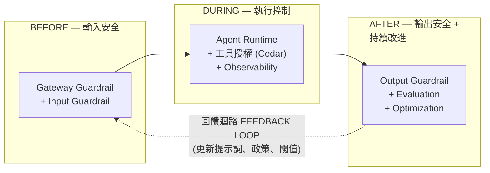

### 2.1 Hop 編號(本文件的規範性定義)

Hop 編號是**本文件自訂的框架**(AWS 官方文件沒有「hop」概念)。下表與下方的 sequence diagram 是規範性定義;本文所有章節、表格與圖均使用這套編號。

| Hop | 檢查點 | 階段 |
|:---:|:---|:---|
| 1 | AgentCore Gateway Policy Guardrails(輸入) | BEFORE |
| 2 | Bedrock Guardrails — 輸入評估(或 ApplyGuardrail) | BEFORE |
| 3 | 模型推論(非 guardrail 檢查點;為延遲預算而納入) | DURING |
| 4 | Agent 對工具的授權(Cedar Policy) | DURING |
| 5 | 工具請求/回應 guardrails(Gateway Policy) | DURING |
| 6 | Bedrock Guardrails — 輸出評估 | AFTER |

各 hop 在單次請求生命週期中的位置(圖示一次工具呼叫;每多一次工具呼叫,Hop #4/#5 重複一次):

<!-- v1.3 修訂:下方 Hop #1 的註記不再說「HTTP 403」—— [corrected per F4-6, FALSE, n=120, us-east-1, 2026-08-10]:在 MCP gateway target 上,全部 120 次政策拒絕都回傳 HTTP 200 帶一個 JSON-RPC error(code -32002),其 message 指名了做出拒絕的 policy ID。見 §3.1 行為註記。 -->

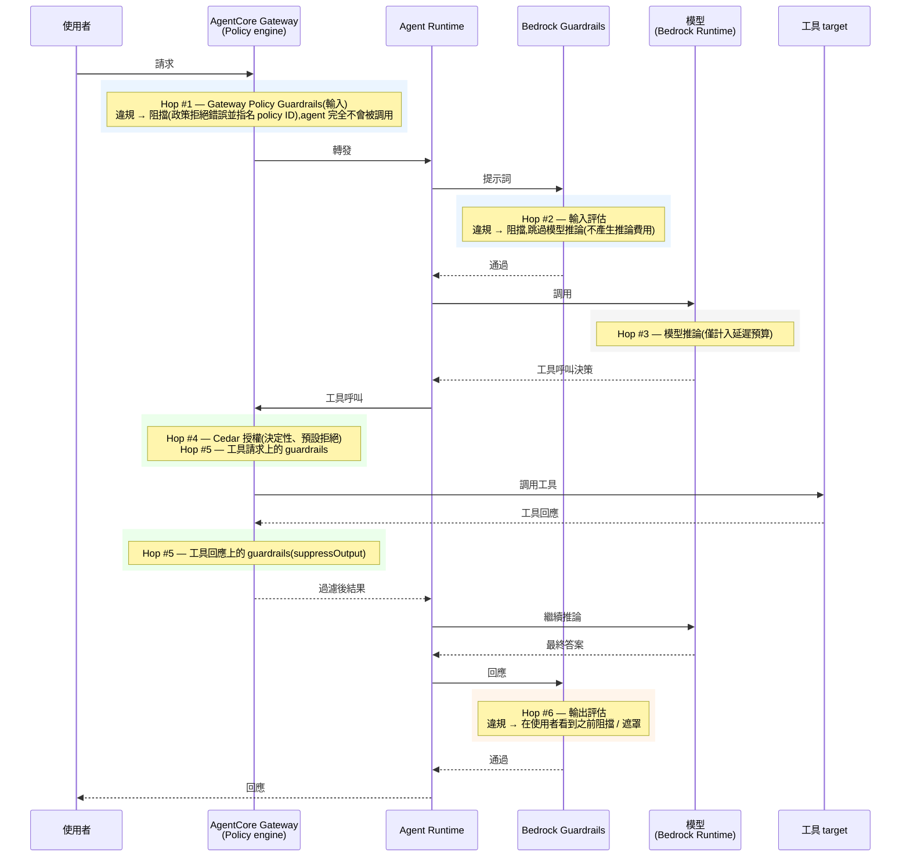

> 註:此圖是檢查點的**邏輯模型**,不是 wire-level 追蹤。當 Hop #2/#6 是透過附加在模型調用上的 `guardrailConfiguration` 執行時,它們是在 Bedrock Runtime 呼叫**內部**執行,而不是獨立的 API 往返;Hop #2-ALT(ApplyGuardrail,3.3 節)則是獨立的一次往返。

## 3. 階段一:BEFORE —— 輸入安全檢查點

### 3.1 檢查點 Hop #1:AgentCore Gateway Policy Guardrails

**服務:** Amazon Bedrock AgentCore Gateway + Policy in AgentCore

**功能:**

- 在 gateway 層攔截進入的請求,**在**它們抵達 agent **之前**
- 使用 Cedar policy conditions,依所設定的 guardrail safeguards 評估內容
- 立即阻擋違規請求——agent 完全不會被調用

**支援的 Safeguards:**

- Prompt Attack 偵測(JAILBREAK、PROMPT_INJECTION、PROMPT_LEAKAGE)
- Content Filter(類別可設定閾值;confidence score 是離散值 {0, 0.2, 0.4, 0.6, 0.8, 1.0},不是連續區間)[verified F1-18, TRUE, n=300, us-east-1, 2026-08-10:全部 300 個觀測到的分數都落在文件所述的格點上;附帶說明——低於所設閾值的分數可能不會發布,因此最低幾個格點可能觀測不到]
- Sensitive Information 偵測

**閾值:** 若你透過自然語言撰寫服務(natural-language authoring service)產生政策且未指定閾值,AgentCore 會套用預設值 Content Filter = 0.2、Prompt Attack = 0.4、Sensitive Information = 0.2。**若你不經該服務、手寫 Cedar 政策,你「必須」明確提供閾值——沒有任何自動預設。** Content Filter 類別:VIOLENCE、HATE、SEXUAL、MISCONDUCT、INSULTS。[verified F1-7, TRUE, API-surface probe, run r20260810T180012Z, 2026-08-10] *(驗證說明:直接探測本段的案例 F1-19,在 run r20260810T130945Z 的第 4–7 輪執行完成(2026-08-13 UTC,在 FINDING-P1-CEDAR-RESOURCE-SCOPE.md 所記錄的儀器修復之後),回傳 INCONCLUSIVE——本段文字保留原狀。以下是機制觀察,不是判定:手寫的那一半的行為與上述完全相符,且機制上如此——一個不帶閾值的 guardrails condition 會停在 `CREATE_FAILED`,錯誤訊息為 "unexpected type: expected Bool but saw {HATE: {confidenceScore: decimal,}, …}",亦即裸的 guardrail 呼叫回傳的是「每類別 confidence score 的記錄」,而文法中沒有任何東西會隱式地把它橋接成 condition 欄位所要求的 Bool;同一條敘述加上明確的 `.greaterThan(decimal("0.2"))` 就成功抵達 ACTIVE。至於「預設值」那一半則無法量測:`StartPolicyGeneration` 停在終端狀態 `GENERATED` 卻沒有產生任何一條敘述,兩個 asset 對兩個 guardrail 意圖片段都帶著 `{"type": "INVALID", "description": "Non-translatable: cannot be expressed in Dogwood"}`——所以上面的 0.2 / 0.4 / 0.2 預設值屬於**未經測試**,而非錯誤。實務上:2026-08-13,在一個帳戶、一個區域、一個提示詞的條件下,自然語言撰寫路徑本身就拒絕表達 guardrail 意圖——在圍繞它的預設值做設計之前,先確認該路徑在你的帳戶裡可用。)*

**設定方式:**

- 在 Cedar 政策內以 `when guardrails { ... }` 或 `unless guardrails { ... }` 條件內嵌定義 guardrails
- 將 policy engine 附加到你的 AgentCore Gateway
- Gateway Execution Role 必須同時具備 AgentCore 操作(`bedrock-agentcore:*`)與 Bedrock Guardrails 的權限。所需的 Guardrails 權限是 `bedrock:InvokeGuardrailChecks`——Policy 資料平面會使用 FAS(Forward Access Session)憑證代表你呼叫此 API。注意:InvokeGuardrailChecks(供 Gateway policy 使用)與 3.3 節的獨立 ApplyGuardrail API 是不同的東西。**SDK 前置條件(v1.3 新增):** 本文所規範的 policy API 介面需要 **botocore/boto3 ≥ 1.43.32**——`CreatePolicy.enforcementMode` 與 `definition.policy` 最早出現在 1.43.32,而 `bedrock-runtime.InvokeGuardrailChecks` 出現在 1.43.30,因此 1.43.30–.31 這兩版會暴露該 API 卻沒有 `enforcementMode`;而缺少的參數會被**靜默地從請求中丟棄**,不會被拒絕。隨附的 AWS CLI v2 沒有任何 policy-engine 子命令——請使用 Python/boto3。[verified F1-1 and F1-2, both TRUE, 離線探測 14 個 botocore wheel 並驗證單調性, 2026-08-09;見 FINDING-F1-1]

> **關鍵設定陷阱(ENFORCE + 預設拒絕):** Cedar 是預設拒絕——若沒有任何政策相符,請求即被拒絕。因此,一個處於 ENFORCE 模式、只包含 guardrail 政策(沒有明確 `permit`)的 policy engine,會**阻擋「所有」gateway 流量,包括良性請求** [verified F4-1, TRUE, n=120, us-east-1, 2026-08-10:engine 在 ENFORCE 下且無 ACTIVE permit 時,拒絕了 120/120 個良性請求;當 permit 回到 ACTIVE,拒絕即消失]。務必在 guardrail 政策旁一併放入明確的基線 permit,例如 `permit (principal, action, resource is AgentCore::Gateway);`(官方入門指南正是這麼做的)。
>
> **v1.3 更正——上述 permit 敘述在預設 `validationMode` 下無法建立** [corrected per F1-3, TRUE, 於 2026-08-10 與 2026-08-11 重現, us-east-1]:照原樣提交,`CreatePolicy` 會以 HTTP 202 接受,隨後停在 `CREATE_FAILED`,帶兩個 "Overly Permissive" 驗證器發現,因為 `PolicyValidationMode` 預設為 `FAIL_ON_ANY_FINDINGS`。官方入門指南對同一條敘述傳入了 `--validation-mode IGNORE_ALL_FINDINGS`;v1.2 從未提到這個參數。建立基線 permit 時請明確設定 `validationMode`,並注意驗證**不是**同步閘門——create 呼叫兩種情況都回傳 202,判定是非同步地出現在政策的 `status` 中,所以在依賴該政策之前必須輪詢它。

**延遲影響:**

- 在 gateway 入口處增加延遲
- 若被阻擋,就不會有任何下游處理(整體反而省下延遲)
- 注意:AWS 官方文件並未公布 Gateway policy guardrail 評估的並行性或延遲特性——請用 `GuardrailLatency` 指標(6.2 節)量測你自己的基線

**行為註記:**

- AWS 文件把 guardrail 評估描述為非決定性("The same input can result in different outputs. Policies, however, are deterministic.")。**實測上,這種變異並未出現** [corrected per F2-2, FALSE, n=300, us-east-1, 2026-08-10:300 個相同輸入 300/300 次產生同一個分數(0.8000);F2-5, FALSE, n=300 次相同的 ApplyGuardrail 呼叫, 2026-08-10:全部 300 個回應在判定與分數上都逐位元組相同,把每次呼叫的翻轉率上界壓到 ≈0.994%(單邊 95%);F2-4, FALSE, 2026-08-10:在每一個閾值位置上,決策翻轉率都是 0,n_usable=299(計畫 300)]。這些結果只界定了**在所量測的操作點上、被回報出來的**變異,並不證明該服務是決定性的——但也不要把「固定輸入的分數會逐次變動」當成一種已觀測到的行為來設計;防禦性閾值的實測依據是 AWS 對底層模型的自動更新(§3.2 BP#5),而不是每次呼叫的噪音。
- Fail-secure:政策評估逾時會導致自動 DENY 決策(AgentCore Service Approval Accelerator v2.9,Policy 章節)。*(驗證說明:本句所主張的 TIMEOUT 模式,從 AWS 外部仍然不可測——服務端評估逾時沒有任何故障注入介面;案例 F9-1 被其自身封存的 oracle 排除。主張保留原文。另一個**不同的**失效模式已被量測且確實 fail closed:把 `bedrock:InvokeGuardrailChecks` 從 gateway execution role 移除後,engine 對違規請求**與**良性請求**都**拒絕——移除前:違規 DENY / 良性 ALLOW;移除後:違規 DENY、良性 DENY;還原後違規仍 DENY——亦即它是停止按內容區分,而不是放行流量 [F5-4b, RECORDED, us-east-1, run r20260810T130945Z, 全部 11 個護欄乾淨]。這只刻畫了「權限缺失」模式,不構成關於逾時模式的證據。)*
- 被拒絕的請求會收到一個指名做出拒絕的 policy ID 的訊息——**但在 MCP target 上不是 HTTP 403** [corrected per F4-6, FALSE, n=120, us-east-1, 2026-08-10]:在 MCP gateway target 上量測到的 120 次政策拒絕,全部回傳 **HTTP 200** 帶一個 JSON-RPC error(code -32002,"Tool Execution Denied: Tool call not allowed due to policy enforcement […]"),訊息中指名了做出拒絕的 policy ID。不要把告警或客戶端邏輯建立在 MCP 流量的 403 狀態上;請改為解析該 JSON-RPC error。**v1.4——拒絕的形狀是「逐介面」的,而且確實有一個介面回答 403** *(來自 F1-15 執行的機制觀察,us-east-1,觀測於 2026-08-14——這是直接的 wire 觀察,不是判定;該案例封存的判定是 INCONCLUSIVE,不修訂任何內容)*:在單一條無條件、gateway 範圍的 `forbid` 之下,gateway 的 **inference** 介面以 **HTTP 403** 拒絕,body 為 `{"error":{"type":"permission_error","message":"Request Denied: Gateway Target request not allowed due to policy enforcement [Policy evaluation denied due to <policyId>]"}}`——狀態碼不同、封裝不同、用字也不同於本文先前唯一描述過的 MCP `-32002` 形狀。**只以 `-32002` 為條件的偵測會完全漏掉 inference 介面的拒絕;請同時比對兩種形狀。** MCP 介面上還存在第三種通道:在同一條 forbid 之下,`tools/list` **成功了,但回傳零個工具**(基線是三個)——engine 過濾的是工具**探索**,而不是讓請求失敗,所以只監看 `tools/call` 錯誤的客戶端根本看不到任何錯誤,而它的工具清單卻靜默地空掉。單一日曆日,單一 gateway。

**最佳實踐:**

1. 在 gateway 層只設定最低必要的 safeguards,以降低延遲
2. 只對高風險類別使用激進閾值(接近 0);一般內容用中等閾值
3. 在 CloudWatch 監控 gateway 的 Latency 與 Duration 指標(namespace `AWS/Bedrock-AgentCore`),加上 6.2 節的 Policy 指標(GuardrailLatency、ConfidenceScore、DenyDecisions)
4. 善用 gateway 的提早阻擋行為,節省下游運算成本
5. 保護 enforcement mode:任何擁有 `bedrock-agentcore:UpdateGateway` 的 principal 都能把 gateway 切成 LOG_ONLY,或整個卸除 policy engine——AWS 文件沒有記載任何保護此欄位的獨立 condition key。只把 UpdateGateway 授予受信任的 principal,並透過 CloudTrail 對 gateway 設定變更告警。[verified F5-2, TRUE, n=120, us-east-1, 於 2026-08-12 與 2026-08-13 重現——在出貨的角色設定下,runtime 角色 120 次 `UpdateGateway` 嘗試 0 次成功。] **偵測控制必須跑贏的實測時間窗(v1.3 新增,同一案例):** 一旦授權存在,模式翻轉在 602.8 ms / 931.7 ms 內被接受,而先前被阻擋的請求在 **13.2–14.2 秒後**就已被正常服務(兩天皆然,並自全新 session 確認)。因此以 CloudTrail 為基礎的告警是「**偵測**」而非「**預防**」——若需要預防,請用 SCP、permission boundary 或 resource policy 拒絕該呼叫。請把 `iam:PassRole` 與 `bedrock-agentcore:UpdateGateway` 一併稽核:`roleArn` 是該呼叫的必要成員,所以每次嘗試也都會被 PassRole 評估。(未量測 CloudTrail 的偵測延遲;此處只量測了攻擊側。)

參考:<https://docs.aws.amazon.com/bedrock-agentcore/latest/devguide/policy-guardrails-in-policies.html>

### 3.2 檢查點 Hop #2:Bedrock Guardrails —— 輸入評估

**服務:** Amazon Bedrock Guardrails(獨立服務)

**功能:**

- 當 `guardrailConfiguration` 附加在模型調用上時,在**模型推論之前**評估使用者提示詞
- 若輸入違反已設定的政策,模型推論**不會**執行——而且你不會被收取模型推論費用(只付 guardrail 評估)。反之,若被阻擋的是**輸出**,你仍要付完整的模型推論費用,加上對輸入與回應兩者的 guardrail 評估。這種計費不對稱,正是「在最外層快速失敗」原則(7.1 節)的量化理由 *(test pending:計費不對稱案例 F10-1 截至 2026-08-13 沒有已發布判定——主張保留原文)*:

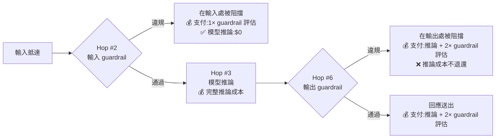

- 支援完整的 guardrail 政策範圍(比 Gateway 層更全面)

**支援的 Safeguards:**

- Content Filters(hate、insults、sexual、violence、misconduct)[verified F3-1, TRUE, n=600, 2026-08-10:合併後高於閾值的偵測率 0.93 [0.907, 0.948];F3-2, TRUE, n=110:良性誤判率 0.9% [0.16%, 5.0%];F3-3, TRUE, n=60:60 個 hard negative 觸發 0 次]
- Denied Topics(自訂)[verified F3-5, TRUE, n=120, 2026-08-10:主題內偵測率 0.90 [0.80, 0.95] 對比主題外誤判率 0.033 [0.009, 0.114],兩區間互斥]
- Word Filters(自訂封鎖清單)[verified F3-6, TRUE, n=66, 2026-08-10:66 個清單詞彙 0 漏]
- Sensitive Information Filters(PII 偵測/遮罩)——**偵測在各個文件所列的 entity type 之間並不一致** [corrected per F3-4, FALSE, n=341(31 種 entity type,每種 11 次), 2026-08-10]:31 種中有 20 種獲得確認(recall 信賴區間下界高於 0.5),但**有 9 種文件所列的 entity type 被推翻**——CA_HEALTH_NUMBER、CA_SOCIAL_INSURANCE_NUMBER、DRIVER_ID、LICENSE_PLATE、UK_NATIONAL_HEALTH_SERVICE_NUMBER、UK_UNIQUE_TAXPAYER_REFERENCE_NUMBER、US_BANK_ACCOUNT_NUMBER、US_BANK_ROUTING_NUMBER、US_PASSPORT_NUMBER,每一種的 recall 信賴區間**上界**都低於 0.5(即使採取較寬鬆的「任一 entity 即算」讀法,DRIVER_ID 仍偵測 0/11、US_PASSPORT_NUMBER 2/11、US_BANK_ACCOUNT/ROUTING 各 3/11);PHONE 與 UK_NATIONAL_INSURANCE_NUMBER 為 inconclusive。請測試你**實際依賴**的那幾種 entity type,不要假設「有文件記載 = 偵測得到」。
- Prompt Attack 偵測——**在 InvokeModel 上需要 input tagging**:使用 InvokeModel / InvokeModelWithResponseStream 時,prompt-attack 過濾**只**套用於被包在 input tag 內的內容("If there are no tags, prompt attacks … will not be filtered")。每次請求請用隨機的 `tagSuffix`,以防 tag 注入。**Converse/ConverseStream 行為不同**:message 內容預設就會被評估,不需要 tagging——但一旦你加入**任何**一個 `guardContent` 區塊,guardrail 就**只**評估被保護的區塊而跳過其餘部分(這是「限縮範圍」,不是「啟用」;system prompt 則相反——除非包在 `guardContent` 內,否則永不被評估)。至於 prompt-attack 過濾器本身是否會在未加 tag 的 Converse message 上執行,文件沒有記載——依賴它之前請先做紅隊測試驗證。[verified F5-6, TRUE, 4 個 arm × (60 攻擊 + 60 良性), us-east-1, 2026-08-11:未加 tag 的 InvokeModel 其 prompt-attack recall 為 0 [0, 0.031](n=120)——未加 tag 的輸入確實不會被掃描 prompt attack,證實了 tagging 要求。]
- Contextual Grounding 檢查(限制見 5.1 節)[verified F3-7, TRUE, n=120, 2026-08-10:無根據回應偵測率 0.933 [0.841, 0.974] 對比有根據回應誤判率 0.033 [0.009, 0.114],兩區間互斥]
- Automated Reasoning 檢查(僅 detect 模式;僅英文(美國);6 個區域可用)[「僅 detect」與「僅 en-US」已驗證 F8-8, TRUE, SDK 介面探測 botocore 1.43.67, 2026-08-10]。**v1.3 更正——「不支援 streaming」並不被 API 介面支持** [corrected per F1-14, FALSE, SDK 介面探測涵蓋 350 個操作 / 14,774 條 member 路徑, 2026-08-10]:`ConverseStream` 接受 `guardrailConfig`,並在 `stream.metadata.trace.guardrail.*` 之下建模了 132 條 Automated-Reasoning 評估路徑——與 `Converse` 所帶的 `GuardrailTraceAssessment` 形狀相同——所以帶 `automatedReasoningPolicyConfig` 的 guardrail 是可以附加到 streaming 操作上的,而 streaming 回應也有容納其評估結果的欄位。(這是 API 模型層面的觀察;並未實際執行 live streaming AR 行為。)

**設定方式:**

- 在 Amazon Bedrock Console 或經由 API 建立 Guardrail 資源
- 取得 `guardrailIdentifier` 與 `guardrailVersion`
- 在 agent 程式碼中附加到模型調用

**延遲影響:**

- 輸入評估時,所有已設定的政策會**並行**評估(官方文件:"the input is evaluated in parallel for each configured policy")
- 延遲隨政策數量與輸入內容長度增加
- 若被阻擋,模型推論會被跳過(對違規輸入而言,延遲與成本都淨節省)

**最佳實踐:**

1. 單一 guardrail 資源就支援分開的輸入 / 輸出設定——content filters 有各自獨立的 `inputStrength` / `outputStrength`,sensitive-info entity 也有獨立的 `inputAction` / `outputAction`。優先使用「一個資源、逐方向設定」,而不是維護兩個資源。
2. 避免重複政策——若 Gateway Guardrails 已經處理 prompt attack,可考慮移除此處的重複檢查(但在只依賴任一層之前,請注意上述的區域與 tagging 限制)
3. 使用 **`AWS/Bedrock/Guardrails`** namespace 下的 InvocationLatency CloudWatch 指標追蹤 ApplyGuardrail 的額外開銷。至於模型調用**內部**的 guardrail 開銷,CloudWatch 沒有直接指標——請改讀調用 trace/回應中的 `invocationMetrics.guardrailProcessingLatency` 欄位。
4. 對延遲敏感的應用,在這一層只啟用必要政策,把全面檢查延後到非同步評估
5. AWS 會定期自動更新底層 guardrail 模型("Updates apply automatically and require no action on your part")。請維護一套回歸測試集,並按排程重新驗證 guardrail 行為——過去的評估結果不保證未來的行為。

參考:<https://docs.aws.amazon.com/bedrock/latest/userguide/guardrails-how.html>

### 3.3 檢查點 Hop #2-ALT:ApplyGuardrail API(供非 Bedrock 模型使用)

**服務:** Amazon Bedrock Runtime —— ApplyGuardrail API

**功能:**

- 提供與 Hop #2 相同的 guardrail 評估,但作為獨立的 API 呼叫,與 foundation model 解耦
- 適用於第三方模型、自架模型,或 LiteLLM Gateway 情境
- 由客戶控制何時、如何呼叫該 API

**設定方式:**

```python
response = client.apply_guardrail(
    guardrailIdentifier="your-guardrail-id",
    guardrailVersion="1",
    source="INPUT",
    content=[{"text": {"text": user_prompt}}]
)
```

**延遲影響:**

- 增加一次完整的 Bedrock Runtime API 往返
- 高吞吐工作負載可考慮批次化 content block:單次 ApplyGuardrail 呼叫傳入多個 content item 可減少往返次數。(AWS 未公布具體的加速數字;相關的 InvokeGuardrailChecks API 則記載了每則 message 最多 10 個 content block 的硬性上限。)

**最佳實踐:**

1. 快取 guardrail 決策風險很高,若要使用必須嚴格限制:AWS 會自動更新底層模型,而「相似」的輸入差異可能恰好就在攻擊 payload 上。若要快取,請限制為**僅完全相符的輸入、短 TTL,且永不用於 prompt-attack 類別**。*(v1.3 註記:此理由中「guardrail 評估是非決定性的」這個前提已被移除—— [corrected per F2-5, FALSE, n=300 次相同的 ApplyGuardrail 呼叫, 2026-08-10:全部 300 個回應在判定與分數上逐位元組相同;每次呼叫翻轉率上界 ≈0.994%,單邊 95%]。實測支持限制快取的理由是 AWS 自動更新與 payload 敏感性,這兩點本身就足以成立。)*
2. 使用 content 陣列批次化以減少 API 呼叫次數
3. 採取選擇性評估——並非所有輸入都需要完整 guardrail 評估。**但不要指望用 input tagging 來降低計費的 text unit:** v1.2 主張 tagging 可讓 RAG 提示詞只評估使用者提供的部分、從而減少計費 text unit,此主張已被推翻 [corrected per F10-3, FALSE, run r20260813T145248Z, 2026-08-13:對一個 RAG 形狀的提示詞,加 tag 評估時 API 回報的 text-unit 計數與未加 tag 者**完全相同**]。附帶說明:這讀的是 API 所回報的 unit 計數;並未讀取任何帳單、Cost Explorer 或 CUR 數字。
4. 為該 API 呼叫設定逾時與斷路器,避免延遲尖峰阻塞整個請求。**請明確決定你的失效姿態**:AWS 並未記載模型調用期間 Bedrock Guardrails 發生錯誤時是 fail-open 還是 fail-closed——當你呼叫 ApplyGuardrail 時,這個決定屬於你的應用程式(對受監管的工作負載,fail-closed 是安全的預設)。

參考:<https://docs.aws.amazon.com/bedrock/latest/userguide/guardrails-use-independent-api.html>

### 3.4 Guardrail Tier 與語言支援

Bedrock Guardrails 提供兩種 safeguard tier,覆蓋範圍有實質差異:

| | **Classic tier** | **Standard tier** |
|:---|:---|:---|
| Content filter / prompt attack 語言 | 僅英文、法文、西班牙文 | 數十種語言,含中文(簡體)、日文、韓文、德文、印地文、阿拉伯文等 |
| Prompt leakage 偵測 | 弱但可量測(v1.2 曾說「無」) | 有(強) |
| Denied topic 定義長度 | 200 字元(已在邊界確認) | 1,000 字元 —— **無法照文件重現;見下方更正** |
| 跨區域推論 | 不使用 | **必需**(`crossRegionConfig` / guardrail profile)[verified F1-6, TRUE, us-east-1, 2026-08-10:STANDARD 不帶 `crossRegionConfig` 在兩個帶 tier 的區塊上都被拒絕,帶了就被接受,兩個 CLASSIC 格子不帶它也被接受——僅為 create 請求的驗證,且在單一區域、單一帳戶] |

**v1.3 對本表的更正:**

- **Prompt leakage 偵測並非 Standard 獨有** [corrected per F8-4, FALSE, n=460(每個 tier 120 leakage + 110 良性), 2026-08-10]:在彙總的 PROMPT_ATTACK 訊號上,Classic tier 偵測 prompt leakage 的 recall 為 0.41 [0.32, 0.50],對應良性 FPR 0.036 [0.014, 0.090]——弱,但真實存在,不是「無」。Standard tier 的 recall 為 0.99 [0.95, 0.998],FPR 0 [0, 0.034]。在 leakage 偵測重要的場合,Standard 仍是正確選擇;但 v1.2 說 Classic 完全不提供,已被推翻。
- **Standard tier 文件所載的 1,000 字元 denied-topic 上限並不成立** [corrected per F8-5, FALSE, 邊界探測, 2026-08-10]:Classic 接受 200 字元定義、對 201 字元回傳 `ValidationException`(邊界確認);Standard **對 1,000 字元的定義回傳 `ValidationException`**(1,001 字元的探測回傳 `ThrottlingException`,所以確切的有效上限並未確立)。不要在未於自己帳戶測試的情況下,規劃 1,000 字元的 topic 定義。

Tier 選擇決策:

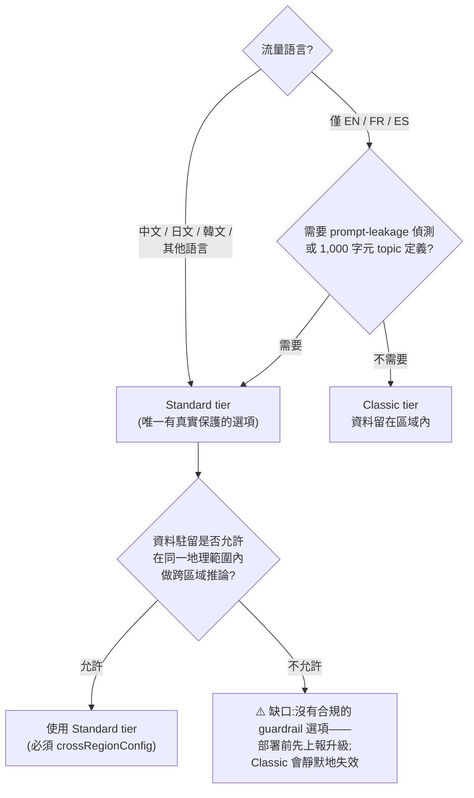

關鍵影響:

- 官方警告:"Guardrails are ineffective with languages that aren't supported."(不支援的語言,guardrails 形同無效。)Classic tier 的 guardrail 對中文/日文/韓文流量幾乎不提供任何保護。[verified F8-2, TRUE, n=240, 2026-08-10:Classic tier 對 zh-TW/zh-CN/ja/ko 攻擊內容的偵測率為 0 [0, 0.0175](n=216)——與良性 FPR 在統計上無法區分——而 EN/FR/ES 的偵測率很高。這種失效是**靜默的**:沒有錯誤,沒有任何訊號顯示評估其實是惰性的。]
- Standard tier 強制的跨區域推論會把資料保持在同一地理範圍內(例如美國的請求留在美國區域),且不額外收費,但「你的輸入提示詞與輸出結果可能移動到主要區域之外」——請把這點與資料駐留承諾、以及第 1 節的 Guardrails-in-policy 區域限制一併對照。[「同地理範圍」主張已驗證 F8-6, TRUE, n=60, 2026-08-10:profile `us.guardrail.v1:0` 的 60 次試驗全部揭露了處理區域,全部落在美國地理範圍內,0 次超出]
- Word filters 在任一 tier 都只支援英文、法文、西班牙文。*(驗證說明:案例 F8-7 回傳 INCONCLUSIVE;F1-26 已執行(run r20260810T130945Z)也回傳 INCONCLUSIVE——`CreateGuardrail` 在**兩個** tier 上都拒絕了非 EN/FR/ES 的 word policy,但「僅支援語言」的對照組**也**被拒絕,所以該拒絕無法歸因於非 EN/FR/ES 的詞彙,而一個原因不明的拒絕無法確立任一分支。主張保留原文。)*
- Automated Reasoning 檢查僅支援英文(美國)。[verified F8-8, TRUE, SDK 介面探測, 2026-08-10:24 個 Automated-Reasoning 操作上,沒有任何欄位能表達非 en-US 的語言,也不存在 DETECT/ENFORCE 模式列舉——即僅 detect]

參考:<https://docs.aws.amazon.com/bedrock/latest/userguide/guardrails-supported-languages.html> 與 <https://docs.aws.amazon.com/bedrock/latest/userguide/guardrails-tiers.html>

## 4. 階段二:DURING —— 執行控制與可觀測性

(Hop #3——模型推論——不是 guardrail 檢查點;它出現在 6.1 節的延遲預算中。)

### 4.1 檢查點 Hop #4:Agent 對工具的授權(Cedar Policy)

**服務:** Amazon Bedrock AgentCore Policy(基於 Cedar)

**功能:**

- 攔截**每一個**經由 AgentCore Gateway 的 agent-to-tool 請求
- 依 Cedar 政策邏輯做出決定性的 allow/deny 決策
- 對 prompt injection 免疫——它在模型的推理之外運作

**關鍵特性:**

- **決定性**(不像 guardrails 那樣是機率性的)[Cedar 決定性已驗證 F2-1, TRUE, n=630, us-east-1, 2026-08-10:630 次重複評估 0 次變動,單邊 95% 上界 0.47%。注意:這個對比的 guardrail 那一側在 n=300 時也沒有出現逐次變異——見 §3.1 行為註記的更正(F2-2/F2-5)]
- 預設拒絕:若無政策相符,請求即被拒絕 [verified F4-4, TRUE, n=120, us-east-1, 2026-08-10:120/120 個無相符政策的請求都被拒絕;forbid 覆蓋 permit 亦已驗證 F4-5, TRUE, n=120, 同一次執行]
- 評估工具呼叫層級的授權(哪個工具、什麼參數、在什麼條件下)
- Policy/guardrails 適用於三種 gateway target 類型—— MCP target(`POST /mcp`,JSON-RPC `tools/call`)、HTTP runtime target(`POST /<target>/invocations`)、HTTP inference target(`POST /inference/v1/messages`——**路徑已在 v1.4 更正**;v1.2 寫的是 `POST /inference`,那是 gateway 的前綴而非完整路由,見本節末的機制觀察)——而不是只有 MCP 工具 *(驗證說明:案例 F1-15 已執行(run r20260810T130945Z,2026-08-14 UTC)並回傳 **INCONCLUSIVE**——「三種 target 類型」的主張完全保留 v1.2 原文。該句所指的三種類型中,`mcp` 與 `inference` 兩者都建立起來了,且在單一條無條件、gateway 範圍的 `forbid` 之下**都被政策拒絕**,而在沒有該 forbid 時各自都被允許;第三種 `http.agentcoreRuntime` 在此 API 版本無法構造,所以封存中「三者皆然」的連言既無法被滿足也無法被推翻。這不是 FALSE:一個無法承載請求的 target 類型,不可能繞過對請求的評估,而且沒有觀測到任何東西繞過任何東西。它也不是 TRUE:二不是三,而把「三者皆然」讀成「所有存在的皆然」,就是在判定一個與封存所指不同的量。上面更正的路徑,是同一項目中順帶的 wire 細節,不是該主張的實質內容——列舉本身未被觸動。見 FINDING-F1-15.md。)*
- Fail-secure:評估逾時導致自動 DENY *(驗證說明:本句所主張的逾時模式從 AWS 外部不可測—— F9-1 被其封存 oracle 排除;主張保留原文。fail-secure 這個標籤**確實**在「權限缺失」這個特定模式上獲得旁證:把 `bedrock:InvokeGuardrailChecks` 從 gateway execution role 移除後,engine 對違規與良性請求都拒絕——對該失效模式而言是 fail-CLOSED [F5-4b, RECORDED, us-east-1, run r20260810T130945Z]。F5-4b 對逾時模式沒有任何說明。)*

**延遲影響:**

- Cedar 政策評估是決定性且快速的(形式邏輯,不是 ML 推論)
- 相較於 guardrail 評估,額外延遲極小
- 啟用 tracing 時,政策操作會發出 span

**最佳實踐:**

1. 工具層級的存取控制請用 Cedar Policy——就授權決策而言,它比 guardrails 更快且更可靠
2. **不要**單靠 guardrails 做工具授權—— guardrails 是機率性的,Cedar 是決定性的
3. 遵循最小權限原則:只明確 permit 必要的工具動作
4. 透過 CloudWatch 的 AgentCore Policy 指標監控政策評估延遲(6.2 節)
5. 保持政策規則聚焦且精簡——過度複雜的政策會增加評估時間
6. 刻意地使用兩層 LOG_ONLY 控制:policy **ENGINE** 有一個 `mode`(預設 ENFORCE / LOG_ONLY),而每一條 **POLICY** 有一個 `enforcementMode`(預設 ACTIVE / LOG_ONLY)。**Engine mode 優先——處於 LOG_ONLY 的 engine 什麼都不阻擋,即使個別政策是 ACTIVE。** 在生產環境依賴任何政策之前,先確認 engine mode 是 ENFORCE。[兩個層級都已驗證:F4-2, TRUE, n=120, us-east-1, 2026-08-10—— engine 在 LOG_ONLY 時,即使政策為 ACTIVE 也只阻擋了 120 個請求中的 0 個;F4-3, TRUE, n=120, 同一次執行—— engine mode 優先於逐政策的 `enforcementMode`;mode 列舉 LOG_ONLY|ENFORCE 與逐政策 `enforcementMode` 的 API 介面已驗證 F1-5 與 F1-1, TRUE, 2026-08-09/10]

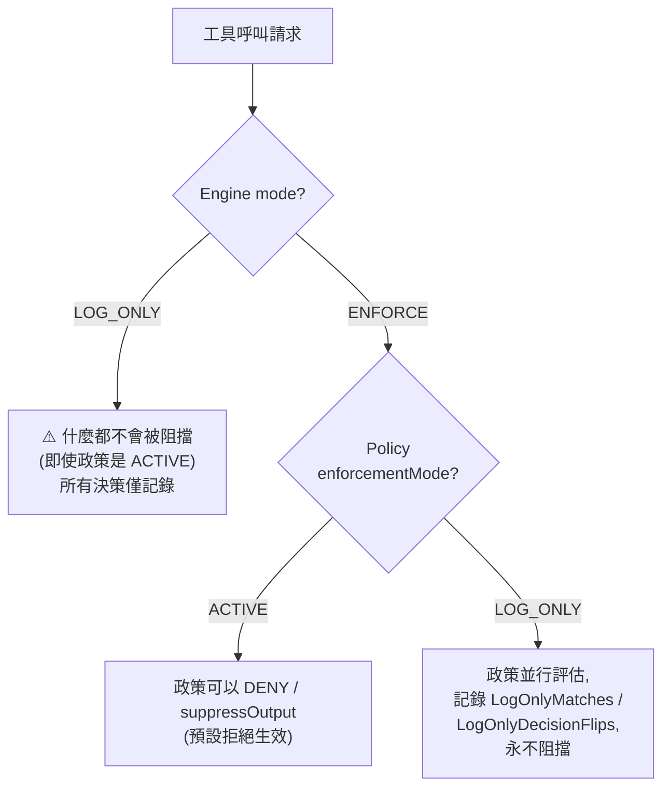

參考:<https://docs.aws.amazon.com/bedrock-agentcore/latest/devguide/policy.html>

**policy 中 guardrails 的限制:**(1)guardrail *函式*是用 ML 對內容評分——它們不做模式比對——但 v1.2 一句「沒有 regex 或 pattern matching」作為「你能撰寫什麼」的陳述已被推翻:驗證器**接受**了在 `when guardrails {…}` 區塊內使用 Cedar 的 `like` 運算子(`context.input.text like "*jailbreak*"`),終端狀態 ACTIVE,四次皆然,無 pattern 的對照組也同樣 ACTIVE;而一個 regex 形狀的類別字面值(`["HATE.*"]`)則被同步拒絕(因為只有五個固定類別)[corrected per F1-25, FALSE, run r20260810T130945Z, us-east-1, **已在兩個 UTC 日重現,2026-08-13 與 2026-08-14**:第二日的回合逐 arm 重現了 `like` 被接受、無 pattern 對照組被接受、regex 形狀類別被拒絕,使用相同 SDK 與相同 `validationMode`]。至於一個被接受的 `like` 是否**真的會被評估**——那個 glob 在請求時是否過濾了任何東西——**未經測試**(所有觀察都是 LOG_ONLY 下的 `CreatePolicy`),所以請把 regex 風格的檢查放在 Gateway REQUEST Lambda interceptor(見下文):一個「被接受但未經驗證」的 `like`,正是該建議要避開的陷阱。(2)v1.2 說你不能把標準 Cedar `when {…}` 與 `when guardrails {…}` 混用——這句話的「撰寫時」那一半已被推翻:驗證器**接受**了混用政策,沒有警告也沒有 finding,終端狀態 ACTIVE,四次皆然,兩個拆分對照組也都 ACTIVE [corrected per F1-24, FALSE, run r20260810T130945Z, us-east-1—— **已於 2026-08-14 UTC 重現**,與 F1-25 相同:混用政策與兩個拆分版本在第二個日曆日再次抵達 ACTIVE]。而「評估時」那一半——即 guardrails 區塊會**取代**標準條件——在此**未經測試**;若它如文件所述成立,那麼「被接受」比 v1.2 承諾的「被拒絕」更糟,因為業務條件會從一條讀起來像連言的政策中被靜默丟棄。所以請把條件拆成兩條敘述,因為「被接受的混用政策」不等於「能運作的政策」——該建議依然成立,而驗證器不會幫你強制它。(3)`when guardrails {…}` 區塊內必須至少包含一個 guardrail 定義。

> **機制觀察(v1.4,來自 F1-15 執行—— INCONCLUSIVE,不是判定;2026-08-14 在 us-east-1 現場觀測,除註明外皆為單一日曆日):** 這裡的五項結果是直接的 API 形狀與 wire 觀察,而非 oracle 輸出,所以它們本身即可被引用。它們**都不**修訂上面**關鍵特性**中的「三種 target 類型」主張,該主張完全保留 v1.2 原文。
>
> 1. **`CreateGateway.protocolType` 是一個只有單一成員 `MCP` 的列舉**(botocore 1.43.67),而 `protocolConfiguration` 相應地只提供 `mcp` 這個 union 成員。因此,`CreateGatewayTarget` 拒絕的是整個 `http` 分支——不是它的某個變體——錯誤為 `ValidationException: HTTP target configuration is not supported for gateways with MCP protocol type. Provide an MCP-compatible target configuration and retry the request.`。**對讀者的後果:「建立一個 HTTP runtime target」這類指引目前無法照做**——不存在任何值能產生非 MCP 的 gateway,因此不存在任何 gateway 會接受 `http.*` target。這一項是從釘住的 service model 讀出的,而 service model 在同一 SDK 版本內不變,所以它不帶日曆重現的附註;要重新檢查它的時機是你換 SDK 版本時,不是換日子時。
> 2. **inference 介面的 wire 路徑是 `POST /inference/v1/messages`。** 單獨的 `POST /inference` 會被拒絕,回傳 `{"success":false,"error":"Http operation is not supported for gateway protocol type MCP"}`,單獨的 `/v1/messages` 亦然。真正的路由是一個組合:`inference.provider.operations[].path` 是**面向客戶端**的路徑(`/v1/messages`),而 gateway 是在自己的 `/inference` 前綴之下提供它——所以 v1.2 的路徑是把前綴誤當成完整路由。已在上面的項目中作為路徑事實更正。
> 3. **在 `inference.provider` target 上,`operations[].models` 是承重的,即使 API 標記它為選填。** 只宣告 `endpoint` 的 target 會被建立、會抵達 READY,而且**無法路由**:每個請求都回傳 `404 Model '<id>' not found on any target`,因為一個不宣告任何 model 的 target 永遠不會被路由層選中。請宣告帶 `models` 的 `operations`,否則這個 target 會在看起來健康的同時完全惰性。
> 4. **`operations[].models[].model` 的 pattern 是 `[a-zA-Z0-9\-\._\*\?@]+(/[a-zA-Z0-9\-\._\*\?@]+)*`**——它容許 `*`/`?` glob,而**完全不容許冒號**,所以 Bedrock 自己的正規 model id(`…-v1:0` 形式)無法寫在那個欄位裡。帶冒號的 id 會被 `400 Model ID contains invalid characters` 拒絕;不帶冒號的 id 與 glob 則被接受。請規劃使用 glob(例如 `anthropic.claude-*`)而不是正規 id。
> 5. **inference 介面上的政策拒絕是 HTTP 403**,body 為 `{"error":{"type":"permission_error","message":"Request Denied: Gateway Target request not allowed due to policy enforcement [Policy evaluation denied due to <policyId>]"}}`——**不是** MCP 介面所用的 JSON-RPC `-32002` 形狀。**任何只以 `-32002` 為條件的拒絕偵測,會完全漏掉 inference 介面的拒絕**(見 §3.1 行為註記、§6.4 與 §8 階段二檢查清單)。而在同一條 forbid 之下的 MCP 介面上,`tools/list` **成功了並回傳空清單**,而基線是宣告三個工具:engine 過濾的是工具探索,而不是讓請求失敗,這是第三個評估通道——一個不會拋出任何錯誤給客戶端捕捉的通道。
>
> 範圍:一個 gateway、一個區域、一個日曆日,而第 2–5 項背後的政策行為是單一日的。依本儲存庫的「兩個日曆日重現」規則,該行為在沒有第二日執行的情況下無法支撐**正向**主張;而這裡沒有任何東西依賴它,因為判定是 INCONCLUSIVE 且沒有任何主張移動。完整敘述與它所更正的那個「差一點成為 FALSE」的近失事件:`results/FINDING-F1-15.md`。

> **互補控制—— Gateway Lambda interceptor:** 除 Cedar policy 之外,AgentCore Gateway 支援 REQUEST/RESPONSE Lambda interceptor,提供工具層級、操作層級與參數層級的存取控制(JWT claims 驗證、RBAC/ABAC、回應過濾/淨化、逐使用者速率限制)。它們與 Hop #4/#5 在同一個 gateway 邊界執行,能實作 Cedar 無法表達的檢查(例如 regex 驗證)。安全註記:啟用 `passRequestHeaders` 後,**所有** header ——包括 OAuth bearer token ——都會被轉發到客戶的 Lambda;請把 interceptor Lambda 當成對安全敏感的邊界來對待。(AgentCore Service Approval Accelerator v2.9,Gateway 章節。)

### 4.2 檢查點 Hop #5:工具請求/回應 Guardrails

**服務:** AgentCore Gateway Policy —— 工具 I/O 上的 Guardrails

**功能:**

- 同時評估工具請求(agent → 工具)與工具回應(工具 → agent)中的內容。請求授權使用 `permit` / `forbid` 效果;工具輸出過濾使用 `suppressOutput` 效果——這是一個獨立的效果,會在某個動作完成後評估它的輸出,並在違反 guardrail 時抑制該輸出。
- 與 Hop #1 相同的 guardrail safeguards,但套用於工具通訊
- **降低**敏感資料經由工具互動外洩的風險——它並不「防止」,而且本研究並未量測這個降低幅度。**殘餘風險:** 本研究中從未觀察到 `suppressOutput` 效果真的抑制了任何輸出。探測它的案例 F1-17 判定為 **INCONCLUSIVE**,而它的儀器是在本機從十個方向讀取 `bedrock`、`bedrock-runtime`、`bedrock-agentcore-control`、`bedrock-agentcore` 的 botocore service model ——**沒有調用任何 operation**。因此該效果「被接受」是一個 API 表面事實,它的**行為**未經測試。這個 hop 所依賴的 PII 偵測另有已知的不完整:31 種有文件記載的 entity type 中有 9 種被推翻 [corrected per F3-4, FALSE, 2026-08-10]。而本研究**完全沒有**任何案例量測工具**輸出**上的 prompt-attack 偵測。請把 Hop #5 當成位於某個決定性控制(Cedar `forbid`,或 egress deny)**之後**的縱深防禦,絕不要把它當成外洩邊界本身。

**延遲影響:**

- 對 agent 執行迴圈中的**每一次**工具調用都會增加
- 對於進行 N 次工具呼叫的多步 agent,這會增加 N × guardrail 評估時間——實測上,每增加一次工具呼叫的成本為 **≈850 ms**(bootstrap 斜率信賴區間 [838.7, 862.7] ms),遠高於 v1.2 估計的 165–750 ms [corrected per F6-8, FALSE, 1600 次中 600 次可用, us-east-1, 2026-08-10;見 §6.1]
- 在複雜的 agent 工作流中,這是最顯著的延遲影響

**最佳實踐:**

1. **逐工具選擇性套用 guardrails**——並非所有工具都處理敏感內容;對受信任的內部工具可跳過 guardrails。**但不要對回傳外部/不可信內容的工具跳過**(網頁搜尋、瀏覽、第三方 API):工具回應是間接 prompt injection 的主要載體,而例如 Web Search Tool 對結果不做任何惡意內容分類—— AWS 的指引是在搜尋結果影響 agent 推理**之前**套用 guardrails(Accelerator v2.9,Web Search 章節)。
2. **監控逐工具呼叫的延遲**——使用帶 ToolName 維度的 `GuardrailLatency` 指標,加上分散式追蹤 span,找出哪些工具互動最慢
3. **按工具類型適當設定 guardrail 閾值**——資料庫查詢工具可能需要比計算器工具更嚴格的 PII 過濾
4. PII 附註已修訂:v1.2 曾陳述 Bedrock Guardrails 的 sensitive-information filter 不會偵測 `tool_use` 參數內的 PII。**實測上,它會** [corrected per F1-28, FALSE, run r20260810T130945Z:相同的 EMAIL PII 在 tool 區塊放置 arm(`tool_result_json`)的**每一次**試驗與 message-text 對照組中都被處理——兩種放置方式都被處理,所以對這個 entity 而言,`tool_use` 參數**不是**掃描盲區]。更正的範圍:`GuardrailPiiEntityType` 的 31 種 entity type 中只探測了**一種**(EMAIL),tool 區塊是由呼叫方提供而非在輸出側由模型產生,且對 `sensitiveInformationPolicyConfig` 的 regex 那一半沒有任何確立。所以仍然不要把 Hop #5 當成結構化工具參數的完整 PII 屏障—— §3.2 實測到的逐 entity 偵測缺口在此同樣適用——而絕不可通過的結構化參數,請用 Cedar 或 interceptor 驗證。

> **機制觀察(v1.3,來自 F5-5 執行—— INCONCLUSIVE,不是判定):** 上述關於工具回應 guardrail 的建議,並不會一致地適用於任意自訂工具。一條引用 `context.output.text` 的 `when guardrails` 政策無法針對某個自訂 echo 工具建立:探測政策停在 `CREATE_FAILED`,服務回報引數 `context.output.text`「is not present in the context」(不存在於該 target 動作的 context 中)——provider 的 context 欄位路徑引數,必須在該規則所適用的**每一個**動作上都有宣告 [F5-5, run r20260810T130945Z;護欄 `probe_policy_became_active` 與 `echo_round_trip_observed` 皆為 false,因此該案例封存的抑制問題從未被量測]。若某個工具的 action schema 沒有宣告輸出欄位,輸出側的 guardrail 規則甚至無法附加到它身上。

參考:<https://docs.aws.amazon.com/bedrock-agentcore/latest/devguide/policy-guardrails-getting-started.html>

### 4.3 即時可觀測性(執行期間)

**服務:** Amazon Bedrock AgentCore Observability

**功能:**

- 提供跨**所有** agent 元件、相容 OpenTelemetry 的分散式追蹤
- 自動擷取:LLM 推論呼叫、工具調用、memory 操作
- 將 metrics、span 與 trace 發布到 Amazon CloudWatch

**關鍵指標(自動產生):**

- Session 數、延遲、duration
- Token 使用量與錯誤率
- First-byte 延遲(到第一個回應 token 的時間)
- 總 duration(端到端處理時間)

**最佳實踐:**

1. 在**每一個** agent 元件上開啟 tracing,不只在最外層邊界—— trace 必須端到端涵蓋整個請求
2. **先**啟用 CloudWatch Transaction Search ——它是在 gateway 上啟用 tracing 的前置條件
3. 自訂 runtime 指標請用 AWS Distro for Open Telemetry(ADOT)SDK(`aws-opentelemetry-distro` >= 0.10.0;注意 agent observability 不支援 ADOT Collector)
4. 為政策與 guardrail 操作加上 span 以做逐跳延遲分析;政策 span 寫入 `aws/spans` log group,而 gateway vended logs(可能包含請求/回應 body)透過 `trace_id`/`span_id` 與 span 關聯 [verified F7-4, TRUE, n=20, us-east-1, 2026-08-10:20/20 個 request ID 都與 `aws/spans` 中的政策 span 接合成功,span 名稱 `AgentCore.Policy.AuthorizeAction`,第一個 span 約在請求後 50 秒可查詢;tracing 關閉的對照組已驗證 F7-5, TRUE, 2026-08-10:停用 tracing 後,同樣的流量出現 0 個 span]

參考:<https://docs.aws.amazon.com/bedrock-agentcore/latest/devguide/observability.html>

### 4.4 不可繞過的逐工具使用 Hook(Agent 圍堵模式)

**目標:** 對 agent 的**每一次**工具使用強制執行一個「hook」——類比於 agent 框架中的 PreToolUse/PostToolUse hook ——使得 agent runtime **無法跳過、繞過或停用該 hook 本身**,即使模型被 prompt injection、或 agent 程式碼被入侵。

**威脅模型:** 你要防禦的對象就是 agent 本身——一個被操縱(或單純出錯)而試圖發出有害工具呼叫的模型,以及可能試圖 (a) 不經檢查點直接呼叫工具、(b) 經由網路外洩資料、或 (c) 用它自己的 AWS 憑證來削弱或移除強制執行層的 agent 程式碼。

**核心原則:強制執行必須存在於 agent 的執行環境「之外」。** 任何在 agent 行程內部執行的東西——框架 callback、程式碼內驗證、system prompt 指令——都只是建議性的:被圍堵的同一份程式碼/模型就能跳過它。AgentCore 的架構在 Gateway 資料平面提供了一個行程外的強制執行點,Accelerator 明確描述:「Policies intercept all agent traffic at the gateway boundary and **cannot be bypassed by agents or malicious actors**」(Accelerator v2.9,Policy 章節)。Cedar policy「在模型的推理之外運作」,因此對 prompt injection 免疫。[繞過路徑 #1 已在穩態下驗證:F5-1, TRUE, n=120, us-east-1, 於 2026-08-11 與 2026-08-12 重現——在出貨的角色設定下,120 次繞過 gateway 的直接工具調用 0 次執行成功(Wilson 99% [0, 0.0587]);一次刻意的權限變更把結果反轉為 20/20,證明了儀器有效。注意這是在特定點上否證了五條列舉的路徑,不是證明了「無法被繞過」這個全稱量詞——後者沒有任何實驗能證明。]

**Hook 對應(框架概念 → AgentCore 原語):**

| 框架 hook 概念 | AgentCore 原語 | 強制執行位置 |
|:---|:---|:---|
| PreToolUse hook(執行前 allow/deny) | Cedar Policy `permit` / `forbid`(Hop #4)——決定性、預設拒絕、參數層級條件 | Gateway 資料平面(agent microVM 之外) |
| PreToolUse 內容檢查 | 工具請求上的 Guardrails-in-policy `when guardrails {...}`(Hop #5) | Gateway 資料平面 |
| PreToolUse 自訂邏輯(regex、外部授權、逐使用者速率限制) | Gateway **REQUEST Lambda interceptor** | Gateway 邊界,客戶 Lambda |
| PostToolUse 輸出過濾 | `suppressOutput` 效果——在動作完成後評估其輸出,違反 guardrail 時抑制它 | Gateway 資料平面 |
| PostToolUse 轉換/淨化 | Gateway **RESPONSE Lambda interceptor** | Gateway 邊界,客戶 Lambda |
| Hook 稽核軌跡 | CloudTrail(政策 CRUD + 評估決策)+ Policy 指標/span | 獨立於 agent |

**五條繞過路徑,以及各自的封閉方式:**

上述 hook 只有在**繞過**它們的每一條路徑都被封閉時才會真正生效。下表每一列是 agent 可能逃脫的一種方式,以及它的封閉方式:

| # | 繞過路徑 | 封閉方式 |
|:--|:---|:---|
| 1 | **Agent 直接呼叫工具 API,跳過 Gateway** | 不要給 agent runtime 任何直接的工具憑證:工具只能作為 Gateway target 被觸及,而對外憑證存放在 AgentCore Identity 的 Token Vault(由 Gateway 逐次呼叫發放,從不存放於 runtime)。runtime execution role 不得帶有該工具底層 API 的 IAM 權限。 |
| 2 | **Agent 程式碼發出任意網路呼叫(外洩 / 影子工具)** | 網路圍堵:以 VPC 模式執行 Runtime,對外流量限制到 Gateway endpoint(加上必要的 AWS endpoint);Code Interpreter 用 Sandbox 或 VPC 模式(Sandbox 仍允許 DNS,是一個受限的外洩通道—— Accelerator 建議對敏感資料使用 Route 53 Resolver DNS Firewall 或 VPC 模式)。**實作細節見 4.5 節。** |
| 3 | **Agent 用它的 execution-role 憑證停用 policy engine** | 這是最關鍵的一條:session 內的任何程式碼都能透過 microVM metadata service 讀到 execution role 的憑證(Accelerator:「any code executing within a tool session can access these credentials」)。*(**已量測——修訂暫緩:** F5-8, TRUE, us-east-1, run r20260810T130945Z, 2026-08-14 UTC。在 **3 個 / 共 3 個**不同的 tool session 中,從 session 內部呼叫 `sts:GetCallerIdentity` 都回傳了 **runtime 自己的 execution role**(每次 HTTP 200,每次試驗的 request id 都記錄在判定紀錄中)。承載它的通道是 `169.254.169.254` 上的 **instance metadata service** —— IMDSv2 token 已發放、role 已列出、role 憑證已提供——而 ECS link-local 位址 `169.254.170.2` 無法連通,沒有設定任何 AWS 憑證環境變數,四個探測路徑上都不存在共用憑證檔案,`boto3` 也無法 import。該列舉涵蓋八種機制,且每個被探測的通道都逐一記錄而非彙總成一個布林值,這正是該紀錄自己聲明的護欄,以防有第九個沒人想到的通道。該 runtime 是 `agentRuntimeArtifact` 的 `codeConfiguration` arm(S3 zip、PYTHON_3_12、serverProtocol HTTP),networkMode 為 PUBLIC。**上面 Accelerator(NDA)的引用在本稿中原封保留,換成這份公開證據的動作被暫緩:** `PREREGISTRATION.yaml` 的 `reproduction_before_amendment` 規則不允許以單一日資料修訂本文任何主張,而這次量測是單一日曆日,第二日重現排定於 2026-08-15 UTC。這個閘門是**程序性**的——量測本身沒有任何可疑之處——引用替換是排在它後面,而非被它削弱。**這個 TRUE 判定「沒有」證明什麼**(取自該案例自己的紀錄):沒有證明這些憑證帶有任何特定權限(此角色只能讀一個 S3 前綴並寫入 logs ——可達性不說明授權);沒有證明基於 **CONTAINER** 的 runtime 行為相同,因為只量測了 `codeConfiguration` arm,而 container arm 是從共用 microVM 契約推論出來的、不是觀測到的;也沒有證明該呼叫是被授權的—— `sts:GetCallerIdentity` 不需要任何 IAM 權限,而此處附加的執行政策刻意省略了它,所以該呼叫證明的是憑證**存在且 STS 接受它們**,不是某項授權允許了它。過程中沒有呼叫任何模型,所以它對「agent 自己的推理在拿到憑證後會做什麼」毫無說明。)* 因此 execution role **不得**包含 `bedrock-agentcore:UpdateGateway`、政策/policy-engine 的變更動作,或 interceptor 管理權限——因為 `UpdateGateway` 能把 engine 切成 LOG_ONLY 或整個卸除,而 **AWS 未記載任何保護 mode 欄位的 condition key**。此處的最小權限**就是**反越獄控制,**但僅限穩態——它不是一個事件回應動作** [已在穩態下驗證並由量測界定範圍:F5-1, TRUE, n=120, 於 2026-08-11/12 重現;F5-2, TRUE, n=120, 於 2026-08-12/13 重現, us-east-1]。當 `DeleteRolePolicy` 回傳時,移除授權並沒有關閉該路徑,**而且即使你去檢查並觀察到拒絕,它也沒有關閉**:在四次資料平面複製中,於**觀察到拒絕之後**送出的 80 次調用有 32 次仍然執行成功,其中包括在橫跨 20 秒的三次連續 `AccessDeniedException` 之後送出的 20 次中有 11 次。在控制平面上,兩項授權都已刪除、且 `ListRolePolicies` 讀回出貨組態之後,`UpdateGateway` 在 325.0 秒(2026-08-12)與 305.8 秒(2026-08-13)時仍被授權——在該時窗內 15 次探測有 6 次、10 次探測有 7 次被接受。同樣的最終一致性也會以「過度寬鬆」的方向誤導你:一項**剛剛授予**的權限,在 300 秒等待的第 26 次探測時仍被拒絕,而緊接其後送出的 20 次調用全部執行成功。**圍堵期間,請使用一個在「正被跨越的那個邊界」上 fail closed 的控制**(停用該 function、撤銷該 session、在 gateway 阻擋),把 IAM 變更當成它背後的持久修復。不要寫出「移除權限、確認拒絕、然後繼續」形式的 runbook ——或它的孿生版「授予權限、確認可用、然後開始」——也不要公布任何「等 N 秒」的數字;量測結果支持不了任何一個。 |
| 4 | **帳戶內任何 principal 削弱強制執行(confused deputy、憑證洩漏)** | 帳戶層級後盾:用 SCP(或 permission boundary)拒絕 `UpdateGateway` / policy-engine 變更,只放行指定的 break-glass 管理角色。即使路徑 #3 的角色衛生退化,這一層仍然成立。 |
| 5 | **強制執行靜默降級(逾時、設定錯誤、LOG_ONLY 忘了關)** | Fail-secure 預設完成前半:Cedar 是預設拒絕,評估逾時回傳自動 DENY。後半由你負責:生產環境永不讓 engine 停在 LOG_ONLY;對 CloudTrail 的 `UpdateGateway`/政策變更事件告警。**v1.3 更正——以 mode 維度過濾的指標告警不是你能依賴的控制** [corrected per F9-2, TRUE, 200 次 `mcp:tools/call` 請求與 308 次 `get_metric_statistics` 讀取, us-east-1, 2026-08-11 與 2026-08-12]:三個 mismatch 指標中,只有 `MismatchErrors` 根本帶有 `PolicyEnforcementMode` 這個維度,而它從未發出任何 LOG_ONLY 值的序列——釘在 `PolicyEnforcementMode=ACTIVE` 的 40 次讀取中有 12 次讀到了發火,而**釘在 `PolicyEnforcementMode=LOG_ONLY` 的 20 次讀取、以及釘在 LOG_ONLY 孿生政策自己的 policy ID 的 8 次讀取,全部什麼都沒讀到**,即使那個孿生政策帶著逐位元組相同的敘述,並且正是被計數的那個「分歧」的一半。該 mismatch 被完全歸因到 ACTIVE 那一側。請對 CloudTrail 呼叫告警,並對「政策確實在評估」的正向訊號證據告警(§6.2),而不要對 mode 維度告警。 |

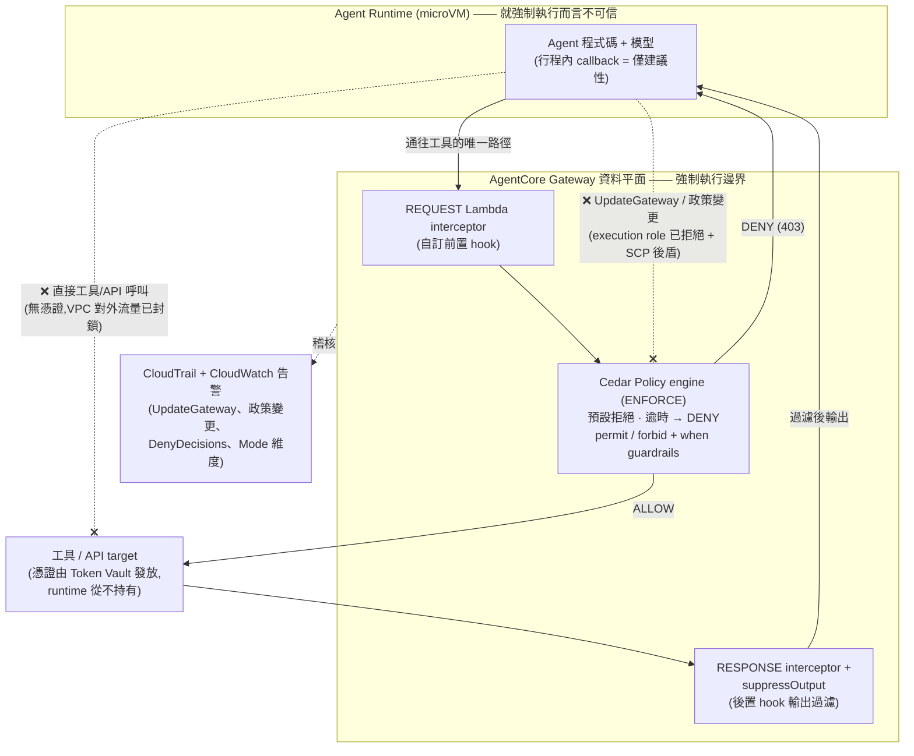

**這個模式「不」涵蓋什麼(對邊界要誠實):**

- hook 內部的 guardrail 內容檢查仍然是非決定性的 ML ——只有 Cedar 的 `permit`/`forbid` 那一層是決定性的。任何「絕不可發生」的事情(工具白名單、參數界限)請放進 Cedar,而不是放進 guardrail 閾值。*(這條建議站在實測的**偵測缺口**上,而不是站在逐次變異上:guardrail 的 recall 在數種 PII entity type(F3-4, FALSE)與 PROMPT_LEAKAGE(F3-8, FALSE)上都遠低於 1,而 Cedar 評估本身 630 次中變動 0 次(F2-1, TRUE)。關於非決定性,見 §3.1 行為註記的更正。)*
- Hook 是在工具**使用**時觸發。不需要工具呼叫就能造成的傷害(例如產生有害文字)是 Hop #2/#6 的職責,不是本模式的。
- Interceptor Lambda 本身就對安全敏感:啟用 `passRequestHeaders` 時它們會收到 bearer token;請縮限它們的 IAM 角色,並像對待任何其他受信任元件一樣做程式碼審查。

參考:Accelerator v2.9(Policy、Gateway、Built-in Tools 章節);<https://docs.aws.amazon.com/bedrock-agentcore/latest/devguide/policy.html>;<https://docs.aws.amazon.com/bedrock-agentcore/latest/devguide/policy-enforcement-modes.html>

### 4.5 網路圍堵(實作繞過路徑 #2)

4.4 節用一句話封閉繞過路徑 #2 ——「限制對外流量」。本節把它變成可執行的。範圍註記:這裡只涵蓋服務於**圍堵**目的(阻止 agent 繞開檢查點)的網路控制。連線性設計——經由 VPC Lattice Resource Gateway 的私有 Gateway target、到地端的 Direct Connect、私有 IdP、自訂網域——屬於另一份網路架構文件;那些請見 Accelerator v2.9 的 Gateway 與 Identity 章節。

> 來源附註:本節多數事實來自 Accelerator v2.9(NDA 文件);公開的 AWS 文件對 AgentCore 網路模式的涵蓋相當稀疏。對外散布之前,請把這些引用降級為「請與你的 AWS 客戶團隊確認」。

#### 4.5.1 Runtime 對外流量鎖定

以 **VPC 模式**執行 Agent Runtime,並把對外流量限制到僅有:

- AgentCore Gateway endpoint(通往工具的**唯一**路徑——這正是讓 Hop #4/#5 檢查點無法迴避的原因)
- 必要的 AWS 服務 endpoint:Bedrock 模型 endpoint(Hop #2/#3/#6)、STS、CloudWatch Logs、X-Ray
- Session 儲存:VPC 模式的 Runtime 需要對外連 S3 ——請用 S3 Gateway endpoint policy 以 `aws:PrincipalServiceName = bedrock-agentcore.amazonaws.com` 條件縮限它(Accelerator,Runtime 章節)

其餘一切—— 0.0.0.0/0、任意可 DNS 解析的主機——都應該不可觸及。一個除了 Gateway 之外什麼都連不到的 agent,無論模型決定做什麼,都無法外洩資料或呼叫影子工具。

#### 4.5.2 Code Interpreter:三種網路模式

Code Interpreter 是 agent 執行**任意產生的程式碼**的地方——架構中風險最高的網路位置。它有三種模式(Accelerator,Built-in Tools 章節):

| 模式 | 可觸及範圍 | 圍堵評價 |
|:---|:---|:---|
| **Public** | 不受限的網際網路 | 僅限開發/測試——被 prompt injection 的 agent 可自由外洩 |
| **Sandbox** | 僅 S3 + DNS | 較好,但 **DNS 是一個真實的外洩通道**—— Accelerator 自己的話:「DNS queries represent a limited data channel — organizations processing sensitive data should evaluate whether VPC Mode provides a stronger security boundary.」請用 Route 53 Resolver DNS Firewall 緩解 |
| **VPC** | 只有你的 subnet/SG 允許的範圍 | 最強的邊界。ENI 透過 `AWSServiceRoleForBedrockAgentCoreNetwork` service-linked role 建立;必要 endpoint:ECR、S3、CloudWatch Logs;仍建議用 DNS Firewall 防 DNS 外洩 |

#### 4.5.3 PrivateLink 覆蓋矩陣

若你的環境要求所有流量都走 PrivateLink,請在設計閉環**之前**先檢查覆蓋範圍——並且要對照即時的 AWS 表格核對,因為這個矩陣已經變動過(Accelerator,Service Controls 表;更正見下):

| 原語(見表頭註記) | 資料平面 | 控制平面 |
|:---|:---:|:---:|
| Runtime、Memory、Built-in Tools、Identity、Gateway、Policy | ✅ | ✅ |
| Evaluations | **AWS 文件於 2026-08-09/10 記載為 Supported**(v1.2 說 ❌) | ✅ |
| **Optimization** | **AWS 文件於 2026-08-09/10 記載為 Supported**(v1.2 說 ❌) | **AWS 文件於 2026-08-09/10 記載為 Supported**(v1.2 說 ❌) |

**v1.3 對本矩陣的更正** [corrected per F5-7a, FALSE, 兩種儀器—— 跨 8 個區域的 `ec2:DescribeVpcEndpointServices`,加上即時的 AWS 文件頁面與 8 份 Internet Archive 快照——於 2026-08-09 與 2026-08-10 重現,比較 75 個欄位、0 處不一致]:

- 五份有日期的存檔快照(2026-04-12 → 2026-07-14)與 v1.2 一致(`Evaluations · Not yet supported`),而 **2026-08-09 與 2026-08-10 的即時頁面都讀到 `Evaluations and Optimizations · Supported · Supported`**。對 Evaluations 而言這是 AWS 行為/文件的一次*變更*;對 Optimization 而言,v1.2 的主張被推翻,但變更日期**無法確定**,因為存檔頁面對 Optimization 是**沉默**而非與之矛盾。更正後的格子陳述的是 AWS **文件所記載**的內容並附上日期——不是說支援在功能上已存在,那是任何唯讀儀器都無法確立的。那正是案例 F5-7b,而它**現已執行並回傳 INCONCLUSIVE**(2026-08-14,us-east-1):功能支援仍屬未量測,但不是因為沒有嘗試——該案例自己的 invoke 通道在三個 arm 上都回傳客戶端 socket 逾時,兩個方向都沒有觀測到任何 image pull,所以那次執行量測到的是儀器而不是平台。見 `results/FINDING-F5-7B.md`。請把這些格子當成**文件事實**,而不是功能確認。
- **表頭已從「Service」更正為「Primitive(原語)」:** 這些列指的是 AgentCore 原語,而 PrivateLink 是附著在 *endpoint service* 上,兩者是多對一的映射——三個 endpoint service 橫跨表中的六個原語。儀器限制也記錄為其中一項:那三個 endpoint service 存在於 8 個區域,包括本文列為不支援的區域,這是關於 **endpoint service 是否存在**的證據,不是關於功能可用性的證據。

兩點政策附註:(a)VPC endpoint policy 只能依 IAM principal 限制——**經 OAuth 認證的呼叫方需要 endpoint policy 中的 Principal `*`**(請改以 resource/action 來約束它們);(b)Gateway 有一個**第三個、獨立的** PrivateLink endpoint,與資料/控制平面都不同 [verified F5-7a, 同一次執行:第三個 Gateway endpoint service 已確認存在]。

#### 4.5.4 兩個已知陷阱

1. **VPC Lattice Resource Gateway ≠ PrivateLink endpoint。** Resource Gateway 是你 subnet 內的一個 ENI,用於私有地**對外**連到 VPC target;PrivateLink VPC endpoint 則是用於**對內**進入 AgentCore。Accelerator 明確警告:「Customers should not conflate these two constructs.」把兩者搞混會產生「阻擋了錯誤方向」的 security group。
2. **Harness 的 VPC 模式必須允許 `public.ecr.aws`。** Session 映像是從 ECR Public 拉取的,而它**沒有 VPC endpoint**—— VPC 模式的部署需要一條到它的對外路由(通常是 NAT gateway + internet gateway),否則 session 會因 image-pull 逾時而無法啟動。這是一個在其他方面封閉的對外政策中**強制存在的破口**;請把它縮限到 ECR Public 的 IP 範圍/網域,而不是開放 0.0.0.0/0。

#### 4.5.5 用 IAM 強制 VPC 部署(圍堵,不是連線性)

網路模式本身就是一項「部署 agent 的 principal 可以削弱」的設定。請在 IAM 層用 condition key 強制要求 VPC 連線的部署(Accelerator,Runtime 章節):調用時用 `aws:SourceVpc` / `aws:SourceVpce` / `aws:SourceIp`,部署時用 `bedrock-agentcore:subnets` / `bedrock-agentcore:securityGroups` ——如此一來,runtime 根本無法被建立在受圍堵網路之外。這與繞過路徑 #4 的 SCP 後盾屬於同一個控制家族:即使個別角色的衛生退化,它仍然成立。

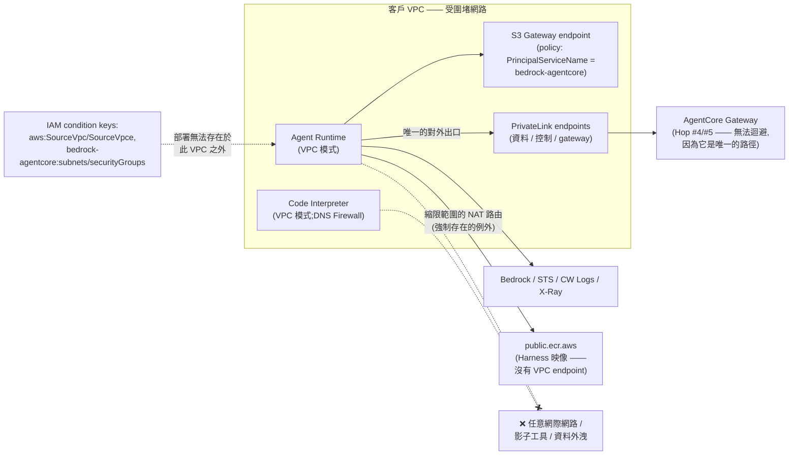

參考:Accelerator v2.9(Runtime、Built-in Tools、Gateway、Service Controls 章節);<https://docs.aws.amazon.com/bedrock-agentcore/latest/devguide/vpc.html>(VPC 與 AWS PrivateLink);<https://docs.aws.amazon.com/bedrock-agentcore/latest/devguide/agentcore-vpc.html>(Runtime 與 built-in tools 的 VPC 設定);<https://docs.aws.amazon.com/bedrock-agentcore/latest/devguide/security-vpc-condition.html>(VPC condition keys)

## 5. 階段三:AFTER —— 輸出安全與持續改進

### 5.1 檢查點 Hop #6:Bedrock Guardrails —— 輸出評估

**服務:** Amazon Bedrock Guardrails(附加於模型調用)

**功能:**

- 在推論**之後**評估模型產生的回應
- 可套用與輸入評估相同的 guardrail 政策,也可在同一個 guardrail 資源內使用不同的輸出專屬設定(見下方最佳實踐 #2)
- 若偵測到違規,在回應抵達使用者之前阻擋它
- 註:reasoning/chain-of-thought 內容區塊被排除在 guardrail 評估之外 *(驗證說明:案例 F1-27 已執行(run r20260810T130945Z)並回傳 INCONCLUSIVE ——沒有任何放置 arm 被服務接受:`reasoning_user` 與 `reasoning_assistant` 兩個 arm 都回傳 `ValidationException`,而一個被服務拒絕的請求,並不是一個「內容未被評估」的請求。主張保留原文。)*

**延遲影響:**

- 在使用者看到回應之前,增加推論後的評估延遲
- 對 streaming 回應,行為取決於 streaming 模式(見最佳實踐 #1)
- AWS 只對**輸入**評估明確記載了政策並行評估;對輸出沒有等價陳述——請自行透過 `guardrailProcessingLatency` 量測輸出側的開銷

**最佳實踐:**

1. 對 streaming,請刻意選擇官方模式:**同步**(預設)會緩衝並在送出前掃描每個 chunk ——準確度較好,但增加延遲;**非同步**(`streamProcessingMode: ASYNCHRONOUS`)立即送出 chunk 並在背景掃描——延遲較低,但不當內容可能在阻擋生效之前就抵達使用者,而且**非同步模式不支援敏感資訊遮罩**。只在該外洩時窗可接受的場合使用非同步。

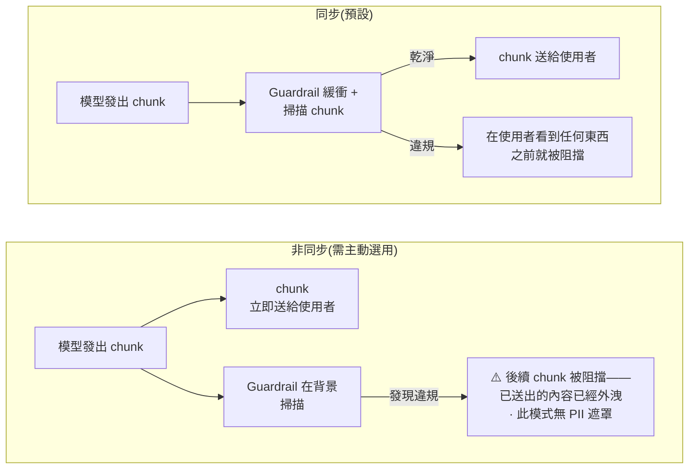

一句話取捨:同步 = 準確度優先(增加延遲);非同步 = 延遲優先(接受一個外洩時窗,並失去遮罩能力)。
2. 若輸出需要與輸入不同的政策,在你的 guardrail 資源內設定輸出專屬設定(`outputStrength`、`outputAction`)
3. 針對輸出評估,分開監控 InvocationLatency(`AWS/Bedrock/Guardrails` namespace,GuardrailContentSource = Output 維度)
4. 對關鍵輸出可考慮用 Automated Reasoning 檢查做幻覺偵測(注意:僅 detect 模式——應用程式必須自行處理 findings;僅英文(美國))[「僅 detect」與 en-US 已驗證 F8-8, TRUE, 2026-08-10]。**「不支援 streaming」這條附註已撤回** [corrected per F1-14, FALSE, SDK 介面探測, 2026-08-10]:`ConverseStream` 接受 `guardrailConfig`,並在其 stream metadata 中建模了 Automated-Reasoning 評估路徑——見 §3.2。
5. 需要納入規劃的 Contextual Grounding 限制:grounding source 最多 100,000 字元、query 1,000 字元、回應 5,000 字元;*(驗證說明:探測這三個限制的案例 F1-13 回傳 INCONCLUSIVE ——限制完全保留 v1.2 所陳述的數值。)* 支援摘要/改寫/QA ——**不支援**對話式聊天機器人的 QA;在 streaming 中,不相關的回應可能要到完全串流結束後才被標記
6. PII 遮罩附註:被遮罩的 PII 在模型調用日誌(CloudWatch `input` 欄位)與 guardrail trace 的 `match` 欄位中仍以**未遮罩**形式出現——請相應地縮限日誌存取與保留期限

參考:<https://docs.aws.amazon.com/bedrock/latest/userguide/guardrails-how.html> 與 <https://docs.aws.amazon.com/bedrock/latest/userguide/guardrails-streaming.html>

### 5.2 持續評估(服務之後)

**服務:** Amazon Bedrock AgentCore Evaluations

**功能:**

提供對 agent 效能品質的自動化評估,共三種模式:

- **On-demand:** 直接分析一組選定的 span(開發 / 抽查)
- **Batch:** 在單一非同步作業中對多個 agent session 執行 evaluator
- **Online:** 持續抽樣並評估**線上**生產互動(按百分比抽樣,例如 10%),無需手動觸發

[三種模式皆已驗證 F1-23, TRUE, 涵蓋 350 個操作的 API 介面探測, 2026-08-10:on-demand、batch(`StartBatchEvaluation` 及其同族)與 online 模式在 `bedrock-agentcore` 上都存在。]

可偵測品質隨時間下降。

**最佳實踐:**

1. 在生產環境啟用 online evaluation 以持續監控品質
2. 定義與你的業務指標對齊的自訂 evaluator(不只是安全性——也包括正確性、有用性)
3. 對評估分數閾值設定 CloudWatch 告警,以及早偵測退化
4. 把評估結果作為最佳化回饋迴路的輸入
5. 資料駐留註記:內建 evaluator 使用服務自有的 Bedrock 憑證執行,並採用 Geo Cross-Region Inference(CRIS),在同一地理範圍內跨區域路由模型調用;自訂 LLM-judge evaluator 則調用**你自己帳戶中你指定的** Bedrock 模型(計費、配額與區域控制都留在你手上)。撰稿時(2026-08)devguide 快照的配額:每個區域每個帳戶最多 1,000 個 evaluation configuration;大型區域每分鐘最多 100 萬 input+output token ——配額值變動頻繁,做容量規劃前請在 Service Quotas console 確認當前數值。

參考:<https://docs.aws.amazon.com/bedrock-agentcore/latest/devguide/evaluations.html>

### 5.3 最佳化回饋迴路

**服務:** Amazon Bedrock AgentCore Optimization

**功能:**

- 分析生產 trace 與評估輸出
- 產生最佳化後的 system prompt 或工具描述(Recommendations)
- 用 batch evaluation 離線驗證改善(這是 AgentCore Evaluations 的能力)
- 用線上流量的 A/B 測試確認改善(online)

**能力(依官方文件):**

1. **Recommendations** ——基於真實 agent trace,由 AI 產生對 system prompt 與工具描述的改善建議;並解釋改了什麼、為什麼
2. **Configuration Bundles** —— agent 設定的版本化、不可變快照;是最佳化變更的部署與回滾單位
3. **A/B Testing** ——透過 AgentCore Gateway 在兩個變體之間做受控的流量切分;由 online evaluation 為每個 session 評分;回報統計顯著性(p < 0.05;流量切分按 runtime session ID 黏著;變體透過 W3C baggage header 注入)

[這三項能力的分解已驗證 F1-22, TRUE, API 介面探測, 2026-08-10:Recommendations、Configuration Bundles 與 A/B Testing(`CreateABTest` 及其同族)都存在,而 Batch Evaluation 沒有 Optimization 根節點——它屬於 Evaluations,正如 v1.2 所述。]

**最佳實踐:**

1. 針對**退化的那個特定 evaluator 指標**執行 recommendations
2. 在推進到 A/B 測試之前,一律先用 batch evaluation 驗證
3. 在全面推出之前,要求 A/B 測試達到統計顯著性
4. 用 Configuration Bundles 對 system prompt 與工具描述做版本控制;把 `UpdateConfigurationBundle` / `DeployConfigurationBundle` 的 IAM 權限限制給「被授權改變 agent 行為」的 principal
5. 為稽核軌跡記錄每一次最佳化週期
6. 私有網路部署:**AWS 的即時文件在 2026-08-09/10 把 Optimization 與 Evaluations 在資料平面與控制平面都標記為 PrivateLink Supported** [corrected per F5-7a, FALSE, 於 2026-08-09 與 2026-08-10 重現—— v1.2 依 Accelerator v2.9 陳述 Optimization 沒有 PrivateLink 支援、Evaluations 僅控制平面;2026-04-12 → 2026-07-14 的五份存檔快照與 v1.2 一致,所以對 Evaluations 這是有文件記載的變更,對 Optimization 則是變更日期無法確定的推翻]。設計之前請對你的區域核對即時的 AWS 表格,並注意「文件記載的支援」不等於「量測到的功能支援」——後者仍未量測。案例 F5-7b **已於 2026-08-14 執行並回傳 INCONCLUSIVE**:它屬於「已嘗試但未量測」,而不是「未嘗試」,因為唯一能觀測 image pull 的通道在每個 arm 上都回傳固定的客戶端逾時(`results/FINDING-F5-7B.md`)。若你的環境要求所有流量走 PrivateLink,請確認當前的覆蓋範圍,而不要圍繞 v1.2 的缺口做規劃。

參考:<https://docs.aws.amazon.com/bedrock-agentcore/latest/devguide/optimization.html>

## 6. 逐跳延遲監控設計

### 6.1 延遲預算分解

下表列出一次典型 agent 調用中的各延遲檢查點。**在 v1.3 中,逐跳數字是「實測值」,不是示意值**—— v1.2 的示意區間在六跳中有五跳被推翻。

> **量測依據(取代 v1.2 的免責聲明):** 下方區間是實測的 p50/p90/p99,附無分布假設的次序統計量信賴區間,**每跳 n=1000 次配對、交錯的觀測**,於 **us-east-1**、**2026-08-10**(run `r20260810T130945Z`),對象是一個 gateway、一個 policy engine、一個模型。它們**不是** AWS 公布或保證的數值,也不是可移植的 SLA:延遲會隨區域、模型、內容長度、政策數量與流量狀況變動,而這些數字描述的是某一個帳戶在某一天的量測。請用 6.2 節的 CloudWatch 指標與 span 量測你自己的基線——但請以實測值而非 v1.2 的估計值來校準預期,後者偏低。

| **Hop #** | **檢查點** | **服務** | **實測延遲(p50 / p90 / p99)** | **v1.2 估計** | **監控指標** |
|:---|:---|:---|:---|:---|:---|
| 1 | Gateway Guardrail(輸入) | AgentCore Gateway Policy | **401 / 528 / 779 ms**(p50 CI [396, 406]) | 50–200ms —— **已推翻** | Gateway Latency + GuardrailLatency(`AWS/Bedrock-AgentCore`) |
| 2 | Bedrock Guardrail(輸入) | Bedrock Guardrails | **231 / 374 / 622 ms**(p50 CI [226, 235]) | 100–500ms —— **已推翻**(p99 超出區間) | InvocationLatency(`AWS/Bedrock/Guardrails` namespace) |
| 3 | 模型推論 | Bedrock Runtime | 500ms–30s *(未單獨重新量測;沿用 v1.2)* | 500ms–30s | InvocationLatency(`AWS/Bedrock` namespace,依模型) |
| 4 | 工具授權(Cedar Policy) | AgentCore Policy | **55 / 70 / 94 ms**(p50 CI [54, 56]) | 5–50ms —— **已推翻** | Policy 調用 span |
| 5 | 工具 Guardrails(每次呼叫) | AgentCore Gateway Policy | **401 / 528 / 779 ms × N 次呼叫**(p50 CI [396, 406]) | 50–200ms × N —— **已推翻** | GuardrailLatency(ToolName 維度) |
| 6 | Bedrock Guardrail(輸出) | Bedrock Guardrails | **234 / 366 / 662 ms**(p50 CI [228, 238]) | 100–500ms —— **已推翻**(p99 超出區間) | guardrailProcessingLatency(調用 trace) |
| — | **總計(單次工具呼叫)** | — | **1483 / 1722 / 2107 ms**(p50 CI [1474, 1491]) | ~800ms–31s+ —— **已確認** | 端到端 trace duration |

逐跳引用:[corrected per F6-1, FALSE, n=1000, us-east-1, 2026-08-10 —— Hop #1 p50 401 ms,約為 50–200 ms 區間上限的 2 倍];[corrected per F6-2, FALSE, n=1000 —— Hop #2 p50 落在區間內,但 p99 622 ms 超出];[corrected per F6-3, FALSE, n=1000 —— Hop #4 p50 55 ms,區間 5–50 ms];[corrected per F6-4, FALSE, n=1000 —— Hop #5 每次呼叫 p50 401 ms];[corrected per F6-5, FALSE, n=1000 —— Hop #6 p50 234 ms,p99 662 ms 超出區間];[verified F6-6, TRUE, n=1000 —— 端到端 p50 1483 ms 落在 ~800ms–31s+ 之內;注意本文的上界是開放式的,所以只有它的下限是可否證的]。Hop #3 沒有自己的實測列:沒有任何案例單獨重新量測模型推論,所以它的 v1.2 區間未經修訂。

**逐跳可加性成立** [verified F6-7, TRUE, n=1600, us-east-1, 2026-08-10]:`Duration_gw = GuardrailLatency + TargetExecutionTime + ε` 中的殘差顯著為**正**(95% CI [258.8, 273.0] ms)而非負——所以各跳並不重疊,而 §6.1、§6.3 與 §6.4 底下的逐跳分解是站得住的。這個正殘差意味著有約 260–273 ms 的 gateway 時間不被那兩個元件指標涵蓋;請把它納入預算。

註:對於會做多次工具呼叫的 agent(例如 3–5 次),Hop #4 與 #5 會逐次重複,**每增加一次工具調用約增加 850 ms**(bootstrap 斜率 95% CI [838.7, 862.7] ms)[corrected per F6-8, FALSE, 1600 次嘗試中 600 次可用, us-east-1, 2026-08-10 —— v1.2 說 165–750 ms;實測區間與它不相交且高於它]。

### 6.2 逐跳監控的 CloudWatch 指標

#### AgentCore Gateway 指標

所有 gateway 指標都發布在 `AWS/Bedrock-AgentCore` namespace 下,以 1 分鐘間隔批次發布。(注意:FirstByteLatency 不是有效的 gateway 指標名稱;請用 Latency。)[verified F7-2, TRUE, us-east-1, 2026-08-10:7 個有文件記載的 gateway 指標全部發布於該 namespace,0 個缺席;1 分鐘批次已驗證 F7-7, TRUE, n=45 個資料點, 同一次執行——每個資料點都精確落在 60 秒的格點上,最大偏移 0 秒]

| **指標** | **說明** | **用途** |
|:---|:---|:---|
| **Latency** | 初始回應時間——從收到請求到第一個回應 token | 量測含 guardrail/政策評估的 gateway 處理時間 |
| **Duration** | 端到端總處理時間 | 整個 gateway 跳的延遲 |
| **Invocations** | 對資料平面 API 的請求總數 | 流量追蹤 |
| TargetExecutionTime | 執行 target(Lambda/OpenAPI 等)的時間 | 從總 Latency 中隔離出 target 的貢獻 |
| Throttles | 被限流的請求(HTTP 429) | 容量規劃 |
| SystemErrors | 以 5xx 失敗的請求 | 可用性監控 |
| UserErrors | 以 4xx 失敗的請求(429 除外) | 客戶端錯誤監控 |

#### AgentCore Policy 指標

預設發布於 `AWS/Bedrock-AgentCore`,維度包含 ToolName、Category、Filter、Mode 與 PolicyEnforcementMode。**v1.3:本節指名的 13 個指標中,有 3 個被量測為缺席** [corrected per F7-1, FALSE, us-east-1, 2026-08-10 —— 15 個有文件記載的 policy 指標中,有 13 個的發布條件確實被本專案的流量創造出來;其中 10 個有發布,而 **`ConfidenceScore`、`ConfidenceThreshold` 與 `TemporalLatency` 完全沒有產生任何資料點**。`SuppressOutputs` 與 `LogOnlyEvalIncomplete` 是被排除在計數外的那 2 個——它們的發布條件從未被觸發,所以屬於未經測試,而非已確認缺席]。guardrails-in-policy 的關鍵指標,附實測發布狀態:

| **指標** | **說明** | **用途** |
|:---|:---|:---|
| **GuardrailLatency** | 政策內 guardrail 評估所花的時間 | Hop #1/#5 延遲隔離。**有發布** [F7-1,此指標為 TRUE] |
| **ConfidenceScore / ConfidenceThreshold** | 文件記載為每次評估的觀測分數與所設閾值 | ⚠️ **實測為缺席——兩個指標都沒有發布任何資料點** [corrected per F7-1, FALSE, 2026-08-10],即使流量確實產生了分數。**不要把閾值校準指向這裡。** 校準請改從應用程式日誌的 `body.policy.guardrailFindings.<policyId>.contentFilter[].score` 讀取分數——並注意它是一個**帶四位固定小數的 JSON 字串**(例如 `"0.8000"`),任何數值比較之前都必須轉型 [corrected per F3-10, FALSE, 3 個 arm / 1,491 筆證據記錄, us-east-1, 2026-08-12;見 §7.1] |
| **AllowDecisions / DenyDecisions** | 授權結果 | 拒絕率追蹤。**兩者皆有發布** [F7-1, 2026-08-10] |
| **SuppressOutputs** | 被 suppressOutput 效果抑制的工具輸出 | Hop #5 過濾率。*(其發布條件從未被本驗證觸發——屬未經測試,不是已確認缺席。)* |
| **LogOnlyMatches / LogOnlyDecisionFlips / LogOnlyEvalIncomplete** | LOG_ONLY 政策的「本應相符」、與 ACTIVE 政策相比的決策變化,以及未完成的評估 | `LogOnlyMatches` 與 `LogOnlyDecisionFlips` **有發布** [F7-1, 2026-08-10]。⚠️ **持續為零的 `LogOnlyDecisionFlips` 「不足以」作為安全升版訊號**——零同時由「影子政策與生產一致」與「影子政策根本沒有評估」兩者產生,而 §7.1 曾把單一含義賦予兩者。請先以一個**正向**訊號作為升版閘門:在該政策本應相符的流量上要求 `LogOnlyMatches > 0`,以及/或者一筆逐請求的應用日誌記錄證明影子評估發生過 [F3-10 把 122 筆標記請求中的 122 筆接合到一次已記錄的評估,0 筆未接合, 2026-08-12]。`LogOnlyEvalIncomplete` **沒有發布任何資料點,而且在本帳戶列出 0 個維度組合**——包含在「一個無法評估的 LOG_ONLY 政策服務了 20 個請求」的那個時窗內,而那正是這個指標得名的條件;同一次查詢中它的兩個同族指標各列出 14 個維度組合,並在 77 分鐘後跨越 UTC 日界再次確認 [F7-1, 2026-08-10, `name_in_namespace_inventory: false`;補充的 CloudWatch 讀取 2026-08-11/12;F9-2 的獨立重數在全部 40 次 `get_metric_statistics` 讀取中找到 0 個正值資料點, 2026-08-13]。對它設的告警會停在 `INSUFFICIENT_DATA` ——若要保留它,請把 missing data 設為 breaching,否則它只是裝飾。 |
| **MismatchErrors / TotalMismatchedPolicies / PolicyMismatch** | 因缺少屬性或型別不符而失敗的 guardrail 評估 | **這些確實會發火** [verified F9-2, TRUE, 200 個請求 / 308 次指標讀取, us-east-1, 2026-08-11 與 2026-08-12:`MismatchErrors` 與 `PolicyMismatch` 各發火兩次,每次都在一個實測為零的基線之上]。v1.3 對如何解讀它們有兩項更正。**(1)後果取決於 mode,而在 ACTIVE 下它是反過來的:** 那個無法評估的政策**以全部拒絕的方式**「保護」了 20/20 個請求,所以「可能沒有在保護你」描述的是一次**可用性事故**,不是暴露;而在 LOG_ONLY 下——暴露是真的——這三個指標全部停在零。**(2)量值不是請求數。** 在 20 個請求上,`MismatchErrors` 加總為 120(6 個維度組合 × 20)、`TotalMismatchedPolicies` 為 80、`PolicyMismatch` 為 40 ——跨維度加總(也就是 CloudWatch console 的預設)會讀到**請求數的 6 倍**。而這個倍數也不穩定:兩天之間,`MismatchErrors` 的組合數從 8 → 16 → 20 成長,`PolicyMismatch` 從 4 → 6 → 8,因為每一個壞掉的政策都會留下它自己以 `Policy` 為維度的序列。請對某一個**釘住的**維度組合的 `SampleCount` 告警,而不要對跨全部組合的 `Sum` 告警。 |
| Policy span(`aws/spans` log group) | 逐操作的評估細節(AuthorizeAction 等) | Trace 層級的逐跳分析。**已確認** [verified F7-4, TRUE, n=20, 2026-08-10:20/20 個請求接合到一個 `AgentCore.Policy.AuthorizeAction` span;第一個 span 約在請求後 50 秒可查詢,所以 span 不是一個即時介面] |

本表並不完備——其他指標(DeterminingPolicies、NoDeterminingPolicies、TemporalLatency 等)記載於 <https://docs.aws.amazon.com/bedrock-agentcore/latest/devguide/observability-policy-metrics.html>。這三者之中,`DeterminingPolicies` 與 `NoDeterminingPolicies` **有發布**;而 **`TemporalLatency` 沒有**,即使流量的每一個請求都攜帶了 temporal policy-session header [corrected per F7-1, FALSE, us-east-1, 2026-08-10]。

用語附註:以 ConfidenceScore 呈現的值,對 content filter 與 prompt attack 稱為 *severity score*,對 sensitive-information filter 稱為 *confidence score*。

#### Bedrock Guardrails 指標

Namespace:**`AWS/Bedrock/Guardrails`**(不是 `AWS/Bedrock` ——那個 namespace 放的是模型 runtime 指標)。維度包含 Operation、GuardrailArn/GuardrailVersion、GuardrailContentSource(Input/Output)與 GuardrailPolicyType。[verified F7-3, TRUE, us-east-1, 2026-08-10:7 個有文件記載的指標中有 5 個在此 namespace 發布,0 個缺席;另 2 個因發布條件未被觸發而排除,屬未經測試而非已確認]

| **指標** | **說明** | **用途** |
|:---|:---|:---|
| **Invocations** | guardrail API 請求數 | 流量追蹤 |
| **InvocationLatency** | guardrail 評估的延遲(ApplyGuardrail 操作) | 獨立呼叫的 guardrail 開銷 |
| **InvocationsIntervened** | guardrail 採取行動的調用次數 | 阻擋/遮罩率 |
| **TextUnitCount** | 已處理的 text unit 數 | 成本追蹤(計費按 text unit)[verified F10-2, TRUE, 橫跨 9 種內容長度的 27 筆可比觀測, 2026-08-10:每個長度上的 per-text-unit 關係都成立,0 處不一致] |
| **InvocationClientErrors** | 客戶端錯誤 | 錯誤率監控 |
| **InvocationServerErrors** | 伺服器端錯誤 | 可用性監控 |
| **InvocationThrottles** | 被限流的請求 | 容量規劃 |

至於模型調用**內部**的 guardrail 開銷(帶 `guardrailConfiguration` 的 Converse/InvokeModel),請用調用 trace 中的 `invocationMetrics.guardrailProcessingLatency` 欄位——逐次調用的 guardrail 開銷沒有對應的 CloudWatch 指標。

#### Bedrock Runtime 指標

| **指標** | **說明** | **用途** |
|:---|:---|:---|
| **InvocationLatency** | 完整推論請求時間 | 模型推論 duration |
| **OutputTokensPerSecond(OTPS)** | Token 產生吞吐量。注意:OTPS 是一個 metric-math 運算式,不是已發布的指標—— `OTPS = OutputTokenCount / (InvocationLatency − TimeToFirstToken) × 1000` ——且需要 TimeToFirstToken,而後者只對 streaming 操作(ConverseStream / InvokeModelWithResponseStream)發布 | 區分「模型端吞吐退化」與「輸出變長」 |

#### AgentCore Runtime Session 指標

| **指標** | **說明** | **用途** |
|:---|:---|:---|
| **Session latency** | 端到端 session duration | 使用者感知到的總延遲 |
| **Token usage** | 每個 session 消耗的 token | 成本追蹤 |
| **Error rates** | 每個 session 的失敗數 | 可靠性監控 |

### 6.3 分散式追蹤架構

下面的 trace 樹示意一次「含一次工具呼叫」的 agent 調用之 span 階層。Hop 標籤沿用 2.1 節的規範性編號。

> 註:下方的 span 名稱(`policy.guardrails.input`、`bedrock.invoke_model` …)是**示意用**,不是 AWS 實際發出的名稱。有官方文件記載的是:policy span 寫入 `aws/spans` log group,操作名稱例如 AuthorizeAction。在以此建立儀表板之前,請透過 CloudWatch Transaction Search 確認你環境中實際的 span 命名。[verified F7-4, TRUE, n=20, us-east-1, 2026-08-10:實際觀測到的 span 名稱是 `AgentCore.Policy.AuthorizeAction`、`AgentCore.Gateway.InvokeTool` 與 `AgentCore.Gateway.InvokeTool.<toolName>` ——下圖中的示意名稱已確認**不是**實際發出的名稱,而 span 約在請求後 50 秒才開始可查詢。span 也**不帶任何 guardrail 分數屬性**,所以不要打算從 span 重建 confidence score。]

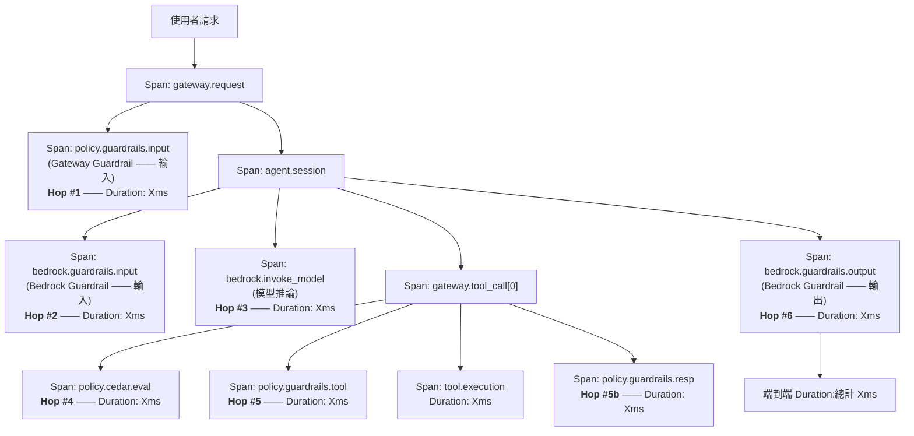

### 6.4 延遲告警策略

| **告警** | **條件** | **行動** |
|:---|:---|:---|
| Gateway guardrail 延遲尖峰 | Latency > P99 + 50% | 檢查 guardrail 設定的複雜度 |
| Bedrock guardrail 延遲尖峰 | InvocationLatency > P99 + 50% | 檢查輸入尺寸是否變大或發生限流 |
| 端到端 session 延遲 | 總 duration > SLA 閾值 | 透過 trace 找出瓶頸所在的跳 |
| Guardrail 限流 | InvocationThrottles > 0 | 申請提高配額或降低呼叫量 |
| 高拒絕率 | 5 分鐘內阻擋率 > 20% | 調查是否遭攻擊或閾值設定錯誤 |
| LOG_ONLY 評估未完成 | ⚠️ `LogOnlyEvalIncomplete > 0` **無法發火——此指標未發布任何資料點,且在本帳戶列出 0 個維度組合** [corrected per F7-1, FALSE, us-east-1, 2026-08-10, `name_in_namespace_inventory: false`;F9-2, TRUE, 2026-08-13:全部 40 次 `get_metric_statistics` 讀取都是 0 個正值資料點,包含一個無法評估的 LOG_ONLY 政策服務了 20 個請求的那個時窗] | 不要照原樣依賴這個告警:對一個從未發布的指標設 CloudWatch 告警,它會停在 `INSUFFICIENT_DATA` 而非 `ALARM`。要嘛刪掉它,要嘛把 missing data 設為 breaching ——並搭配確實會發布的正向訊號 `LogOnlyMatches > 0`。 |
| Policy engine mode 變更 | CloudTrail UpdateGateway 事件 | 確認該變更經過授權(3.1 節 BP#5)。**v1.3:規則要綁在「呼叫」上,不要綁在某個 mode 值上**——關於「被接受的 mode 翻轉」到「請求被正常服務」之間實測約 13 秒的時窗,見 §3.1 BP#5;關於為什麼 `Mode`/`PolicyEnforcementMode` 維度過濾不是可靠的覆蓋,見 §4.4 route #5 [F5-2, TRUE, 於 2026-08-12/13 重現;F9-2, TRUE, 2026-08-11/12]。 |

**v1.3 新增——上表每個告警週期底下的發布延遲下限** [verified F7-6, TRUE, n=30, us-east-1, 2026-08-10]:從請求到資料點可查詢的實測延遲 **p90 = 11.5 秒**。本表七個告警中,只有「高拒絕率」那一列陳述了評估週期(5 分鐘 / 300 秒),而 300 秒遠高於實測 p90 ——該告警照原樣是站得住的,而 1 分鐘的週期也同樣高於實測延遲。其餘**六列完全沒有陳述評估時窗,因此照原樣無法實作**:請挑一個週期,並讓它 ≥ 60 秒,使實測的發布延遲不會讓告警漏掉事件。

**v1.4 新增——只綁定一種 wire 形狀的拒絕偵測規則不構成覆蓋** *(來自 F1-15 執行的機制觀察,us-east-1,2026-08-14 ——直接的 wire 觀察,不是判定;該案例為 INCONCLUSIVE 且不修訂任何主張)*。上表的「高拒絕率」那一列,以及任何計數政策拒絕的日誌側或客戶端規則,都必須比對同一個決策的**三種**可觀測形式,因為單一條無條件、gateway 範圍的 `forbid` 一次就產生了全部三種:

| 介面 / 通道 | 拒絕看起來的樣子 |
|:---|:---|
| MCP `tools/call` | HTTP **200** + JSON-RPC error **`-32002`**,"Tool Execution Denied: Tool call not allowed due to policy enforcement [Policy evaluation denied due to `<policyId>`]" [F4-6, FALSE, n=120, 2026-08-10 —— 見 §3.1] |
| Inference(`POST /inference/v1/messages`) | HTTP **403** + `{"error":{"type":"permission_error","message":"Request Denied: Gateway Target request not allowed due to policy enforcement […]"}}` ——**狀態碼不同、封裝不同、用字不同** |
| MCP `tools/list` | **完全沒有錯誤**:呼叫成功,並回傳一個**空的工具清單**(基線為三個工具)。工具探索被過濾,而不是失敗 |

只比對 `-32002` 的規則會看到第一種而漏掉第二種;只比對 HTTP 403 的規則反之;兩者都看不到第三種——第三種必須以「所宣告的工具數量」對照「gateway 本應公開的工具」來捕捉。一個 gateway、一個區域、一個日曆日。

## 7. 最佳實踐總結:在有 guardrails 的前提下最佳化延遲

### 7.1 設計原則

**閾值調校流程(LOG_ONLY → ENFORCE):** AWS 建議在強制執行之前先校準 guardrail 閾值。下面的流程**按實測是可執行的**,但 v1.2 的四個步驟中有三個需要更正——關於讀者被指向**何處**,以及一個綠燈訊號**代表什麼** [corrected per F3-10, FALSE, 3 個 arm、1,491 筆全部帶 `request_id` 的證據記錄、11 個護欄全數通過, us-east-1, 2026-08-12,另有一次補充的日誌介面讀取,涵蓋 579 筆 log event、0 筆無法解析]。

1. **把 policy engine 設為 LOG_ONLY** ——不會有任何請求被拒絕 [verified F4-2, TRUE, n=120, us-east-1, 2026-08-10:在有 ACTIVE 政策的情況下,120 個請求中 0 個被阻擋]。**但「沒有東西被阻擋」不等於「沒有東西被記錄為阻擋」:** 每一次影子評估都往應用日誌寫入了 `decision: DENY`、`effect: FORBID`、`isError: true` 與 `severityText: ERROR` —— LOG_ONLY arm 中 30 筆全中,而且用的是與 ENFORCE arm 中 31 筆真實拒絕**完全相同的四個欄位值**。唯一指名 mode 的欄位 `policyMode` 在兩者都讀到 `ENFORCE`,因為它回報的是**政策**所設定的 mode,不是 engine 的。**請預期你的錯誤率與拒絕率儀表板會在 LOG_ONLY 時窗中變動**,並且以 policy ID 或測試 arm 來限定任何日誌型告警的範圍,而不要用 `decision`、`effect`、`isError` 或 severity ——這次量測沒有找到任何欄位能區分影子拒絕與真實拒絕。
2. **讓一組 golden test set 或真實生產流量**通過 policy engine 所附著的那個 gateway。
3. **從「應用日誌」而非 CloudWatch 指標來標記結果並建立混淆矩陣。** v1.2 把讀者指向 §6.2 的 `ConfidenceScore`;那個指標什麼都沒發布(F7-1, FALSE ——見 §6.2),而即使存在某個分數指標,1 分鐘的彙總也會在任何可用的請求速率下摧毀逐請求的接合:兩個生產速率 arm 的接合都失敗,只有在一個刻意放慢到每分鐘一個請求的 arm 才回來,所以失敗的原因是速率,不是儀器。從日誌接合則是完整的—— **122 筆標記列、122 筆接合成功、0 筆未接合、0 個重複的 `request_id`**,且矩陣算得出來(在所設閾值下,三個 arm 全部為 tp 30、tn 30、fp 0、fn 0)。讀者需要知道三個性質:**(a)介面**是 `body.policy.guardrailFindings.<policyId>.contentFilter[].score`;**(b)型別**是一個**帶四位固定小數的 JSON 字串**(`"0.8000"`),所以 `jq 'select(.score > 0.5)'` 在沒有轉型的情況下會靜默地做錯事;**(c)方向**—— **122 個請求中有 61 個完全沒有發布分數,而每一個發布了分數的請求都是正例**:分數低於所設閾值(此處 0.2)的請求不會發出 `score` 欄位。所以一個已結束的校準時窗能支持**提高**閾值(20 個候選閾值中有 17 個可回答),但**不能支持降低**它(20 個中有 3 個無法回答)。請從「你實際願意執行的最寬鬆閾值」開始校準。
4. **校準完成後,把 engine 切成 ENFORCE** ——並先確認存在一條明確的 permit 政策、且它是以明確的 `validationMode` 建立的(3.1 節),否則 ENFORCE 會阻擋所有流量 [verified F4-1, TRUE, n=120, us-east-1, 2026-08-10]。**不要只憑 `LogOnlyDecisionFlips` 作為升版閘門。** 持續為零同時由「影子政策與生產一致」**與**「影子政策根本沒有評估」兩者產生,而 v1.2 把單一含義賦予兩者:一條條件建立在不存在的資料路徑上的 guardrail 敘述,以空的 `lint` 陣列抵達了 `ACTIVE`,在 LOG_ONLY 下發布了 `LogOnlyDecisionFlips = 0` 與 `LogOnlyMatches = 0` ——然後在被升版的那一刻**拒絕了 20/20 個請求**。這個零不是儀器缺席:`list_metrics` 指名了這兩個指標且各有 14 個維度組合,60 分鐘的前置時窗基線也是 0,而同樣這兩個指標在同一個 gateway 上為一個*正常工作*的 LOG_ONLY 政策發布了 4,708 與 3,372 個資料點 [F7-1,這兩個指標為 TRUE, 2026-08-10;失效模式記錄於 F5-4a, 5 個 arm 各 n=20, us-east-1, 2026-08-11/12,並由 F9-2, TRUE, 2026-08-13 交叉核對]。**在讀任何翻轉計數之前先加一個正向閘門:** 在該政策本應相符的流量上要求 `LogOnlyMatches > 0`,以及/或者在應用日誌中逐請求確認影子政策確實評估過(步驟 3 的接合對 122 個請求中的 122 個做到了這件事)。

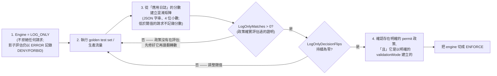

*(此圖在 v1.3 修訂:`LogOnlyMatches > 0` 閘門為新增 [F5-4a 失效模式, us-east-1, 2026-08-11/12;F7-1,`LogOnlyMatches` 為 TRUE, 2026-08-10];步驟 1 與步驟 3 的標籤依 F3-10, FALSE, 2026-08-12 更正;步驟 4 的 `validationMode` 要求依 F1-3, TRUE, 於 2026-08-10/11 重現。)*

| **#** | **原則** | **理由** |
|:--:|:---|:---|
| 1 | **依風險分層 guardrails,不要依功能分層** | 不是每個檢查點都需要每一項政策。請讓 guardrail 的範圍對應每一跳的實際風險。 |
| 2 | **在最外層快速失敗** | 在 Gateway(Hop #1)阻擋明顯有害的內容,以避免不必要的下游處理——並注意計費不對稱:輸入端阻擋完全免除模型推論費用,輸出端阻擋則不會 *(計費不對稱測試未完成:F10-1 截至 2026-08-13 沒有已發布判定——主張保留原文)*。**延遲**的節省是實測的:被阻擋的請求比通過的請求快 30–57 ms(Hodges-Lehmann 位移 95% CI [30.2, 57.0] ms)[verified F6-9, TRUE, 計畫 1000 次中 455 次可用, us-east-1, 2026-08-10 ——方向已確認;區間比設計預期更寬,所以請把量值當作指示性的]。 |
| 3 | **授權請用決定性控制** | 就工具層級存取控制而言,Cedar Policy(Hop #4)比 guardrails 更快且更可靠。Cedar 是決定性的 [verified F2-1, TRUE, n=630, 2026-08-10:630 次評估 0 次變動],且 fail-secure(逾時 → DENY)*(逾時行為從 AWS 外部不可測—— F9-1 已排除;主張保留原文)*。**「更快」是實測的,而且差距很大:** Cedar 授權 p50 55 ms,對比 gateway guardrail 評估 p50 401 ms [F6-3 與 F6-1,兩者相對 v1.2 的估計都是 FALSE,但兩者都是實測值,各 n=1000, us-east-1, 2026-08-10]。偏好用 Cedar 做授權的理由是 ML 路徑上實測到的偵測缺口(§3.2,F3-4 與 F3-8,兩者皆 FALSE),而不是逐次的非決定性——後者並未被觀測到(§3.1 行為註記)。 |
| 4 | **獨立監控每一跳** | 端到端延遲會掩蓋是哪一跳在退化。請對每個檢查點使用分散式追蹤 span 與逐跳指標(6.2 節)。 |
| 5 | **跨層去除重複政策** | 若 Gateway Guardrails 已處理 prompt attack,就不要在模型層重複同樣的檢查——但務必先確認區域可用性(Hop #1)與 input tagging(Hop #2),以免去重反而製造缺口。 |
| 6 | **高吞吐量請批次化** | ApplyGuardrail API 呼叫請用 content 陣列批次化。把快取當成最後手段,並施加嚴格限制(3.3 節 BP#1)。 |
| 7 | **為每一跳設定延遲預算** | 為每個檢查點定義可接受的延遲,並在超出時告警。 |

### 7.2 應避免的反模式

| **反模式** | **問題** | **建議** |
|:---|:---|:---|
| **在「每一跳」啟用「所有」guardrail 政策** | 延遲過度累積 | 每一跳只套用最低必要的政策 |
| 用 guardrails 做工具授權 | 機率性偵測且有實測缺口(例如 31 種 PII entity type 中 9 種被推翻、PROMPT_LEAKAGE 合併 recall 0.36)——而且可被 prompt injection 繞過 | 用 Cedar Policy 做決定性授權 [F2-1, TRUE, n=630;缺口見 F3-4 與 F3-8,兩者皆 FALSE, 2026-08-10] |
| **ENFORCE 模式下只有 guardrail 政策** | 預設拒絕會在沒有明確 permit 的情況下阻擋「所有」流量 [verified F4-1, TRUE, n=120, us-east-1, 2026-08-10:120/120 被拒] | 一律加入一條基線 permit 政策——並以明確的 `validationMode` 建立它,否則 create 會靜默地停在 `CREATE_FAILED`(3.1 節)[F1-3, TRUE, 於 2026-08-10/11 重現] |
| **沒有可觀測性儀器** | 無法找出延遲瓶頸 | 從第一天就啟用完整的分散式追蹤 |
| 所有內容用同一組 guardrail 閾值 | 過度阻擋正當內容,或阻擋不足而放過有害內容 | 依跳與內容類型分別調校閾值 |
| **忽略 guardrail 限流** | 負載下的靜默失效 *(驗證說明:案例 F9-3 已執行(run r20260810T130945Z)並回傳 INCONCLUSIVE ——全部 480 個 burst `ApplyGuardrail` 回應都帶有真實判定,0 次可觀測失效、0 次靜默通過,但在實際達到 182.2 rps(對比文件所載 100 rps 上限)的情況下 0 個請求被限流,所以「0 次靜默通過」對一個從未被提出的問題而言是空真,而速率變異也沒有反轉結果。主張保留原文。)* | 監控 InvocationThrottles 並實作重試/退避 |
| 對回傳外部內容的工具跳過 guardrails | 工具回應是間接 prompt injection 的主要載體 | 對不可信的工具輸出套用 prompt-attack + content guardrails(4.2 節) |
| 對非 EN/FR/ES 流量使用 Classic tier guardrails | 「不支援的語言,guardrails 形同無效」——實測:Classic tier 對 zh/ja/ko 攻擊內容的偵測率在 n=216 時為 0 [0, 0.0175],而且失效是靜默的 [verified F8-2, TRUE, 2026-08-10] | 使用 Standard tier(並為它的跨區域推論要求做好規劃)[Standard 多語言覆蓋已驗證 F8-3, TRUE, n=216, 2026-08-10] |
| 只做人工提示詞最佳化 | 慢、不一致、非證據導向 | 用 AgentCore Optimization 做自動化改善 |

### 7.3 建議的 Guardrail 分配

| **Hop** | **建議政策** | **理由** |
|:---|:---|:---|
| **Gateway(輸入)** | Prompt Attack(HIGH 閾值)、Content Filter(MEDIUM) | 快速地提早阻擋明顯威脅 |
| **Bedrock Guardrails(輸入)** | Denied Topics、Sensitive Info、Content Filter(細緻)、Prompt Attack(需 input tagging ——未加 tag 的 InvokeModel 輸入確實沒有被掃描:n=120 時 recall 為 0 [0, 0.031] [verified F5-6, TRUE, us-east-1, 2026-08-11]) | 在 gateway 過濾之後做全面的輸入安全檢查——但請驗證你實際依賴的那些 PII entity type;31 種有文件記載的類型中有 9 種被推翻 [F3-4, FALSE, 2026-08-10] |
| **Cedar Policy(工具授權)** | 工具層級 allow/deny、參數驗證 | 決定性授權——沒有 ML 開銷 |
| **工具 I/O Guardrails** | Sensitive Info(工具回應上的 PII);對外部/不可信工具回應做 Prompt Attack | **降低**——而非防止——資料外洩與來自工具輸出的間接 prompt injection,且**本研究並未量測這個降低幅度**:沒有任何案例觀察到 `suppressOutput` 抑制輸出(F1-17 為 INCONCLUSIVE,靜態 API 表面讀取,未調用任何 operation),也沒有任何案例量測工具輸出上的 prompt-attack 偵測。這是一項組態建議,不是一項已驗證的控制;殘餘風險見 §4.2 |
| **Bedrock Guardrails(輸出)** | Content Filter、Sensitive Info、Contextual Grounding(在其字元上限內) | 使用者看到回應之前的最終安全檢查 |

## 8. 實作檢查清單

**階段一:基礎**

- [ ] **在撰寫任何 policy 程式碼之前,把 `botocore`/`boto3` 釘在 ≥ 1.43.32** —— 1.43.30–.31 會暴露 `InvokeGuardrailChecks` 卻沒有 `enforcementMode`,而隨附的 AWS CLI v2 完全沒有 policy-engine 子命令(v1.3 新增)[F1-1/F1-2, TRUE, 離線探測 14 個 wheel, 2026-08-09]
- [ ] 建立 Bedrock Guardrail 資源(含逐方向的輸入/輸出設定)*(逐方向獨立性:案例 F1-11 回傳 INCONCLUSIVE ——本項保留原文)*
- [ ] **確認 tier 與流量語言相符**(3.4 節):非 EN/FR/ES 的流量**必須**用 Standard tier —— Classic 會靜默地失效 [verified F8-2, TRUE, n=240, 2026-08-10];並確認資料駐留規範允許 Standard 強制的跨區域推論 [`crossRegionConfig` 要求已驗證 F1-6, TRUE, us-east-1, 2026-08-10 ——僅為 create 請求的驗證]。**也請測試你自己的 denied-topic 定義長度:** 文件所載的 Standard tier 1,000 字元上限被 `ValidationException` 拒絕 [F8-5, FALSE, 2026-08-10]
- [ ] 設定帶 Policy Engine 的 AgentCore Gateway ——確認 Guardrails-in-policy 在你的區域可用。**不要**依 v1.2 的五區域清單做規劃:它已被推翻 [corrected per F8-1, FALSE, run r20260810T130945Z —— `CreatePolicyEngine` 在該清單排除的 us-west-2、eu-central-1、sa-east-1 與 ap-south-1 四個區域也成功(HTTP 202)]。create 被接受只涉及控制平面,不證明該功能會在那些區域評估請求,而 ap-southeast-1(新加坡)未被探測——請自行驗證你的特定區域
- [ ] **在啟用 ENFORCE 之前,先寫一條明確的基線 permit 政策**(預設拒絕陷阱,3.1 節)[verified F4-1, TRUE, n=120, 2026-08-10] ——**並傳入明確的 `validationMode`**:本文所建議的那條敘述在 `FAIL_ON_ANY_FINDINGS` 預設下會被拒絕,而且是在一個 202 回應之後非同步發生。請輪詢政策的 `status`;不要把 202 當成成功 [F1-3, TRUE, 於 2026-08-10/11 重現]
- [ ] 為工具授權定義 Cedar 政策
- [ ] 在 Gateway Policy 中設定 guardrails(Cedar `when guardrails` 條件——手寫政策中閾值是必填的)
- [ ] 凡是預期在模型層做 prompt-attack 過濾的地方,都設定 input tagging(附隨機 `tagSuffix`)[verified F5-6, TRUE, 4 個 arm × 120, us-east-1, 2026-08-11:未加 tag 的 InvokeModel 其 prompt-attack recall 為 0 [0, 0.031] —— tagging 是真的必要,不是選配]
- [ ] 施加網路圍堵(4.5 節):Runtime VPC 模式 + 對外白名單、Code Interpreter Sandbox/VPC 模式 + DNS Firewall、部署 IAM 上的 VPC condition key;若在私有網路中,請檢查 PrivateLink 矩陣
- [ ] 先啟用 CloudWatch Transaction Search,再啟用 AgentCore Observability tracing [verified F7-5, TRUE, us-east-1, 2026-08-10:停用 tracing 時,同樣的流量出現 0 個 span;啟用後 span 出現—— tracing 是真的前置條件,而 span 落後請求約 50 秒]
- [ ] 用 ADOT SDK 為 agent 程式碼加上自訂 span 的儀器

**階段二:監控**

- [ ] 建立含逐跳延遲指標的 CloudWatch 儀表板(GuardrailLatency、InvocationLatency、guardrailProcessingLatency)—— **不要加入 `ConfidenceScore`/`ConfidenceThreshold`;兩者都沒有發布任何資料點** [F7-1, FALSE, 2026-08-10]。任何 mismatch 指標,請對某一個釘住的維度組合繪製 `SampleCount`,而不要繪製跨維度的 `Sum` ——後者最多可讀到請求數的 6 倍 [F9-2, TRUE, 2026-08-11/12]
- [ ] 為每個延遲檢查點設定告警(週期 ≥ 60 秒——實測發布延遲 p90 = 11.5 秒,而 §6.4 的七個告警中有六個完全沒有陳述週期 [F7-6, TRUE, n=30, 2026-08-10]),並為 UpdateGateway 設定變更設定告警——規則綁在 CloudTrail 呼叫上,不要綁在某個 mode 值上 [F5-2, TRUE, 於 2026-08-12/13 重現]。**`LogOnlyEvalIncomplete` 無法照 v1.2 所規範的方式當成告警使用:該指標什麼都沒發布,且在本帳戶列出 0 個維度組合** [F7-1, FALSE, 2026-08-10;F9-2, TRUE, 2026-08-13]。若要保留它,請把 missing data 視為 breaching;並改以 `LogOnlyMatches > 0` 作為正向閘門
- [ ] **讓政策拒絕偵測具備「介面意識」(v1.4 新增):** 同時比對 MCP 形狀(HTTP 200 + JSON-RPC `-32002`)**與** inference 形狀(HTTP **403** + `permission_error`,"Request Denied: Gateway Target request not allowed due to policy enforcement"),並且除了呼叫錯誤之外也檢查**所宣告的工具數量**——在一條生效的 forbid 之下,MCP `tools/list` 會成功並回傳空清單,所以那個拒絕通道不會拋出任何可供告警的錯誤 [來自 F1-15 執行的機制觀察, INCONCLUSIVE, us-east-1, 2026-08-14 ——見 §3.1、§4.1 與 §6.4;單一日曆日,一個 gateway]
- [ ] 設定 guardrail 專屬指標的監控(調用數、延遲、限流、InvocationsIntervened、TextUnitCount)
- [ ] 在所有 agent 元件上啟用分散式追蹤
- [ ] 建立延遲尖峰調查的營運 runbook

**階段三:最佳化**

- [ ] 啟用 AgentCore Evaluations(online 模式)做持續品質評估——若在私有網路中,請先確認 PrivateLink 姿態(5.3 節 BP#6;注意 AWS 現在把 Evaluations 與 Optimization 記載為 PrivateLink Supported,與 v1.2 不同 [F5-7a, FALSE, 於 2026-08-09/10 重現])
- [ ] 為每一跳建立基線延遲量測
- [ ] 品質退化時執行 AgentCore Optimization Recommendations
- [ ] 在做 A/B 測試之前先用 batch evaluation 驗證
- [ ] 透過 Gateway 流量切分實作 A/B 測試
- [ ] 記錄每次最佳化週期與閾值調校決策

**階段四:維運**

- [ ] 每季審視 guardrail 政策——移除重複的檢查
- [ ] 監控延遲趨勢——隨模型/流量型態變化調整
- [ ] 新增工具時更新 Cedar 政策
- [ ] 依誤判/漏判率重新檢視閾值
- [ ] 定期重跑 guardrail 回歸測試集—— AWS 會在無需你採取任何行動的情況下自動更新底層 guardrail 模型

## 9. 參考架構:完整閉環

下圖呈現橫跨三個階段的完整端到端架構。**下圖的延遲標註是 §6.1 的實測 p50/p90 值**(us-east-1,每跳 n=1000,2026-08-10),不是 v1.2 的示意區間;Hop #3 保留其 v1.2 區間,因為沒有任何案例重新量測它。

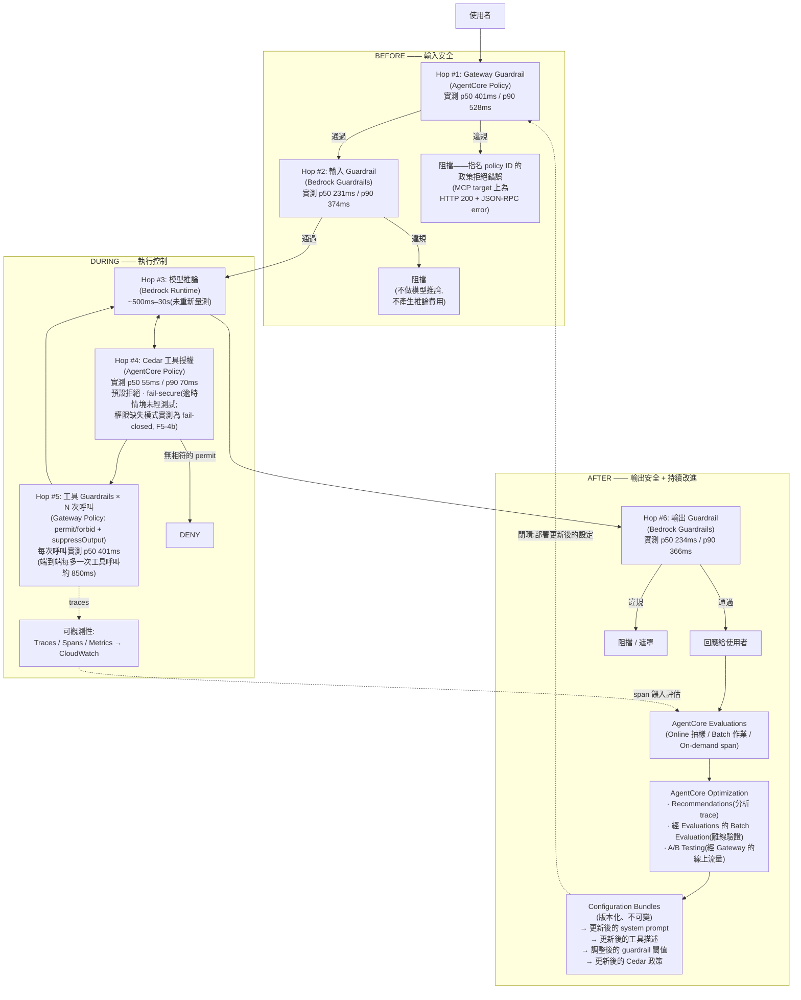

## 10. 主要 AWS 文件參考

下表全部 24 列都已抓取並核對 [verified F0-1, TRUE, 24 列, 觀測於 2026-08-09:每個 URL 都能解析,且頁面標題與該列主題相符,0 次失敗]。

| **主題** | **URL** |
|:---|:---|
| Bedrock Guardrails 的運作方式 | <https://docs.aws.amazon.com/bedrock/latest/userguide/guardrails-how.html> |
| AgentCore Policy 中的 Guardrails | <https://docs.aws.amazon.com/bedrock-agentcore/latest/devguide/policy-guardrails-in-policies.html> |
| Gateway Guardrails 入門 | <https://docs.aws.amazon.com/bedrock-agentcore/latest/devguide/policy-guardrails-getting-started.html> |
| AgentCore 中的 Policy | <https://docs.aws.amazon.com/bedrock-agentcore/latest/devguide/policy.html> |
| 理解 Cedar 政策 | <https://docs.aws.amazon.com/bedrock-agentcore/latest/devguide/policy-understanding-cedar.html> |
| Policy 條件(when guardrails) | <https://docs.aws.amazon.com/bedrock-agentcore/latest/devguide/policy-conditions.html> |
| 測試政策(LOG_ONLY 流程) | <https://docs.aws.amazon.com/bedrock-agentcore/latest/devguide/policy-test-a-policy.html> |
| ApplyGuardrail API | <https://docs.aws.amazon.com/bedrock/latest/userguide/guardrails-use-independent-api.html> |
| Guardrails Streaming 模式 | <https://docs.aws.amazon.com/bedrock/latest/userguide/guardrails-streaming.html> |
| Guardrails Tiers | <https://docs.aws.amazon.com/bedrock/latest/userguide/guardrails-tiers.html> |
| Guardrails 支援語言 | <https://docs.aws.amazon.com/bedrock/latest/userguide/guardrails-supported-languages.html> |
| Guardrails Input Tagging | <https://docs.aws.amazon.com/bedrock/latest/userguide/guardrails-tagging.html> |
| AgentCore Observability | <https://docs.aws.amazon.com/bedrock-agentcore/latest/devguide/observability.html> |
| AgentCore Gateway 指標 | <https://docs.aws.amazon.com/bedrock-agentcore/latest/devguide/observability-gateway-metrics.html> |
| AgentCore Policy 指標 | <https://docs.aws.amazon.com/bedrock-agentcore/latest/devguide/observability-policy-metrics.html> |
| 用 CloudWatch 監控 Bedrock Guardrails | <https://docs.aws.amazon.com/bedrock/latest/userguide/monitoring-guardrails-cw-metrics.html> |
| 監控 Bedrock Runtime 指標 | <https://docs.aws.amazon.com/bedrock/latest/userguide/monitoring-runtime-metrics.html> |
| AgentCore Evaluations | <https://docs.aws.amazon.com/bedrock-agentcore/latest/devguide/evaluations.html> |
| AgentCore Optimization | <https://docs.aws.amazon.com/bedrock-agentcore/latest/devguide/optimization.html> |
| AgentCore A/B Testing | <https://docs.aws.amazon.com/bedrock-agentcore/latest/devguide/ab-testing.html> |
| Well-Architected Agentic AI Lens | <https://docs.aws.amazon.com/wellarchitected/latest/agentic-ai-lens/agentic-ai-lens.html> |
| 輸入驗證最佳實踐 | <https://docs.aws.amazon.com/prescriptive-guidance/latest/agentic-ai-security/best-practices-input-validation.html> |
| AgentCore Memory 最佳實踐(Memory 安全;非 guardrails 專屬) | <https://docs.aws.amazon.com/bedrock-agentcore/latest/devguide/best-practices.html> |
| 用 OTPS 診斷 InvocationLatency | <https://docs.aws.amazon.com/bedrock/latest/userguide/monitoring-runtime-otps.html> |

## 附錄 A:Guardrails 檢查點決策矩陣

用這個矩陣決定每一跳要啟用哪些 guardrails:

| **內容風險** | **Gateway (Hop#1)** | **輸入 Guard (Hop#2)** | **工具 I/O (Hop#5)** | **輸出 Guard (Hop#6)** |
|:---|:--:|:--:|:--:|:--:|
| **Prompt Injection/Attack** | ✅ HIGH | 選配(去重;需要 input tagging ——已驗證 [F5-6, TRUE, 2026-08-11]) | ✅ 對外部/不可信的工具回應(間接注入載體) | ❌ |
| **暴力內容** | ✅ MEDIUM | ✅ LOW | ❌ | ✅ MEDIUM |
| **性內容** | ✅ MEDIUM | ✅ LOW | ❌ | ✅ MEDIUM |
| **仇恨言論** | ✅ MEDIUM | ✅ LOW | ❌ | ✅ MEDIUM |
| **PII/敏感資訊** | ❌ | ✅(偵測—— **但 31 種有文件記載的 entity type 中有 9 種被量測為未偵測;見 §3.2** [F3-4, FALSE, n=341, 2026-08-10]) | ✅(遮罩—— v1.2 說 `tool_use` 參數不被掃描的附註,對所探測的 entity 已被推翻:相同的 EMAIL PII 在 message 文字與 tool-result JSON 區塊中的每一次試驗都被處理 [corrected per F1-28, FALSE, 2026-08-10];31 種中只探測了 1 種、僅限呼叫方提供的輸入側 tool 區塊、regex `sensitiveInformationPolicyConfig` 未經測試——見 §4.2 BP#4) | ✅(遮罩) |
| **Denied Topics** | ❌ | ✅ | ❌ | ✅ |
| **Word Blocklist** | ❌ | ✅ | ❌ | ✅ |
| **幻覺** | ❌ | ❌ | ❌ | ✅(Contextual Grounding / Automated Reasoning,僅 detect) |
| **工具授權** | ❌ | ❌ | ✅(Cedar) | ❌ |

## 附錄 B:延遲最佳化技巧

| **技巧** | **說明** | **延遲降低** |
|:---|:---|:---|
| **政策並行評估** | Bedrock 並行評估所有輸入政策(內建) | 相對於循序評估有顯著改善 |
| **在 Gateway 提早阻擋** | 在 Hop#1 阻擋,完全跳過 Hop #2–6 | 實測節省 30–57 ms(Hodges-Lehmann 位移 95% CI [30.2, 57.0])[verified F6-9, TRUE, n=455, us-east-1, 2026-08-10 ——方向已確認;n 未達計畫的 1000,所以請把量值當作指示性的]。免除模型推論費用 *(測試未完成:F10-1 截至 2026-08-13 未發布)* |
| **Content block 批次化** | 在單次 ApplyGuardrail 呼叫中批次處理多個 content block | 減少往返次數(AWS 未公布具體數字;InvokeGuardrailChecks 上限為每則 message 10 個 content block) |
| **選擇性套用** | 只對需要評估的內容套用 guardrails | 與跳過率成比例——**但不要把 input tagging 算成 text-unit 的節省:** 對一個 RAG 形狀的提示詞,加 tag 評估所回報的 text-unit 計數與未加 tag 者**完全相同** [corrected per F10-3, FALSE, 2026-08-13;讀的是 API 回報的 unit 計數——沒有讀取任何帳單、Cost Explorer 或 CUR 數字]。tagging 對 prompt-attack 掃描仍然是必要的(F5-6,§3.2) |
| **跨層去重** | 從多個跳中移除同一項政策(先確認沒有覆蓋缺口) | 移除重複的評估時間 |
| **延遲最佳化推論** | 對模型呼叫使用 Bedrock latency-optimized inference | 縮短 Hop#3 的時間 |
| **非同步 streaming 模式** | 官方的 ASYNCHRONOUS streamProcessingMode:chunk 立即串流,掃描在背景進行 | 消除緩衝延遲(取捨:阻擋生效前有一個外洩時窗;非同步模式無 PII 遮罩) |

> v1.2 已從本清單移除:「智慧快取」這項通用技巧—— AWS 會自動更新底層模型,而「相似」的輸入差異可能恰好就在攻擊 payload 上;快取可被辯護的狹窄條件見 3.3 節 BP#1。*(v1.3:此理由中「guardrails 是非決定性的」那一半已被移除——在固定輸入上 n=300 沒有觀測到逐次變異 [F2-5, FALSE, 2026-08-10]。此項排除仍站在自動更新與 payload 敏感性的理由上。)*

## 附錄 C:變更紀錄 v1.1 → v1.2

**事實更正(已對照 AWS 官方文件核實):**

1. Guardrails 的 CloudWatch namespace 全文更正為 `AWS/Bedrock/Guardrails`(原為 `AWS/Bedrock`)。
2. 政策預設閾值釐清:僅在透過自然語言撰寫服務時套用;手寫 Cedar 需要明確閾值。
3. 移除 AgentCore Optimization 的「(Preview)」標籤——該服務已 GA(Accelerator v2.9 服務表)。
4. Optimization 能力更正為 Recommendations / Configuration Bundles / A/B Testing;Batch Evaluation 改歸 AgentCore Evaluations。
5. 並行評估的主張限縮到 AWS 有文件記載的範圍(僅輸入評估);Gateway policy 部分移除。
6. best-practices.html 參考重新標註——該頁涵蓋的是 AgentCore Memory,不是 guardrails。
7. 附錄 B 移除非官方的「190x」/「80–90%」數字(v1.1 已從 §3.3 移除)。
8. §6.4 告警條件從 FirstByteLatency 更正為 Latency。
9. Hop 編號在標題、執行摘要、表格與圖之間統一(1–6,模型推論 = Hop #3)。

**基於風險的修訂:**

10. 快取指引改寫並加上嚴格限制(§3.3 BP#1)。
11. 非同步輸出評估對齊官方 streaming 模式,並加上遮罩/外洩警告(§5.1 BP#1)。
12. 附錄 A 現在建議對不可信的工具回應做 prompt-attack 篩檢(間接 prompt injection)。

**新增:** ENFORCE 預設拒絕的 permit 陷阱;兩層 LOG_ONLY 優先順序 + UpdateGateway 風險;prompt-attack 的 input-tagging 要求;擴充的 Policy 指標(GuardrailLatency、LogOnlyDecisionFlips 等);guardrailProcessingLatency 指引;新增 §3.4 Tier 與語言支援;計費不對稱;PII 日誌/`tool_use` 附註;fail-secure 與未記載失效行為的對比;Gateway Lambda interceptor;Evaluations/Optimization 的 PrivateLink 缺口;CRIS 資料駐留註記;Contextual Grounding 限制;OTPS 釐清;Evaluations 三種模式。

**新章節:** §4.4 不可繞過的逐工具使用 Hook(agent 圍堵模式)——把框架風格的 Pre/PostToolUse hook 對應到行程外的 AgentCore 原語(Cedar Policy、guardrails-in-policy、suppressOutput、Lambda interceptor),並封閉五條繞過路徑(直接工具呼叫、網路對外流量、execution-role 自我停用、帳戶層級篡改、靜默降級)。

**新章節:** §2.1 Hop 編號——宣告 hop 框架是本文自訂的(不是 AWS 概念),並以一張規範性 sequence diagram 把 #1–#6 錨定在請求生命週期上。

**審閱後精修(外部 agent 審閱,2026-08-08):** §6.2 Policy 表新增 MismatchErrors 家族 + 非完備附註;§3.2 prompt-attack 條目現在區分 Converse 的預設評估與 guardContent 的限縮範圍陷阱(未加 tag 的 Converse message 上 prompt-attack 行為未有文件記載——請紅隊測試);§5.2 配額標上 as-of 日期 + Service Quotas 附註;§8 的 tier/語言檢查提升為獨立的檢查清單項目。

**新章節:** §4.5 網路圍堵——把繞過路徑 #2 變成可執行的:Runtime 對外流量鎖定(S3 Gateway-endpoint 縮限)、Code Interpreter 三種網路模式 + DNS 外洩警告、PrivateLink 覆蓋矩陣(Optimization 缺口)、兩個已知陷阱(Lattice Resource Gateway ≠ PrivateLink;ECR Public 強制存在的對外例外),以及強制受圍堵部署的 IAM VPC condition key。連線性設計刻意排除在範圍之外。§8 階段一檢查清單新增一項網路圍堵。

**格式變更(v1.2):** 本 Markdown 檔是本文件的正式版本,並以 Mermaid 圖提升人類與 AI agent 的可讀性:hop 編號 sequence diagram(§2.1,規範性)、閉環總覽(§2)、計費不對稱(§3.2)、tier 選擇決策樹(§3.4)、兩層 LOG_ONLY 優先順序(§4.1)、圍堵邊界(§4.4)、streaming 模式比較(§5.1)、trace 樹(§6.3,附 span 名稱免責聲明)、閾值調校流程(§7.1)、參考架構(§9)。.docx 的沿革止於 v1.1;需要 Word/PDF 匯出時請從本檔重新產生。

## 附錄 D:變更紀錄 v1.2 → v1.4(實證修訂)

v1.3 與 v1.4 的每一項變更,都可追溯到 `grx-validation` 儲存庫 `results/phase1/` 下的一個已發布判定檔。案例仍未完成、INCONCLUSIVE 或不可測的主張**未被變動**——只加上了標記。計數於 2026-08-15 以 `census.py` 重新推導。第二批修訂於 2026-08-14 施加,當時被暫緩的結果檔已入庫(見驗證狀態一節的 resolved 標記):F1-6(TRUE —— §1、§3.4、§8)、F8-1(FALSE —— §1、§8)、F10-3(FALSE —— §3.3 BP#3、附錄 B)、F1-28(FALSE —— §4.2 BP#4、附錄 A)、F5-4b(RECORDED —— §3.1、§4.1、§9)、九個 INCONCLUSIVE 結果(F1-19、F1-24、F1-25、F1-26、F1-27、F5-3a、F5-5、F5-9、F9-3 ——主張未變動,註解已更新),以及 F5-3b(已執行,不具可發布地位)。第三批修訂於 2026-08-14 施加:同一次執行的第 4–7 輪(2026-08-13 UTC,在 FINDING-P1-CEDAR-RESOURCE-SCOPE.md 所記錄的儀器修復之後——那是一份儀器文件,對本文不作任何主張,也不被引用為任何判讀的證據)取代了文法案例中被缺陷作廢的第 1 輪結果,而第 8 輪(2026-08-14 UTC)在第二個日曆日重現了它們:F1-24 與 F1-25 從 INCONCLUSIVE 移到已發布的 FALSE(§4.1 限制條目 2 與 1 ——見更正項 13,其橫跨兩個 UTC 日的覆蓋滿足修訂閘門),而 F1-19 仍為 INCONCLUSIVE(沒有主張變動;機制觀察註記於 §3.1)。**第四批—— v1.4 這份草稿——恰好涵蓋兩個新完成的案例,且兩者都不修訂任何主張:** F1-15(INCONCLUSIVE —— §4.1 的「三種 target 類型」主張未變動;五項直接的 API 形狀與 wire 觀察以帶日期的機制觀察形式註記於 §4.1,該項目中順帶的 `POST /inference` 路徑作為 wire 事實被更正,而新觀測到的 inference 介面拒絕形狀被帶入 §3.1、§6.4 與 §8 ——下方第 21 與 22 項)與 F5-8(TRUE,但僅單一日曆日—— §4.4 route #3 的 Accelerator 引用**保留**,換成公開證據的動作被 `reproduction_before_amendment` 暫緩;見下方「刻意未變動」登記)。驗證狀態一節的計數相應移動:89 個已發布判定,2 個案例未完成(F5-7b、F10-1)。**第五批—— v1.4 正式發布,2026-08-15 ——恰好涵蓋一個新完成的案例,且不修訂它的任何主張:** F5-7b(INCONCLUSIVE —— §4.5 網路圍堵與 §4.4 routes #2 與 #4 未變動;見下方「刻意未變動」登記與 `results/FINDING-F5-7B.md`)。計數移至 90 個已發布判定、1 個案例未完成(F10-1)。本次發布另新增 `results/CENSUS-NOT-MEASURED.md`,以記錄兩個未量測案例各自未被量測的原因來封閉普查;它不引入任何關於產品的主張,也不修訂任何內容。**第六批—— 2026-08-15,也是本文件中唯一既非由判定、也非由 wire 觀察驅動的一批——更正本文件在兩處對機率性控制使用了「防止」這個動詞。** 它的依據來自外部(OWASP LLM01:2025、AWS 自家頁面標題「**Detect** prompt attacks」、NIST AI RMF Playbook MANAGE 1.4 要求殘餘風險必須被記錄與揭露),再加上本研究內部證據的**缺席**,而不是任何案例結果。它不改變任何主張的真假值、不移動任何計數,也不滿足任何修訂閘門——因為它不請求修訂:受影響的主張在此前後都未被本研究驗證。見下方第 23 項更正,以及驗證狀態一節的第二條編輯規則。

**由 FALSE 判定驅動的更正(文件缺陷):**

1. §6.1 延遲表——逐跳示意區間替換為每跳 n=1000 的實測 p50/p90/p99;六個被量測的跳中有五個落在 v1.2 的區間之外 [F6-1、F6-2、F6-3、F6-4、F6-5,全部 FALSE, us-east-1, 2026-08-10]。§9 的圖標註相應更新。
2. §6.1 / §4.2 ——每多一次工具呼叫的成本從 165–750 ms 更正為約 850 ms(CI [838.7, 862.7])[F6-8, FALSE, 600 次可用, 2026-08-10]。
3. §3.1 行為註記、§7.1 原則 #3、§3.3 BP#1、附錄 B 附註——「guardrail 評估是非決定性的」這個前提被重新界定範圍:在固定輸入上沒有觀測到逐次變異 [F2-2、F2-5、F2-4,全部 FALSE,各 n=300, 2026-08-10]。AWS 有文件記載的陳述被保留;但本文不再把建議**建立在**已觀測到的變異上。
4. §3.1 行為註記、§2.1 圖、§9 圖——「HTTP 403」已更正:MCP target 的拒絕回傳 HTTP 200 帶一個指名 policy ID 的 JSON-RPC error(-32002),120/120 [F4-6, FALSE, n=120, 2026-08-10]。
5. §3.2 Sensitive Information Filters、附錄 A —— 31 種有文件記載的 PII entity type 中有 9 種被量測為未偵測(recall 信賴區間上界低於 0.5)[F3-4, FALSE, n=341, 2026-08-10]。
6. §3.4 tier 表——「Prompt leakage 偵測:Classic = 無」更正為「弱但可量測」(recall 0.41 [0.32, 0.50] 對比 FPR 0.036)[F8-4, FALSE, n=460, 2026-08-10]。
7. §3.4 tier 表—— Standard tier 的 1,000 字元 denied-topic 上限已更正:1,000 字元的定義被 `ValidationException` 拒絕;Classic 的 200 字元邊界成立 [F8-5, FALSE, 2026-08-10]。
8. §3.2、§5.1 BP#4 ——「Automated Reasoning:不支援 streaming」已撤回:`ConverseStream` 接受 `guardrailConfig`,並建模了 132 條 AR 評估路徑 [F1-14, FALSE, SDK 介面探測, 2026-08-10]。
9. §4.5.3、§5.3 BP#6 —— PrivateLink 矩陣已更正並標上日期:AWS 的即時頁面在 2026-08-09/10 把 Evaluations 與 Optimization 在兩個平面都標為 Supported,而五份與 v1.2 一致的存檔快照相對 [F5-7a, FALSE, 於 2026-08-09/10 重現]。表頭從「Service」更正為「Primitive」。
10. §6.2 policy 指標、§6.4、§8 —— `ConfidenceScore`、`ConfidenceThreshold` 與 `TemporalLatency` 被量測為缺席,而 `LogOnlyEvalIncomplete` 從未發布且有 0 個維度組合,所以它所規範的告警無法發火 [F7-1, FALSE, 2026-08-10;由 F9-2, TRUE, 2026-08-13 佐證]。
11. §7.1 步驟 1、3、4 與流程圖——校準的指向從 CloudWatch 指標改為應用日誌,並陳明分數的 JSON 字串型別與低於閾值時的截斷;「沒有東西被阻擋」的承諾被界定範圍(影子評估會以 ERROR 層級記錄 `DENY`/`FORBID`);在讀任何翻轉計數之前加上一個正向的 `LogOnlyMatches > 0` 閘門 [F3-10, FALSE, 2026-08-12;失效模式來自 F5-4a, 2026-08-11/12]。
12. §6.2 mismatch 指標列、§4.4 route #5、§8 ——後果按 mode 拆分(ACTIVE = 全部拒絕的可用性訊號,LOG_ONLY = 靜默)、記錄維度倍數(跨維度 `Sum` 最多讀到請求數的 6 倍),並撤回以 mode 過濾的告警方式(不可靠)[F9-2, TRUE, 2026-08-11/12 ——這項指標解讀的更正,站在一個關於「會發火」的 TRUE 判定上,不是站在對指標存在性的推翻上]。

13. §4.1「policy 中 guardrails 的限制」——條目(1)與(2)改寫以區分「撰寫」與「評估」:驗證器**接受**了在 `when guardrails {…}` 區塊內使用 Cedar 的 `like`(無 pattern 的對照組為 ACTIVE;一個 regex 形狀的類別字面值則對照五個固定類別被同步拒絕),也**接受**了把 `when {…}` 與 `when guardrails {…}` 混用的政策(兩個拆分對照組皆 ACTIVE)——每個 arm 四次終端 ACTIVE 的接受、0 次模型呼叫、全程 LOG_ONLY [F1-24 與 F1-25,兩者皆 FALSE, run r20260810T130945Z, us-east-1, 證據為 2026-08-13 **與** 2026-08-14 UTC]。**日期覆蓋:兩個不同的 UTC 日曆日**,這正是本儲存庫修訂閘門所要求的。第 4–7 輪全部落在 2026-08-13,這排除了瞬時現象,但排除不了同日部署;而第二日的回合(第 8 輪,2026-08-14T00:54:25Z–00:55:19Z UTC,其目標在執行前就固定於 FINDING-F1-GRAMMAR-PERMISSIVENESS §6,結果記錄於其 §6.1)重現了每一個 arm:混用政策 ACTIVE 且兩個拆分皆 ACTIVE、`like` 政策 ACTIVE 且無 pattern 對照組 ACTIVE、regex 形狀的類別字面值被拒絕——使用與第一日相同的 SDK build 與相同的 `validationMode`。因此這兩項更正是已發布的,而非暫定的。評估時的行為(混用政策的標準條件是否被遵守;被接受的 `like` 是否真的過濾了什麼)仍屬未量測;「拆成兩條敘述」與「regex 交給 interceptor」這兩項建議未變動。

**由 TRUE 判定驅動的新增與確認:**

14. §3.1 —— **新增 SDK 前置條件:** `botocore`/`boto3` ≥ 1.43.32,並指名 1.43.30–.31 的陷阱區間;同時加入 §8 檢查清單 [F1-1、F1-2, TRUE, 2026-08-09]。
15. §3.1 預設拒絕提示框、§7.1 步驟 4、§7.2、§8 —— **新增 `validationMode` 要求:** 本文所建議的基線 permit 敘述在預設的 `FAIL_ON_ANY_FINDINGS` 下,會在一個 202 之後非同步地停在 `CREATE_FAILED` [F1-3, TRUE, 於 2026-08-10/11 重現]。
16. §3.1 BP#5 —— **新增實測時間間隔:** 一次被接受的 mode 翻轉花了 602.8/931.7 ms,而先前被阻擋的請求在 13.2–14.2 秒後被正常服務;`iam:PassRole` 與 `UpdateGateway` 並列指名 [F5-2, TRUE, 於 2026-08-12/13 重現]。
17. §4.4 route #3 —— **最小權限重新界定為僅限穩態:** 撤銷在兩個方向上都是最終一致的(80 次調用中有 32 次在觀察到拒絕之後仍執行成功;控制平面授權在授權刪除後持續 325.0 秒 / 305.8 秒),因此「撤銷、確認、繼續」形式的 runbook 被禁止,而且不公布任何「等 N 秒」的數字 [F5-1 與 F5-2,兩者皆 TRUE,橫跨四個 UTC 日重現]。
18. §6.4 —— **新增發布延遲下限:** 實測 p90 延遲 11.5 秒;七個告警中只有 1 個陳述了週期,其餘 6 個照原樣無法實作 [F7-6, TRUE, n=30, 2026-08-10]。
19. §6.3 ——記錄實際的 span 名稱(`AgentCore.Policy.AuthorizeAction`、`AgentCore.Gateway.InvokeTool[.<tool>]`)、約 50 秒的 span 延遲,以及實測到 span 上沒有分數屬性 [F7-4, TRUE, n=20, 2026-08-10]。
20. 新增就地確認(文字未變,附上引用):§1 與 §3.4 的語言/tier 主張 [F8-2、F8-3、F8-6、F8-8];§3.1 分數格點 [F1-18]、content-filter 類別 [F1-7];§3.2 偵測效能 [F3-1、F3-2、F3-3、F3-5、F3-6、F3-7] 與 input tagging [F5-6];§4.1 決定性、預設拒絕、forbid 覆蓋與兩層 LOG_ONLY 優先順序 [F2-1、F4-2、F4-3、F4-4、F4-5、F1-5];§4.4 繞過路徑 #1 [F5-1];§5.2/§5.3 能力清單 [F1-22、F1-23];§6.1 可加性 [F6-7] 與端到端總計 [F6-6];§6.2 指標 namespace 與批次 [F7-2、F7-3、F7-7] 與 per-text-unit 計費 [F10-2];§7.1 原則 #2 的提早阻擋節省 [F6-9];§10 參考 [F0-1]。

**v1.4 ——由直接的 API 形狀與 wire 觀察驅動的更正與新增,而非由判定驅動:** 下面兩項都來自 F1-15 執行,其封存判定為 INCONCLUSIVE 且不許可任何修訂。它們以「觀察」身分被引用,因為它們是對 service model 與 wire 的讀取而不是 oracle 輸出,而且兩者都不觸及 oracle 所量化的那個主張。

21. §4.1 target 類型項目,以及同一節內新增的機制觀察區塊——記錄五項結果,日期 2026-08-14,us-east-1:(a)`CreateGateway.protocolType` 是一個唯一成員為 `MCP` 的列舉(botocore 1.43.67),所以 `CreateGatewayTarget` 以 `ValidationException: HTTP target configuration is not supported for gateways with MCP protocol type` 拒絕整個 `http` 分支——「建立一個 HTTP runtime target」的指引**目前無法照做**,而且因為這是從釘住的 service model 讀出的(在同一 SDK 版本內不變),它不帶日曆重現的附註;(b)inference 的 wire 路徑是 **`POST /inference/v1/messages`**,不是 v1.2 的 `POST /inference`(後者被以 `Http operation is not supported for gateway protocol type MCP` 拒絕)——該路由是一個組合,`operations[].path` 是面向客戶端的路徑,在 gateway 自己的 `/inference` 前綴之下提供,而**這個路徑是該項目中唯一被更正的文字**;(c)在 `inference.provider` target 上,`operations[].models` 是承重的,即使 API 標記它為選填——少了它,target 會抵達 READY 卻無法路由,回傳 `404 Model '<id>' not found on any target`;(d)`operations[].models[].model` 的 pattern 為 `[a-zA-Z0-9\-\._\*\?@]+(/[a-zA-Z0-9\-\._\*\?@]+)*`,容許 `*`/`?` glob 而不容許冒號,所以 Bedrock 正規的 `…-v1:0` id 無法寫在那裡;(e)兩種政策拒絕的 wire 形狀,見第 22 項。「三種 target 類型」這個主張本身未變動,並留在下方「刻意未變動」登記中。
22. §3.1 行為註記、§6.4(告警表之後的新表)、§8 階段二(新增檢查清單項目)——政策拒絕偵測改為具**介面意識**:在單一條無條件、gateway 範圍的 `forbid` 之下,inference 介面以 **HTTP 403** 與一個 `permission_error` 封裝拒絕("Request Denied: Gateway Target request not allowed due to policy enforcement […]"),而 MCP 介面以 HTTP 200 + JSON-RPC `-32002` 拒絕,並且 MCP `tools/list` 在基線宣告三個工具的情況下**成功並回傳空的工具清單**。只綁定 `-32002` 的偵測——也就是 v1.3 所描述的全部——會漏掉 inference 介面的拒絕,而兩種錯誤形狀規則都看不到工具探索通道:它完全不拋出錯誤,必須靠檢查所宣告的工具數量來捕捉。這不更正 v1.2 所主張的任何內容;它封閉的是 v1.3 指引會留下的一個覆蓋缺口。單一日曆日、一個 gateway,所以其背後的政策行為若要支撐任何正向主張,還需要第二日的執行——而目前沒有任何主張倚賴它。

**v1.4 ——由外部標準與證據缺席驅動的更正,而非由任何判定驅動:**

23. §4.2 BP#1(Hop #5 項目)與 §7.3(Tool I/O Guardrails 那一列)——動詞從**防止**改為**降低**,兩處各自帶上明確的殘餘風險陳述。這是一項表述框架上的更正,而且它**不修訂任何主張**:那兩句話斷言了一個本研究從未量測過的安全**結果**,而這次更正並不用一個量測去取代它,它陳述的是那個缺口。三項事實決定了這個用字。第一,唯一接近該機制的案例是 **F1-17,INCONCLUSIVE** ——其封存 oracle 寫的是「若一個使用 `suppressOutput` 的政策被接受且確實抑制了工具輸出則為 TRUE;若該效果被拒絕則為 FALSE」,而它的儀器是在本機沿十個方向讀取 `bedrock`、`bedrock-runtime`、`bedrock-agentcore-control` 與 `bedrock-agentcore` 的 botocore **service model**,所以**沒有任何操作被呼叫,也從未觀察到任何東西被抑制**。第二,對 `lib/oracle.py` 執行 grep,`suppressOutput` 出現 **0** 次,`indirect` 出現 **0** 次:本研究沒有任何案例量測工具輸出的抑制,也沒有任何案例量測針對工具**輸出**的 prompt attack 偵測——最接近的量測 F5-6 報告的是未加標籤 `InvokeModel` **輸入**上的 prompt-attack recall **0 [0, 0.031]**(n=120),那是不同的通道,而且指向相反的方向。第三,在資料外洩這一半,F3-4(FALSE,2026-08-10)推翻了 31 種文件所載實體類型中的 **9 種**,所以連看起來像確定性的 PII 元件都未覆蓋該項目所暗示的範圍。外部依據是:對一個機率性過濾器使用「防止」這個動詞,正是 OWASP LLM01:2025 明確點名的缺陷——它指出是否存在萬無一失的 prompt injection 防止手段並不清楚,並轉向緩解其**影響**;AWS 自家的指引頁面標題是「**Detect** prompt attacks」,通篇只用偵測/過濾/阻擋的語彙;而 NIST AI RMF Playbook MANAGE 1.4 要求殘餘風險必須被記錄與揭露,而不是被暗示掉。兩處都寫明的指引後果是:把 Hop #5 當成**站在確定性控制背後**的縱深防禦(一條 Cedar `forbid`,或一條 egress deny),絕不要把它當成外洩邊界本身。本文件其餘三處帶有「防止」語意的用字是正確的,並被刻意保留:§3.1 明確的「**偵測**」對比「**預防**」(「若需要預防,請用 SCP、permission boundary 或 resource policy 拒絕該呼叫」——所指的是確定性控制)、§3.2 每請求隨機 `tagSuffix`「以防 tag 注入」,以及 §3.3「為該 API 呼叫設定逾時與斷路器,避免延遲尖峰阻塞整個請求」——它們或指名一項確定性控制,或所指的並非某個過濾器的效力。英文版在同樣的兩處帶有相同的變更;該版本使用的字面動詞是 `prevent`,在英文版第 23 項中逐處列出。

**刻意未變動(證據為 inconclusive、缺席或不可測):** §3.2 BP#1 逐方向獨立性(F1-11 INCONCLUSIVE);§5.1 BP#5 Contextual Grounding 字元限制(F1-13 INCONCLUSIVE);§3.4 word-filter 語言主張(F8-7 INCONCLUSIVE;F1-26 已執行, run r20260810T130945Z, INCONCLUSIVE ——兩個 tier 都拒絕了非 EN/FR/ES 的 word policy,但「僅支援語言」的對照組也被拒絕,所以該拒絕無法歸因於任一分支);§3.1 prompt-attack 子類型列舉(F1-8 INCONCLUSIVE);§5.1 BP#1 streaming 模式(F1-12 INCONCLUSIVE);§4.1 interceptor(F1-16 INCONCLUSIVE)與 `suppressOutput` 效果(F1-17 INCONCLUSIVE);§3.3/附錄 B 的 10 個 content block 上限(F1-20 INCONCLUSIVE);§3.2 自動更新/漂移指引(F3-11 INCONCLUSIVE);§3.2 與 §7.1 計費不對稱(F10-1 未量測,並在 `results/CENSUS-NOT-MEASURED.md` 中如此記錄,而非無限期開放:Cost Explorer 最細的細度是日級,而該 oracle 讀的是「輸入端被阻擋」與「輸出端被阻擋」請求之間的差值,這還額外要求 Bedrock 推論費用能按 request tag 歸屬——並未確立。該主張完全按 v1.2 的原文成立,在任一方向上都沒有量測支持);§4.1 三種 target 類型(F1-15 已執行, run r20260810T130945Z, 2026-08-14 UTC, INCONCLUSIVE ——該項目指名的三種 target 類型中,`mcp` 與 `inference` 都已建立,且在單一條無條件、gateway 範圍的 `forbid` 之下**都被政策拒絕**,沒有該 forbid 時各自被允許,而 `http.agentcoreRuntime` **在此 API 版本無法構造**,因為 `CreateGateway.protocolType` 只容許 `MCP`,`CreateGatewayTarget` 因而拒絕整個 `http` 分支,所以封存的「三者皆然」既無法被滿足也無法被推翻;它不是 FALSE,因為一個無法承載請求的 target 類型不可能繞過對請求的評估;也不是 TRUE,因為把「三者皆然」讀成「所有存在的皆然」會判定一個與封存所指不同的量;該次執行的五項直接 API 形狀與 wire 觀察可被獨立引用,並以帶日期的機制觀察記錄於 §4.1 ——見上方更正項 21 與 22 ——而唯一移動的項目文字是那個順帶的 inference 路徑,`POST /inference` → `POST /inference/v1/messages`,那是一個 wire 事實而非該主張的實質內容);§5.1 reasoning 區塊排除(F1-27 已執行, INCONCLUSIVE ——兩個 reasoning 區塊放置 arm 都回傳 `ValidationException`;一個被服務拒絕的請求,不是一個內容未被評估的請求);§3.1/§4.1/§9 fail-secure 逾時 → DENY(F9-1 依其封存 oracle 不可測;權限缺失模式由 F5-4b, RECORDED 刻畫為 fail-closed ——見 §3.1/§4.1 ——那不構成關於逾時模式的證據);§4.5 網路圍堵與 §4.4 routes #2 與 #4(F5-7b 已執行, run r20260810T130945Z, 2026-08-14 UTC, INCONCLUSIVE ——該案例建立了一個專用 VPC,並從同一個公開映像建立三個 VPC 模式 runtime,彼此唯一差異是私有 route table 是否帶有通往 NAT gateway 的預設路由,而**三者都抵達 READY 且 `failureReason` 為空**,所以 create 通道沒有指出任何可歸因於對外流量的失敗;本應決定該案例的 invoke 通道反而在三個 arm 上都回傳**客戶端 socket 逾時,分別為 70082 / 70077 / 70073 ms ——三次獨立呼叫之間僅 9 ms 的散布**,亦即那是一個常數而不是一次量測,沒有 HTTP 狀態也沒有 request id,而一個沒有收到任何回應的 invoke 無法指認 image pull 或任何其他步驟。封存的 oracle 是以 pull 為計量單位的,所以它從未被實際帶入:不是 TRUE,因為 TRUE 要求「沒有路由時抓取失敗、有路由時成功」;也不是 FALSE,因為 FALSE 是一個「兩種情況下對外流量都可達」的正面斷言,而沒有任何 arm 確立抓取曾經發生。另請注意所使用的映像服務於 `:80`,而 AgentCore 的契約是 `:8080`,所以在這個 fixture 上,一次**成功**的 pull 會產生與失敗的 pull 相同的沉默。有一個誘人的訊號被明確捨棄:第一個 arm 花了 261.9 秒抵達 READY,而另兩個各為 20.2 秒,這與 NAT 路由相關聯,但第三個 arm 已把路由再次移除卻仍是 20.2 秒——若 create 延遲追蹤的是對外流量,移除路由本應恢復較長的時間,所以「第一次建立的暖機」解釋了它,而那 261.9 秒不構成任何證據。有一個這次執行無法排除的可能性,會使該 oracle 自己的前提站不住腳:runtime 的網路介面是由 `amazon-aws` 以服務託管的介面類型附掛的,而 `networkModeConfig` 帶有 `requireServiceS3Endpoint`,所以 AgentCore 可能是在「客戶 NAT 路由無關」的服務託管基礎設施上抓取映像——這批資料無法把它與儀器失效區分開來。該案例真正欠缺的是一個可用的讀取通道,最好是 runtime 自己的 CloudWatch log stream,而不是一張放寬的決策表;見 `results/FINDING-F5-7B.md` §3 與 §4。已發布的結果檔在 2026-08-15 發現儀器缺陷後重新評分:判定在前後都是 INCONCLUSIVE ——該缺陷只可能發出「pull 失敗」,而兩種判定都無法從那裡抵達——但所記錄的理由現在陳述「沒有任何 arm 可讀」,而不是暗示各 arm 與 oracle 的表格相矛盾;F5-3a 已執行,其封存 oracle 為 NOT EVALUABLE ——如實回報,不帶任何判定;它的撰寫那一半只是一項未計畫的機制觀察:organization 對一個刻意留空的 OU **接受**了「拒絕並帶 break-glass 例外」的政策文件,這對強制執行什麼都沒有證明;F5-3b 已執行並回傳 TRUE —— permissions boundary 在明確拒絕該動作時、以及僅僅省略它時,都阻止了 `UpdateGateway`,而一個在 boundary 內的 `GetGateway` 對照在每個 boundary 下都成功——但它的 `every_boundary_transition_was_observed_to_settle` 護欄未通過(兩次 IAM 轉換在各約 307 秒的預算內始終未穩定),所以它**不具可發布地位**、不計入已發布判定,也不被引用為確認任何主張);§4.4 route #3 的前提「tool session 內的任何程式碼都能讀到 execution role 的憑證」,**以及它的 Accelerator(NDA)引用,兩者都留在原處**(F5-8 已執行, run r20260810T130945Z, 2026-08-14 UTC,並回傳 TRUE —— 3 個 / 共 3 個不同的 tool session 中,`sts:GetCallerIdentity` 都回傳了 runtime 自己的 execution role,每次 HTTP 200,經由 `169.254.169.254` 上的 microVM instance metadata service 並附 IMDSv2 token,在 `agentRuntimeArtifact` 的 `codeConfiguration` arm 上(S3 zip、PYTHON_3_12),networkMode 為 PUBLIC,而 ECS link-local 位址無法連通,也不存在環境變數、共用憑證檔案或 `boto3` 通道——但只在**一個**日曆日。`PREREGISTRATION.yaml` 的 `reproduction_before_amendment` 規則不允許以單一日資料修訂任何主張,而第二日重現排定於 2026-08-15 UTC,所以該封存 oracle 自己的目的——藉由以**公開**證據確認 §4.4 的前提來移除 NDA 引用——是**被暫緩而非已完成**:引用保留,主張就地註記。這個暫緩是程序性的,不是對量測的懷疑——量測是乾淨的,且其逐 session 的 request id 已封存。從案例紀錄延續下來的範圍:它沒有證明這些憑證帶有任何特定權限;沒有證明基於 CONTAINER 的 runtime 行為相同,因為只量測了 `codeConfiguration` arm;而 `sts:GetCallerIdentity` 不需要任何 IAM 權限——此處的執行政策刻意省略了它——所以該呼叫證明的是憑證存在且 STS 接受它們,不是某項授權允許了它);§4.2 BP#1 間接 prompt injection(F5-5 已執行, INCONCLUSIVE ——探測政策從未成為 ACTIVE,也沒有觀測到 echo 往返,所以封存的抑制問題從未被量測;CREATE_FAILED 的原因作為機制觀察記錄於 §4.2);§4.4 帳戶層級強制 guardrails 的不可繞過性(F5-9 已執行, INCONCLUSIVE —— arm B 沒有產生可用的試驗,而 arm B2 顯示強制執行也影響了良性文字,所以一次阻擋可能是全面失效而不是一次評估;影響範圍乾淨:事前 0 個既有的 enforced 設定,事後亦為 0);§7.2 限流反模式(F9-3 已執行, INCONCLUSIVE —— 480/480 個 burst 回應都帶有真實判定,但在實際達到 182.2 rps(對比文件所載 100 rps 上限)下 0 個被限流,所以靜默通過的問題從未被提出);§3.1 閾值預設值(F1-19 在 run r20260810T130945Z 的第 4–7 輪執行完成, 2026-08-13 UTC,判定為 INCONCLUSIVE ——手寫的那一半的行為與文件完全相符,且機制上如此:一個不帶閾值的 guardrails condition 停在 `CREATE_FAILED`,訊息為 "unexpected type: expected Bool but saw {HATE: {confidenceScore: decimal,}, …}",而同一條敘述加上明確的 `.greaterThan(decimal("0.2"))` 就抵達 ACTIVE;但預設值那一半從未被量測—— `StartPolicyGeneration` 停在終端狀態 `GENERATED` 卻沒有產生任何敘述,兩個 asset 對兩個 guardrail 意圖片段都帶著 `Non-translatable: cannot be expressed in Dogwood` ——所以 0.2 / 0.4 / 0.2 的預設值是未經測試,而非錯誤;缺一半不構成推翻,此案例不許可任何修訂,主張就地註記於 §3.1)。本草稿的較早修訂版曾因一個 harness 缺陷把 F1-19、F1-24 與 F1-25 報為 INCONCLUSIVE 並排入重跑;那次重跑已經發生。第 1–3 輪確實被儀器缺陷作廢——是六個缺陷,不是一個,包括一個 wildcard-resource head 與一個錯誤的 `definition` union 成員;本節先前所載的「單一缺陷」歸因已撤回,完整的修復歷程見 FINDING-P1-CEDAR-RESOURCE-SCOPE.md ——那是一份儀器文件,在此不被引用為任何判讀的證據。在第 4–7 輪中對照組被**接受**,F1-24 與 F1-25 回傳 FALSE(各四次接受),而 2026-08-14 UTC 的第 8 輪逐 arm 重現了兩者的接受,所以 §4.1 的「policy 中 guardrails 的限制」不再列於此清單——它們已移到上方更正項 13,其橫跨兩個 UTC 日的覆蓋滿足修訂閘門。F1-19 留在這裡:它的第二日重現了同一個型別錯誤與同一個零敘述的 `GENERATED`,而一個被重現的「缺一半」仍然是缺一半。先前註記中仍然成立的部分:`unexpected token guardrails` 是一個關於畸形儀器敘述的 parser 首次失敗訊息,**不可**被讀成服務拒絕 `when guardrails { … }` 語法—— F5-4a 建立過這樣的政策,而它們抵達了 ACTIVE。

*文件結束*
